# LightRAG 项目架构图

**项目**：LightRAG · **版本**：1.5.5 · **日期**：2026-07-10 · **作者**：15531

> 本文档抽象出 LightRAG 的**整体架构**：分层、边界、契约、可插拔点。全部基于源码核实（`base.py`、`kg/factory.py`、`kg/__init__.py`、`lightrag.py`、`pipeline.py`、`operate.py`）。

---

## 一、分层架构总图

LightRAG 是一个**五层架构**，每一层都通过明确的契约与上下层解耦：

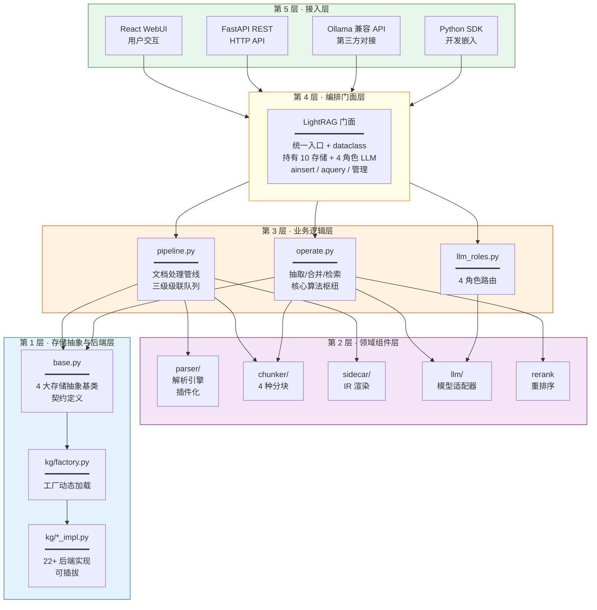

---

## 二、核心抽象：四类存储契约

整个系统建立在**四类存储抽象**之上。这是 LightRAG 最核心的设计——所有后端都实现同一套契约，业务代码完全不感知底层是 JSON 文件还是 PostgreSQL。

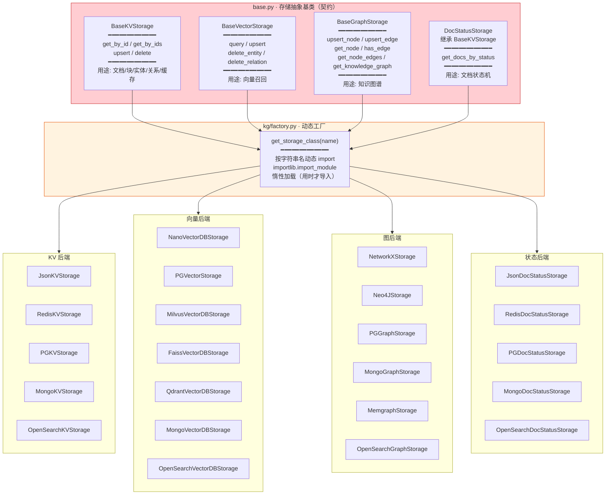

### 契约的核心方法（业务代码只调这些）

| 抽象类 | 业务调用的方法 | 语义 |
|---|---|---|
| `BaseKVStorage` | `get_by_id(id)` / `upsert(data)` / `get_by_ids(ids)` | 按 ID 存取结构化数据 |
| `BaseVectorStorage` | `query(query_vector, top_k)` / `upsert(data)` | 向量相似度召回 |
| `BaseGraphStorage` | `upsert_node()` / `upsert_edge()` / `get_node_edges()` / `get_knowledge_graph()` | 图节点/边读写与遍历 |
| `DocStatusStorage` | `get_docs_by_status(status)` | 按状态查文档（继承 KV） |

---

## 三、LightRAG 门面：持有关系

LightRAG 实例是**唯一对外入口**，它持有系统中所有关键依赖。这是典型的**门面模式（Facade）**：

```mermaid
graph TB
    FACADE["LightRAG 门面<br/>━━━━━━━━━━━━━━━━━<br/>@dataclass @final<br/>继承: RoleLLM + Migration + Pipeline"]

    FACADE -->|"持有"| STORAGES["10 个存储实例"]
    FACADE -->|"持有"| LLM_ROLES["4 个角色 LLM"]
    FACADE -->|"持有"| MODELS["模型函数"]
    FACADE -->|"持有"| CONFIG["配置与参数"]

    STORAGES --> S1["full_docs (KV)"]
    STORAGES --> S2["doc_status (Status)"]
    STORAGES --> S3["text_chunks (KV)"]
    STORAGES --> S4["full_entities (KV)"]
    STORAGES --> S5["full_relations (KV)"]
    STORAGES --> S6["entities_vdb (Vector)"]
    STORAGES --> S7["relationships_vdb (Vector)"]
    STORAGES --> S8["chunks_vdb (Vector)"]
    STORAGES --> S9["chunk_entity_relation_graph (Graph)"]
    STORAGES --> S10["llm_response_cache (KV)"]

    LLM_ROLES --> R1["EXTRACT 抽取"]
    LLM_ROLES --> R2["QUERY 问答"]
    LLM_ROLES --> R3["KEYWORDS 关键词"]
    LLM_ROLES --> R4["VLM 多模态"]

    MODELS --> M1["embedding_func"]
    MODELS --> M2["rerank_func 可选"]

    CONFIG --> C1["addon_params"]
    CONFIG --> C2["workspace 隔离"]
    CONFIG --> C3["top_k / chunk 配置"]

    style FACADE fill:#fffde7,stroke:#f57f17
    style STORAGES fill:#e3f2fd,stroke:#1565c0
    style LLM_ROLES fill:#f3e5f5,stroke:#6a1b9a
    style MODELS fill:#e8f5e9,stroke:#2e7d32
    style CONFIG fill:#fff3e0,stroke:#e65100
```

### 门面的生命周期

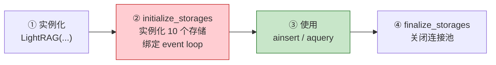

> ⚠️ **必须调 `initialize_storages()`**，否则 `AttributeError: __aenter__` 或 `KeyError: history_messages`。

---

## 四、三个可插拔轴

LightRAG 的架构灵活性来自三个独立的可插拔轴，每个轴都能单独替换：

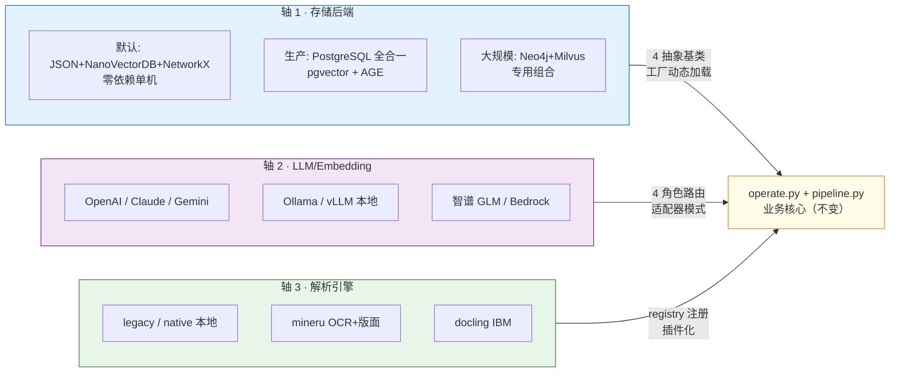

### 三个轴的替换方式

| 轴 | 替换方式 | 契约 |
|---|---|---|
| **存储** | `kv_storage=` / `vector_storage=` 等参数，或 `LIGHTRAG_*_STORAGE` 环境变量 | `base.py` 4 个抽象类 |
| **模型** | `llm_model_func=` / `embedding_func=` 参数，或 `*_BINDING` 环境变量 | `llm_roles.py` 4 角色 + `EmbeddingFunc` 装饰器 |
| **解析器** | `LIGHTRAG_PARSER` 路由规则 + `register_parser()` API | `BaseParser.parse(ctx)` + `ParserSpec` |

---

## 五、数据架构：存储如何组织知识

LightRAG 把一份文档拆解成**四类向量 + 一个图 + 五类 KV**，形成立体知识结构：

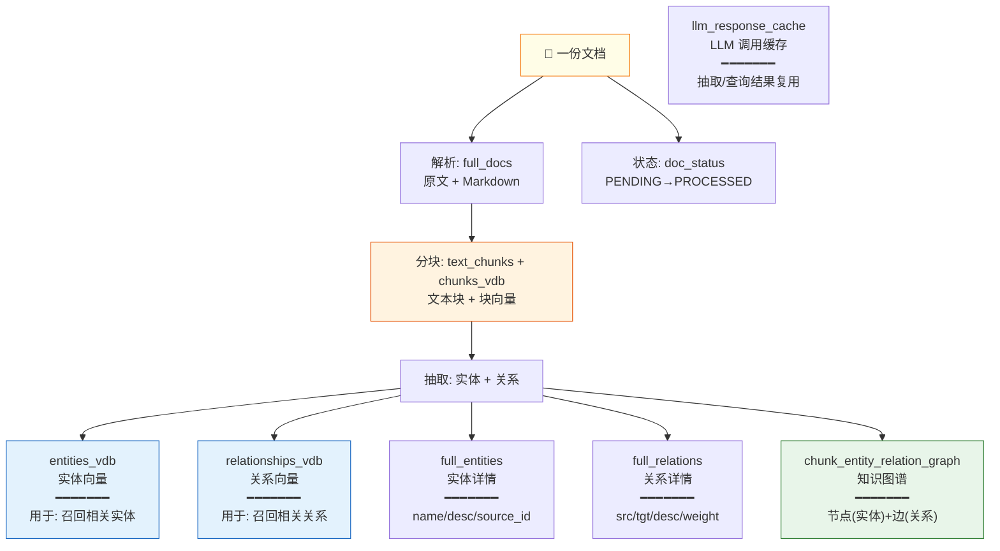

### 为什么是「图 + 三向量」而非单一向量库

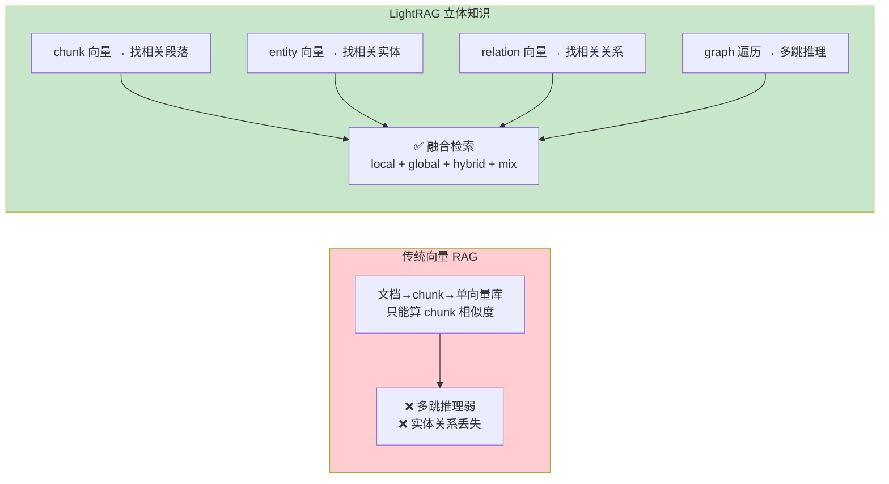

---

## 六、处理架构：双流水线

系统分**写入流水线**和**查询流水线**两条，共享存储层：

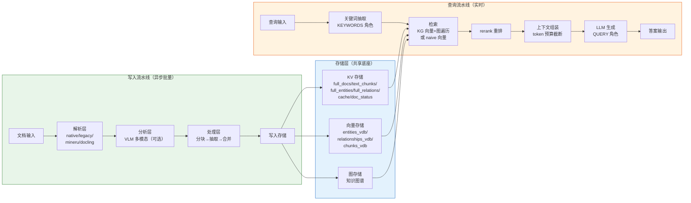

---

## 七、并发架构：三级队列 + 多级锁

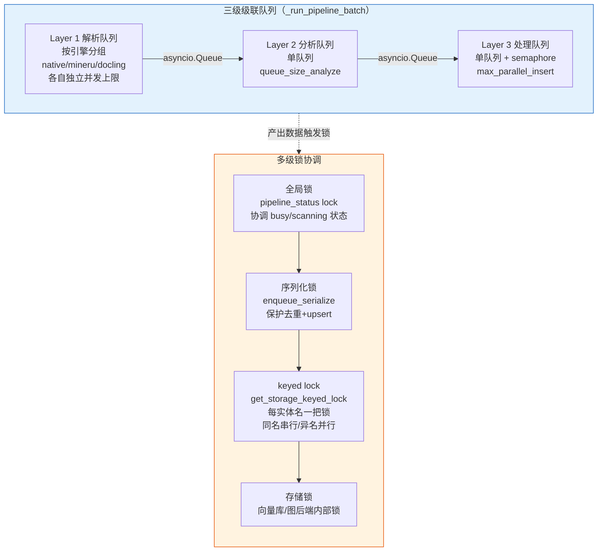

---

## 八、组件关系全景（C4 风格）

用 C4 Container 风格画出系统组件及其交互：

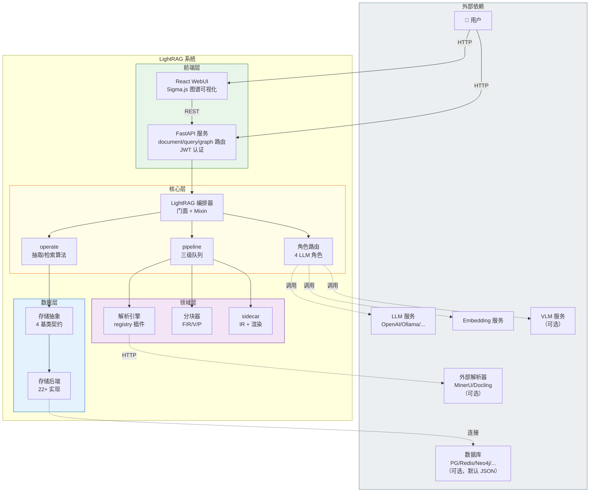

---

## 九、设计原则总结

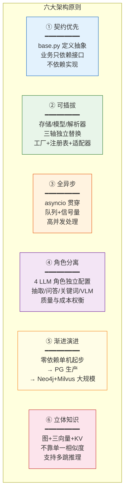

---

## 十、架构决策记录（ADR 速览）

| # | 决策 | 理由 |
|---|---|---|
| 1 | 四类存储抽象 + 工厂动态加载 | 业务代码与后端完全解耦，按规模平滑演进 |
| 2 | 图 + 三向量立体知识结构 | 克服单向量库的多跳推理短板 |
| 3 | 双层检索范式（local + global） | 兼顾细节事实与全局综述 |
| 4 | 4 角色 LLM 独立配置 | 抽取用强模型、关键词用快模型，质量成本兼得 |
| 5 | 全异步 + 三级队列 + keyed lock | 大规模并发不锁死 |
| 6 | dataclass 门面 + Mixin 组合 | 公共 API 稳定，内部实现可拆分演进 |
| 7 | 解析器 registry 插件化 | 第三方引擎可 `register_parser()` 接入 |
| 8 | 惰性导入（importlib） | 不用的后端/引擎不占启动时间和内存 |

---

## 十一、源码索引

| 架构图 | 关键源码 |
|---|---|
| 存储抽象契约 | `base.py` StorageNameSpace / BaseKVStorage / BaseVectorStorage / BaseGraphStorage / DocStatusStorage |
| 存储工厂 | `kg/factory.py get_storage_class` |
| 后端注册表 | `kg/__init__.py STORAGES / STORAGE_IMPLEMENTATIONS` |
| 门面 | `lightrag.py LightRAG`（@dataclass @final） |
| Mixin 组合 | `_RoleLLMMixin` + `_StorageMigrationMixin` + `_PipelineMixin` |
| 处理管线 | `pipeline.py _PipelineMixin` |
| 核心算法 | `operate.py` extract_entities / merge_nodes_and_edges / kg_query / naive_query |
| 角色路由 | `llm_roles.py ROLES / _RoleLLMMixin` |
| 解析器插件 | `parser/registry.py _REGISTRY / register_parser / ParserSpec` |
| API 服务 | `api/lightrag_server.py` + `api/routers/` |

---

## 相关文档

- 流水线流程与网状关系：`流水线流程与网状关系.md`
- 核心执行链路与架构速览：`核心执行链路与架构速览文档.md`
- 技术栈与能力全景：`技术栈与能力全景.md`
- 作为 RAG 基座融合指南：`作为RAG基座与MCP工具的融合指南.md`
