# LightRAG 流水线流程与网状关系

**项目**：LightRAG · **版本**：1.5.5 · **日期**：2026-07-10 · **作者**：15531

> 本文档用**网状关系图**梳理 LightRAG 流水线：组件之间如何互相依赖、数据如何在它们之间流动、谁调用谁、谁持有谁。全部基于源码核实。

---

## 一、全景网状关系图

一张图看清 LightRAG 的全部核心组件与依赖关系：

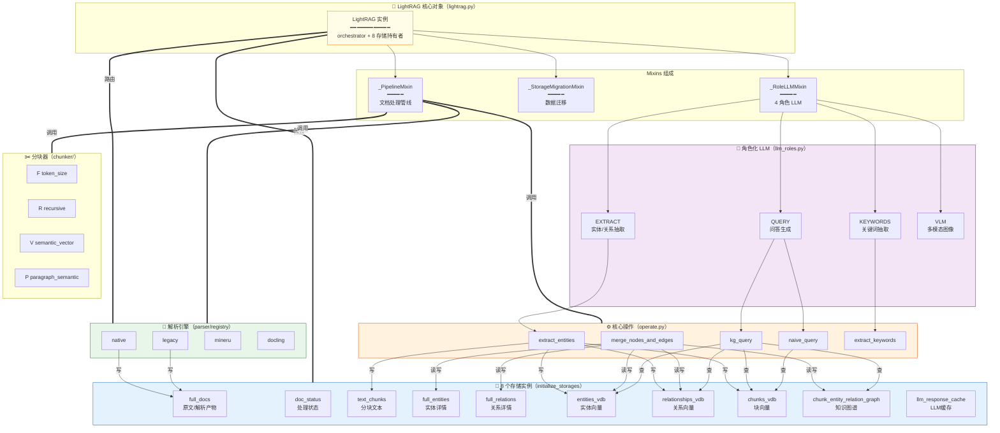

---

## 二、LightRAG 持有的 10 个存储实例

LightRAG 核心对象在 `initialize_storages()` 时实例化以下存储（`lightrag.py:1095-1145`），它们是整个系统的数据底座：

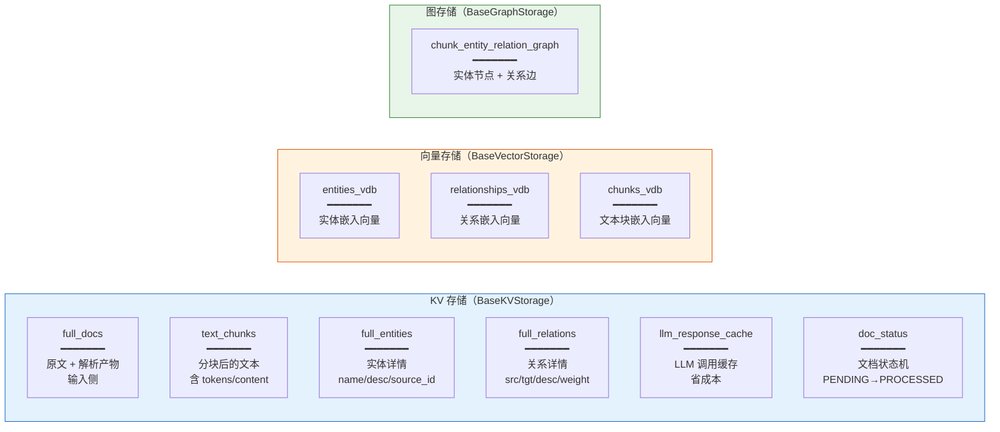

### 各存储的读写角色

| 存储 | 谁写入 | 谁读取 |
|---|---|---|
| `full_docs` | parse_worker（解析后） | analyze/process worker、去重检查 |
| `doc_status` | enqueue、各 worker（状态转换） | 处理循环、scan、去重 |
| `text_chunks` | 分块阶段 | 抽取阶段、查询（chunk 内容） |
| `full_entities` | merge_nodes_and_edges | 图谱重建、查询 |
| `full_relations` | merge_nodes_and_edges | 图谱重建、查询 |
| `llm_response_cache` | extract/keywords/query（命中则跳 LLM） | 所有 LLM 调用前查 |
| `entities_vdb` | extract + merge（embed 入库） | kg_query（向量召回实体） |
| `relationships_vdb` | extract + merge（embed 入库） | kg_query（向量召回关系） |
| `chunks_vdb` | 分块阶段（embed 入库） | kg_query + naive_query（召回 chunk） |
| `chunk_entity_relation_graph` | merge_nodes_and_edges（upsert node/edge） | kg_query（图遍历取子图） |

---

## 三、入库流水线（写入侧）网状流程

文档从进入到知识图谱的完整流程，每一步标注**数据流向哪个存储**：

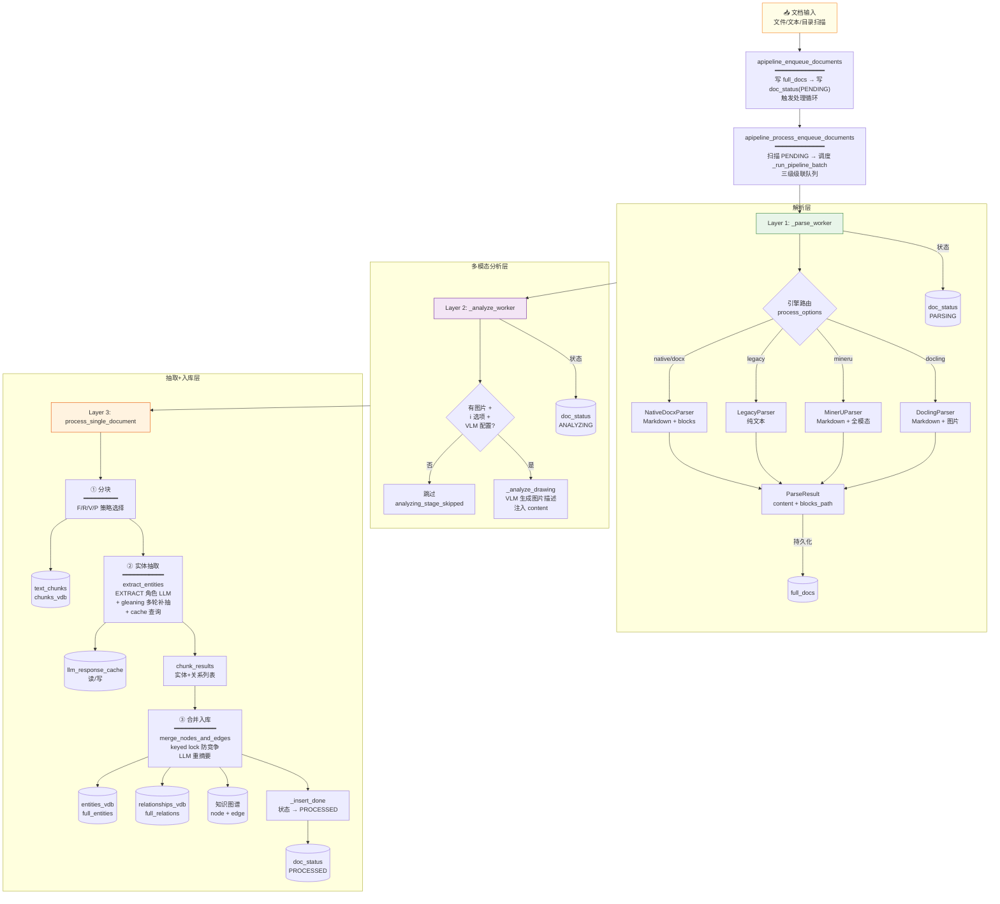

---

## 四、查询流水线（读取侧）网状流程

查询时数据从各存储召回，最终组装成答案：

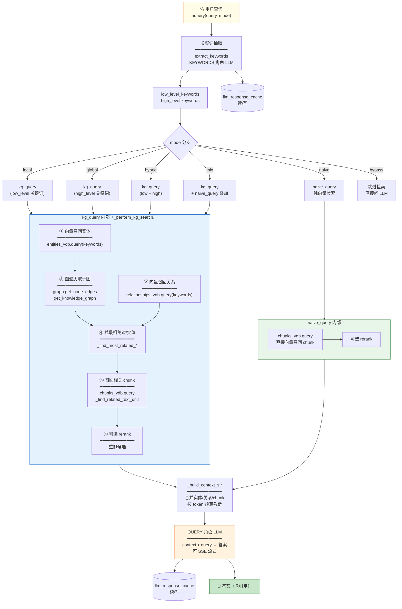

---

## 五、模块依赖网

代码层面的 `import` 依赖关系（谁依赖谁）：

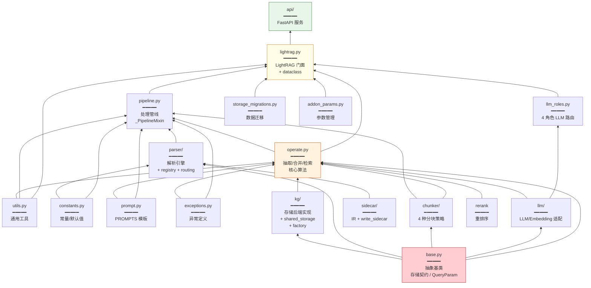

### 分层职责

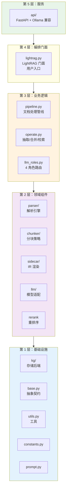

---

## 六、并发与锁的关系网

LightRAG 用多级锁协调并发，这是它处理大规模语料不锁死的关键：

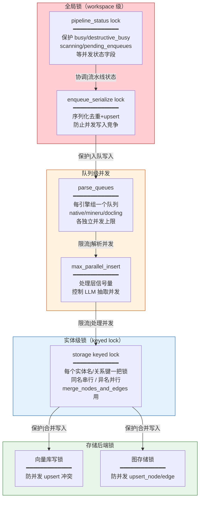

---

## 七、状态流转网

文档在系统中的生命周期状态转换：

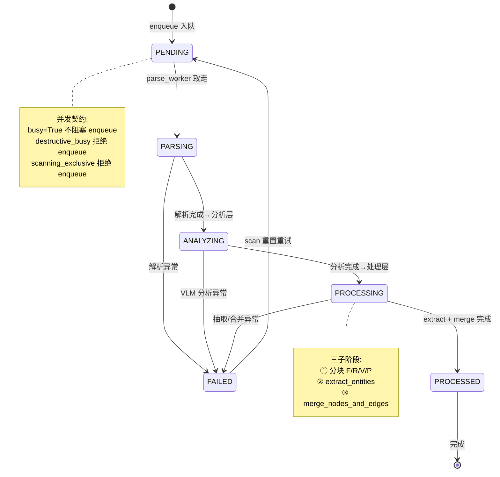

---

## 八、数据流总览（一图打通读写）

把入库和查询放一起，看数据如何从输入流向输出：

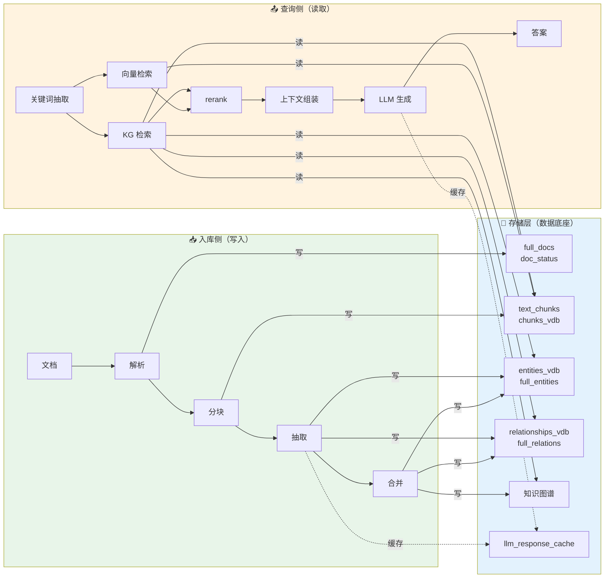

---

## 九、关键关系总结

### 9.1 谁持有谁

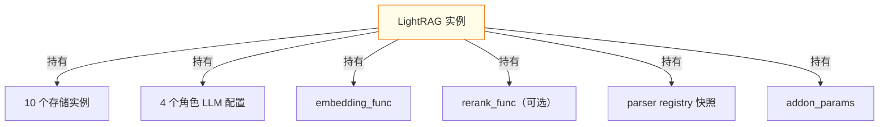

### 9.2 关键调用链（最常走的路径）

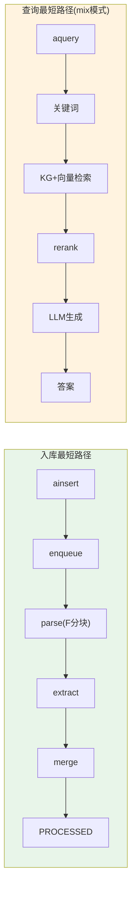

### 9.3 组件耦合度

| 组件 | 耦合度 | 说明 |
|---|---|---|
| `operate.py` | **最高** | 被 pipeline 和 lightrag 双向依赖，核心枢纽 |
| `pipeline.py` | 高 | 依赖 parser/chunker/operate，被 lightrag 依赖 |
| `kg/` 后端 | 低 | 通过 base.py 契约解耦，可自由替换 |
| `llm/` provider | 低 | 通过角色路由解耦，可自由替换 |
| `parser/` 引擎 | 低 | 通过 registry 解耦，可插件注册 |

---

## 十、源码索引

| 关系图 | 关键源码位置 |
|---|---|
| LightRAG 持有存储 | `lightrag.py:1095-1145 initialize_storages` |
| 三级队列调度 | `pipeline.py:1143 _run_pipeline_batch` |
| 解析引擎路由 | `parser/registry.py:177 _REGISTRY` / `parser/routing.py` |
| 分块策略选择 | `pipeline.py:2188` |
| 实体抽取 | `operate.py:3320 extract_entities` |
| 合并入库 | `operate.py:2914 merge_nodes_and_edges` |
| KG 检索 | `operate.py:3786 kg_query` / `:4315 _perform_kg_search` |
| naive 检索 | `operate.py:5740 naive_query` |
| 角色定义 | `llm_roles.py:52 ROLES` |
| 锁机制 | `kg/shared_storage.py get_namespace_lock / get_storage_keyed_lock` |
| 状态机 | `base.py DocProcessingStatus` / `pipeline.py 各 worker` |

---

## 相关文档

- 解析流水线全流程详解：`解析流水线全流程详解.md`（侧重逐步执行细节）
- 核心执行链路与架构速览：`核心执行链路与架构速览文档.md`（侧重调用图）
- 技术栈与能力全景：`技术栈与能力全景.md`（侧重技术选型）
- 文档解析能力与输出格式对照：`文档解析能力与输出格式对照.md`（侧重格式）
