# LightRAG 文档解析能力与输出格式对照

**项目**：LightRAG · **版本**：1.5.5 · **日期**：2026-07-08 · **作者**：15531

> 本文档回答两个问题：**「什么格式的文件能入库」** 与 **「每种格式解析后产出什么内容」**。所有结论均来自源码核实（`parser/legacy/extractors.py`、`parser/docx/`、`sidecar/writer.py`、`pipeline.py`）。全文使用 Mermaid 图表表达结构与流程。

---

## 一、解析引擎全景

LightRAG 有四类解析引擎，各有专长。下图展示引擎间的分工与能力侧重：

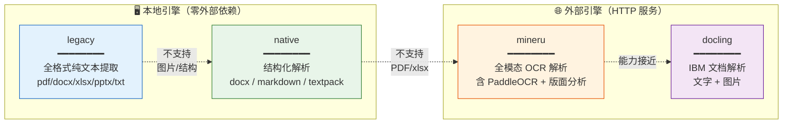

---

## 二、格式 × 引擎 能力矩阵

哪个引擎能解析哪种格式、产出什么内容，一图看清：

```mermaid
graph TD
    DOC["📄 文档输入"]

    DOC --> WORD["Word .docx"]
    DOC --> XLSX["Excel .xlsx"]
    DOC --> PPTX["PowerPoint .pptx"]
    DOC --> PDF["PDF .pdf"]
    DOC --> MD["Markdown / 纯文本"]

    WORD -->|"legacy ✅<br/>纯文本+表格"| W_LEG["段落 + 制表符表格"]
    WORD -->|"native ✅ 推荐<br/>Markdown+结构块"| W_NAT["标题层级 + MD表格 + 图片引用"]
    WORD -->|"mineru/docling ✅"| W_EXT["Markdown + 全模态"]

    XLSX -->|"legacy ✅ 唯一支持"| X_OUT["多sheet纯文本<br/>====================<br/>Sheet: 标题<br/>===================="]
    XLSX -->|"native ❌"| X_NO["不支持"]
    XLSX -->|"mineru/docling ✅"| X_EXT["结构化表格"]

    PPTX -->|"legacy ✅ 唯一支持"| P_OUT["逐页 shape 文字<br/>无图片/图表"]
    PPTX -->|"native ❌"| P_NO["不支持"]
    PPTX -->|"mineru/docling ✅"| P_EXT["Markdown"]

    PDF -->|"legacy ✅<br/>仅文字层"| PDF_LEG["pypdf 提取文字<br/>⚠️ 扫描件提空"]
    PDF -->|"native ❌"| PDF_NO["不支持"]
    PDF -->|"mineru ✅ 推荐<br/>全模态 OCR"| PDF_MIN["文字+图片+表格+公式<br/>PaddleOCR 驱动"]
    PDF -->|"docling ✅"| PDF_DOC["文字 + 图片"]

    MD -->|"legacy ✅ UTF-8 原样"| M_LEG["原文本"]
    MD -->|"native ✅ 原样+图片"| M_NAT["原文本 + 图片识别"]

    style DOC fill:#fffde7,stroke:#f57f17
    style W_NAT fill:#c8e6c9,stroke:#2e7d32
    style X_OUT fill:#e3f2fd,stroke:#1565c0
    style P_OUT fill:#e3f2fd,stroke:#1565c0
    style PDF_MIN fill:#ffe0b2,stroke:#e65100
```

### 能力速查（精简表）

| 格式 | legacy | native | mineru | docling | 推荐引擎 |
|---|:---:|:---:|:---:|:---:|---|
| **Word .docx** | ✅ 纯文本 | ✅ **Markdown+块** | ✅ | ✅ | **native** |
| **Excel .xlsx** | ✅ **多sheet文本** | ❌ | ✅ | ✅ | **legacy** |
| **PowerPoint .pptx** | ✅ **纯文本** | ❌ | ✅ | ✅ | **legacy** |
| **PDF 数字版** | ✅ 文字层 | ❌ | ✅ | ✅ | legacy 够用，mineru 更好 |
| **PDF 扫描件** | ❌ 提空 | ❌ | ✅ **OCR** | ❌ | **mineru** |
| **Markdown/文本** | ✅ 原样 | ✅ 原样+图 | — | ✅ | legacy 或 native |

---

## 三、各格式解析后的内容格式

### 3.1 Word (.docx) — 两种引擎差异对比

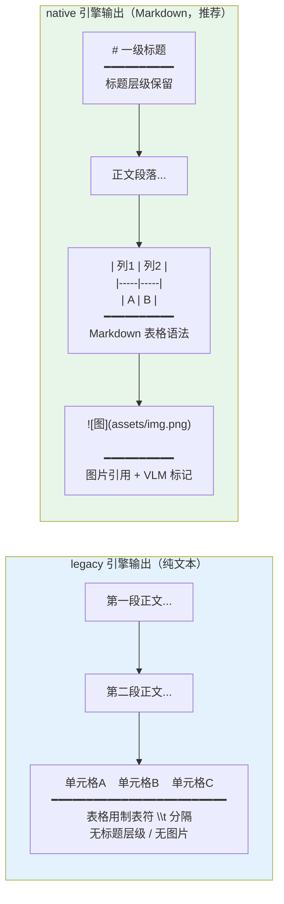

**native 额外产出**（送入 P 分块和 VLM 分析）：
- `<base>.blocks.jsonl` — 结构化块（标题/段落/表格/图片分类）
- `<base>.blocks.assets/` — 提取出的图片文件

### 3.2 Excel (.xlsx) — 多 sheet 纯文本

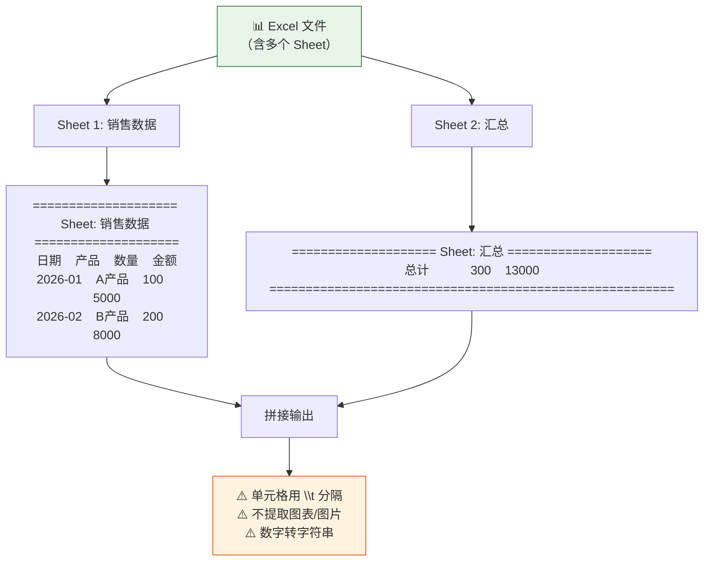

### 3.3 PowerPoint (.pptx) — 纯文本逐页

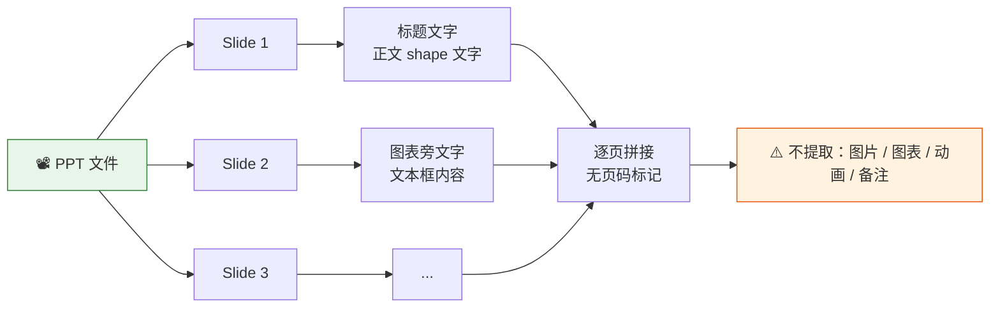

### 3.4 PDF — 能力取决于引擎

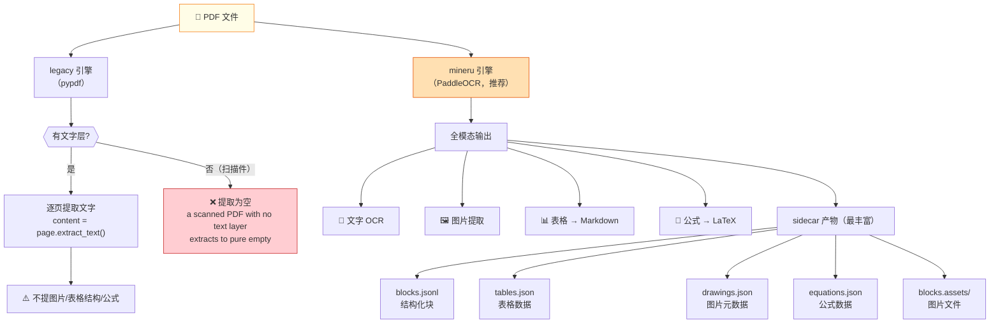

---

## 四、内容格式统一化流程

不同引擎解析后，如何统一成 LightRAG 内部格式：

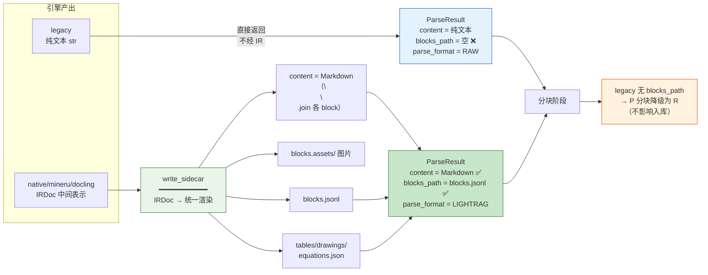

---

## 五、PDF 图片语义化入库（完整链路）

这是最复杂的场景，需要解析 → VLM 分析 → 抽取三段协同：

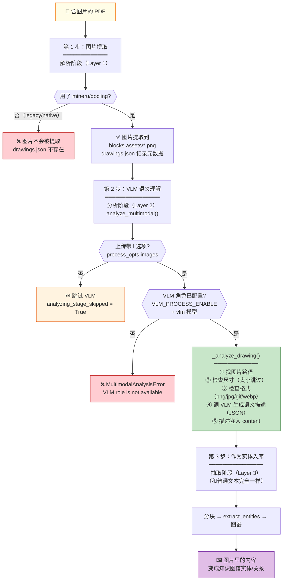

### 三个前提条件（缺一不可）

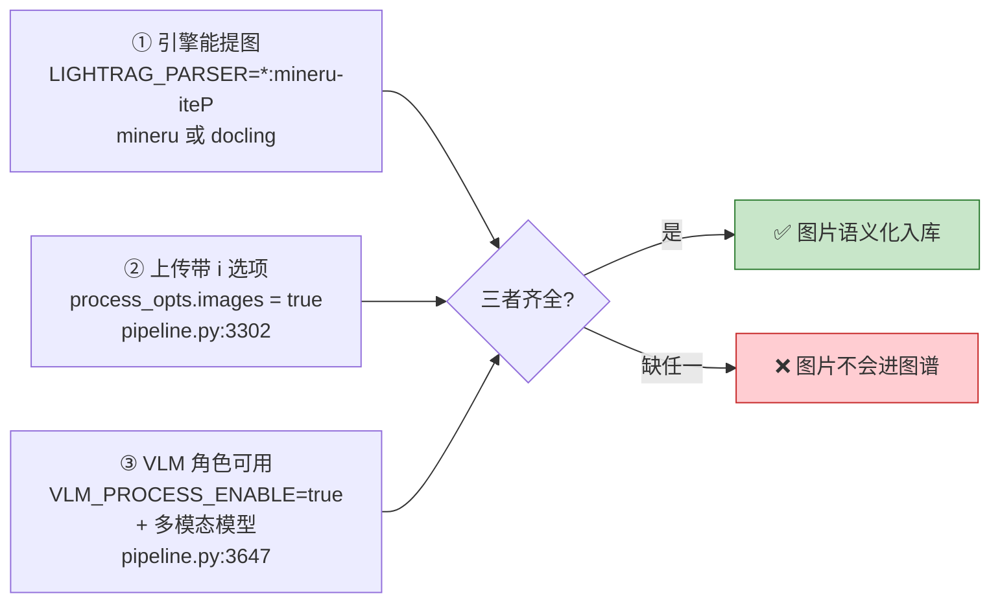

### VLM 三模态（pipeline.py:3319-3323）

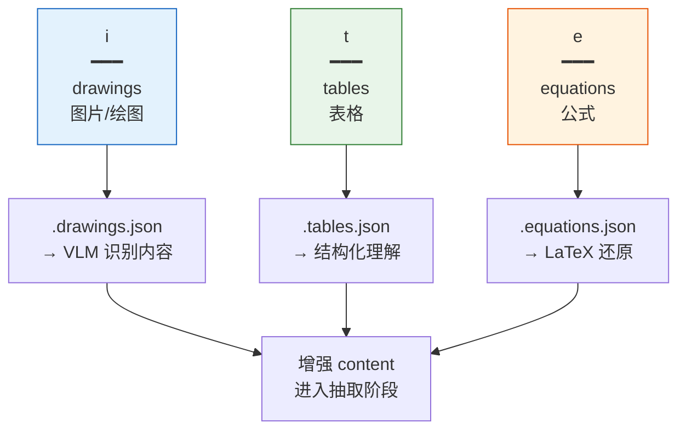

---

## 六、引擎选型决策树

根据你的文档类型选择最佳引擎：

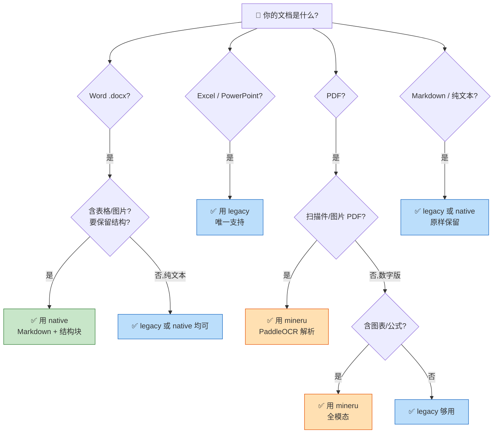

---

## 七、配置示例

### 场景对照

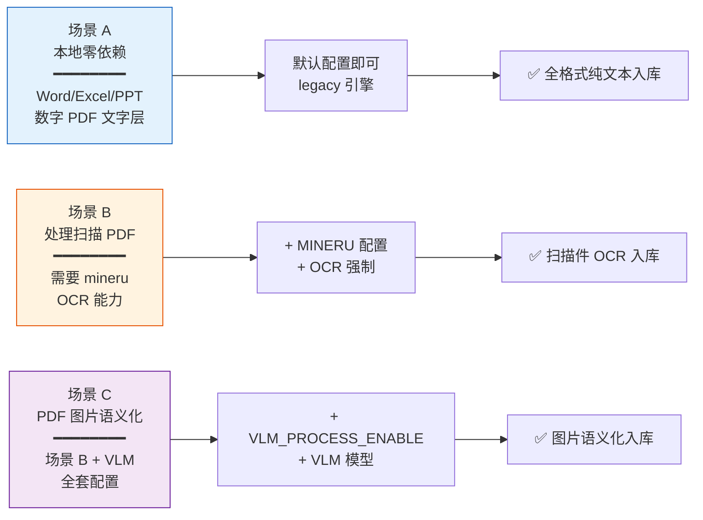

### 场景 A：只用本地引擎（零外部依赖）

```env
# 默认配置即可，Excel/PPT/纯文本 Word/PDF文字层 都能处理
LIGHTRAG_KV_STORAGE=JsonKVStorage
# （其他默认）
```

### 场景 B：处理扫描件/复杂 PDF（需 mineru）

```env
MINERU_API_MODE=local
MINERU_LOCAL_ENDPOINT=http://127.0.0.1:8000
MINERU_LOCAL_BACKEND=pipeline         # CPU 友好（含 PaddleOCR）
MINERU_LOCAL_PARSE_METHOD=ocr         # 强制 OCR（扫描件必备）
MINERU_ENABLE_TABLE=true
MINERU_ENABLE_FORMULA=true
# 路由：PDF 用 mineru，其他降级 legacy
LIGHTRAG_PARSER=*.pdf:mineru-iteP;*:legacy-R
```

### 场景 C：PDF 图片语义化（全套）

```env
# 在场景 B 基础上加：
VLM_PROCESS_ENABLE=true
VLM_BINDING=openai
VLM_MODEL=gpt-4o                       # 必须多模态模型
# 上传时带 i 选项（已在 mineru-iteP 的 i 里）
```

---

## 八、常见问题诊断流程

遇到问题时按此流程排查：

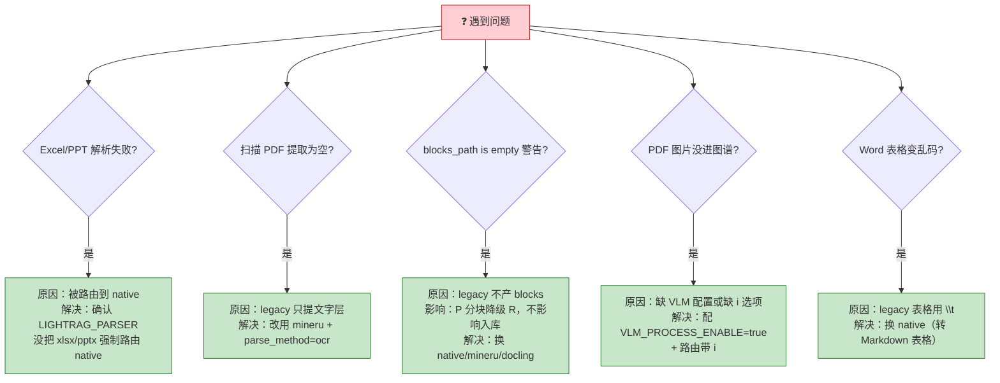

---

## 九、源码索引

所有结论的代码出处：

| 结论 | 源码位置 |
|---|---|
| legacy Word 提取（段落+表格） | `parser/legacy/extractors.py:41 _extract_docx` |
| legacy Excel 提取（多 sheet） | `parser/legacy/extractors.py:97 _extract_xlsx` |
| legacy PPT 提取 | `parser/legacy/extractors.py:83 _extract_pptx` |
| legacy PDF 文字层 | `parser/legacy/extractors.py:19 _extract_pdf_pypdf` |
| native docx 结构化 | `parser/docx/parser.py NativeDocxParser` |
| IR 统一中间表示 | `sidecar/ir.py:217 IRDoc` |
| Markdown 渲染 | `sidecar/writer.py:60 write_sidecar` / `:289 merged_text` |
| VLM 图片分析 | `pipeline.py:3247 analyze_multimodal` / `:3619 _analyze_drawing` |
| VLM 三模态选项 | `pipeline.py:3319-3323` |
| VLM 缺失报错 | `pipeline.py:3647` |

---

## 相关文档

- 解析流水线全流程详解：`解析流水线全流程详解.md`
- 技术栈与能力全景：`技术栈与能力全景.md`
- 作为 RAG 基座融合指南：`作为RAG基座与MCP工具的融合指南.md`
