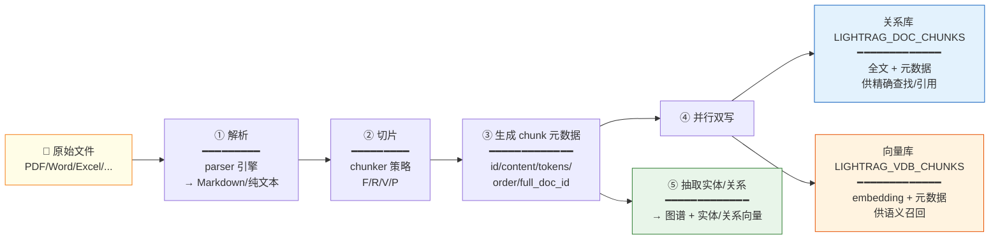
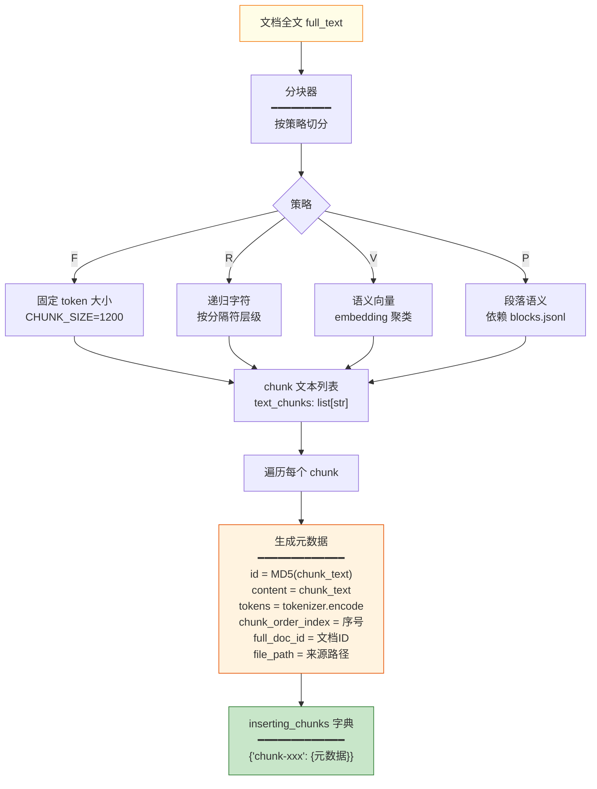
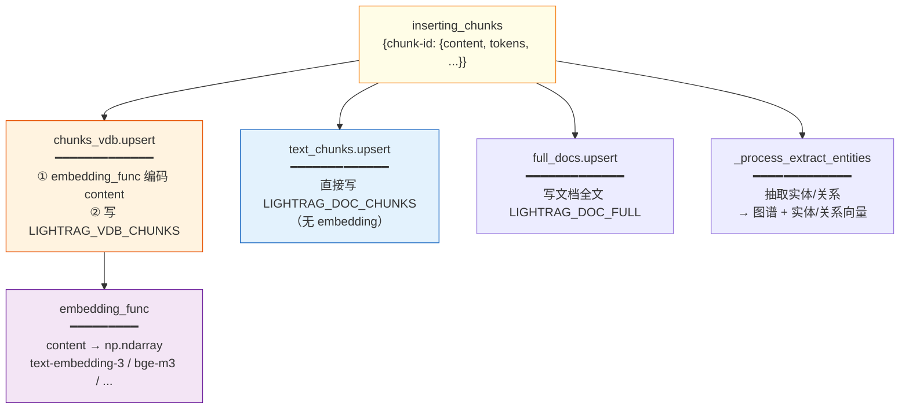
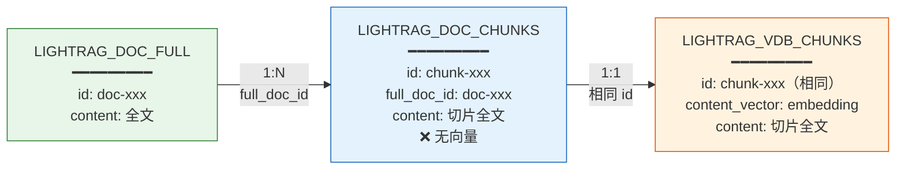
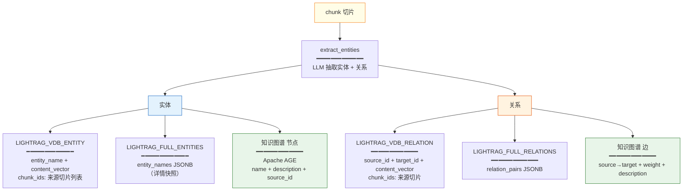
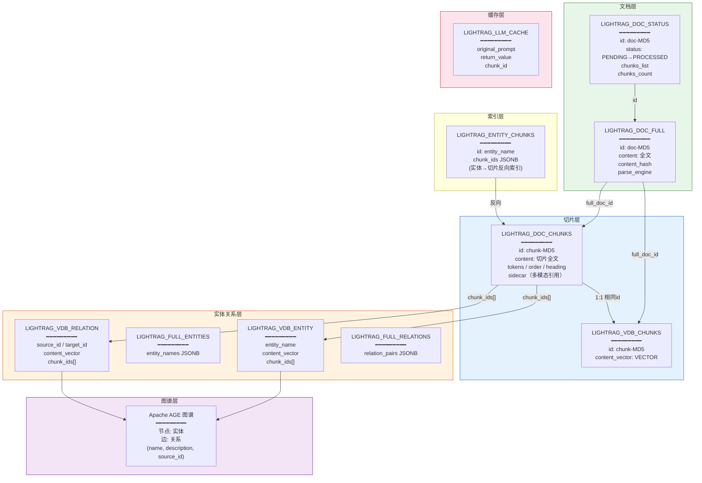
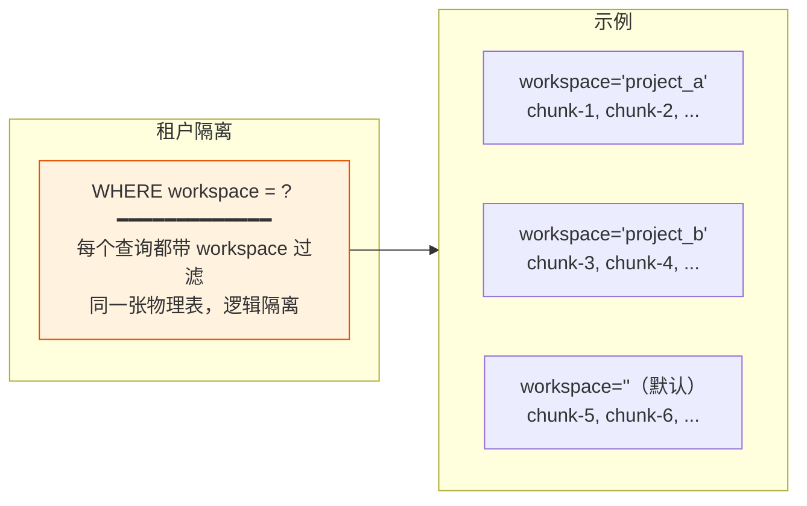
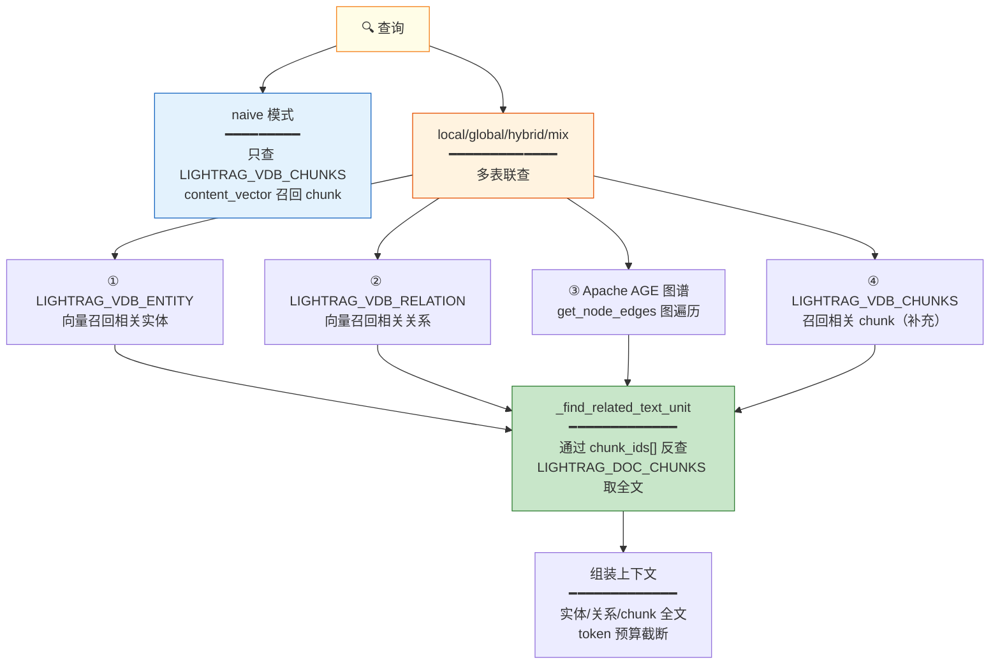
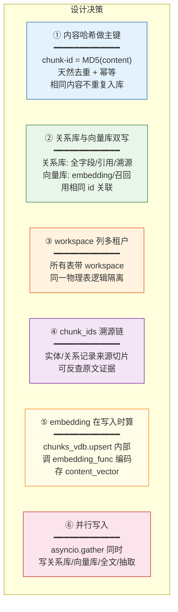

# LightRAG 切片存储设计

**项目**：LightRAG · **版本**：1.5.5 · **日期**：2026-07-10 · **作者**：15531

> 本文档详解 LightRAG **文件识别 → 切片 → 存储**的设计：一份文档如何被拆分、切出来的 chunk 携带哪些字段、如何同时落库到**关系型数据库（PostgreSQL）**和**向量库（pgvector）**、以及表结构细节。全部基于源码核实（`lightrag.py:1513`、`base.py:72`、`kg/postgres_impl.py:7964`）。

---

## 一、全景：从文件到存储

一份文档从进入系统到落库，经过五个阶段，产出**关系库 + 向量库**双写：



**关键设计：同一份 chunk 数据，同时写两张表**——关系库存全文+元数据，向量库存 embedding+元数据。两者用相同的 `id`（chunk 的 MD5）关联。

---

## 二、切片：一份文档切成什么

### 2.1 切片过程（`lightrag.py:1538`）



### 2.2 chunk 的数据结构（`base.py:72`）

每个切片是一个 `TextChunkSchema`，携带以下字段：

| 字段 | 类型 | 来源 | 用途 |
|---|---|---|---|
| `id` | str | `compute_mdhash_id(chunk_text, "chunk-")` | 全局唯一键（内容哈希） |
| `content` | str | 分块器输出 | 切片全文 |
| `tokens` | int | `len(tokenizer.encode(chunk_text))` | token 数（预算控制） |
| `full_doc_id` | str | 文档的 MD5 (`doc-xxx`) | 反查所属文档 |
| `chunk_order_index` | int | `enumerate` 序号 | 切片在文档中的顺序 |
| `file_path` | str | 原始文件路径 | 引用溯源 |

> **内容哈希去重**：相同内容 → 相同 `id` → `filter_keys` 自动跳过已存在的 chunk（`lightrag.py:1551`），避免重复入库。

---

## 三、存储设计：关系库 vs 向量库

### 3.1 双写架构（`lightrag.py:1559-1565`）

切片生成后，**四个任务并行执行**（`asyncio.gather`）：



### 3.2 关系库表：LIGHTRAG_DOC_CHUNKS

**存什么**：切片全文 + 元数据，**不含向量**。供精确查找、引用溯源、顺序还原。

```sql
CREATE TABLE LIGHTRAG_DOC_CHUNKS (
    id                 VARCHAR(255),      -- chunk-<MD5>，内容哈希
    workspace          VARCHAR(255),      -- 多租户隔离
    full_doc_id        VARCHAR(256),      -- 所属文档 doc-<MD5>
    chunk_order_index  INTEGER,           -- 切片在文档中的序号
    tokens             INTEGER,           -- token 数
    content            TEXT,              -- 切片全文
    file_path          TEXT NULL,         -- 来源文件路径（引用溯源）
    llm_cache_list     JSONB DEFAULT '[]',-- LLM 缓存引用
    heading            JSONB DEFAULT '{}',-- 标题层级（parent_headings）
    sidecar            JSONB DEFAULT '{}',-- 多模态引用（图片/表格/公式）
    create_time        TIMESTAMP,
    update_time        TIMESTAMP,
    CONSTRAINT LIGHTRAG_DOC_CHUNKS_PK PRIMARY KEY (workspace, id)
);
```

**主键设计**：`(workspace, id)` —— workspace 实现多租户，id 是内容哈希保证幂等。

### 3.3 向量库表：LIGHTRAG_VDB_CHUNKS

**存什么**：切片的 embedding + 精简元数据。供语义召回（naive 查询、KG 检索的 chunk 补充）。

```sql
CREATE TABLE LIGHTRAG_VDB_CHUNKS (
    id              VARCHAR(255),         -- chunk-<MD5>，与 DOC_CHUNKS 关联
    workspace       VARCHAR(255),
    full_doc_id     VARCHAR(256),         -- 所属文档
    chunk_order_index INTEGER,
    tokens          INTEGER,
    content         TEXT,                 -- 原文（冗余存，便于召回后直接用）
    content_vector  VECTOR(dimension),    -- ← pgvector，embedding 维度
    file_path       TEXT NULL,
    create_time     TIMESTAMP,
    update_time     TIMESTAMP,
    CONSTRAINT LIGHTRAG_VDB_CHUNKS_PK PRIMARY KEY (workspace, id)
);

-- 向量索引（HNSW 最常用，cosine 相似度）
CREATE INDEX idx_vdb_chunks_vector
    ON LIGHTRAG_VDB_CHUNKS USING hnsw (content_vector vector_cosine_ops)
    WITH (m = 16, ef_construction = 200);
```

> **`VECTOR(dimension)`** 的 dimension 由 embedding 模型决定（text-embedding-3-small=1536, bge-m3=1024）。建表时动态替换。

### 3.4 两表关系



**关联方式**：两表用**相同的 `id`（chunk 的内容哈希）**关联，而非外键。关系库存全字段，向量库只存召回必需字段 + 向量。

---

## 四、实体/关系的存储设计

切片不仅直接入库，还触发**实体/关系抽取**，产生更多存储写入：



### 实体向量表

```sql
CREATE TABLE LIGHTRAG_VDB_ENTITY (
    id              VARCHAR(255),
    workspace       VARCHAR(255),
    entity_name     VARCHAR(512),         -- 实体名
    content         TEXT,                 -- 实体描述（用于 embed）
    content_vector  VECTOR(dimension),    -- 实体描述的 embedding
    chunk_ids       VARCHAR(255)[] NULL,  -- ← 来源切片 ID 数组（溯源）
    file_path       TEXT NULL,
    ...
);
```

### 关系向量表

```sql
CREATE TABLE LIGHTRAG_VDB_RELATION (
    id              VARCHAR(255),
    workspace       VARCHAR(255),
    source_id       VARCHAR(512),         -- 源实体名
    target_id       VARCHAR(512),         -- 目标实体名
    content         TEXT,                 -- 关系描述（用于 embed）
    content_vector  VECTOR(dimension),    -- 关系描述的 embedding
    chunk_ids       VARCHAR(255)[] NULL,  -- ← 来源切片 ID 数组（溯源）
    file_path       TEXT NULL,
    ...
);
```

> **`chunk_ids` 数组**是关键溯源字段：实体/关系来自哪些切片，能反查回原文。

---

## 五、完整的表关系图（ER 图）

PostgreSQL 全栈部署时的所有表及其关系：



---

## 六、workspace 多租户设计

所有表都有 `workspace` 列，主键都是 `(workspace, id)`：



> 同一个 PG 实例、同一张表，不同 `workspace` 数据互不可见。切换 workspace 不影响已有数据。

---

## 七、查询时如何用这些存储

不同的检索模式读取不同的表：



**关键链路**：向量召回实体/关系 → 它们的 `chunk_ids[]` → 反查 `LIGHTRAG_DOC_CHUNKS` 拿切片全文 → 组装进上下文。

---

## 八、设计要点总结



---

## 九、源码索引

| 设计点 | 源码位置 |
|---|---|
| chunk 数据结构 | `base.py:72 TextChunkSchema` |
| chunk 生成 + 元数据 | `lightrag.py:1538-1548` |
| 并行双写（关系库+向量库+全文+抽取） | `lightrag.py:1559-1565 asyncio.gather` |
| 内容哈希去重 | `lightrag.py:1540 compute_mdhash_id` + `:1551 filter_keys` |
| embedding 编码入口 | `chunks_vdb.upsert`（内部调 `embedding_func`） |
| LIGHTRAG_DOC_CHUNKS DDL | `postgres_impl.py:7988` |
| LIGHTRAG_VDB_CHUNKS DDL | `postgres_impl.py:8005` |
| LIGHTRAG_VDB_ENTITY DDL | `postgres_impl.py:8020` |
| LIGHTRAG_VDB_RELATION DDL | `postgres_impl.py:8034` |
| HNSW 索引配置 | `postgres_impl.py` `POSTGRES_VECTOR_INDEX_TYPE=HNSW` |
| workspace 过滤 | `postgres_impl.py` 所有查询的 `WHERE workspace=$1` |

---

## 相关文档

- 项目架构图：`项目架构图.md`（整体分层）
- 流水线流程与网状关系：`流水线流程与网状关系.md`（存储读写角色）
- 文档解析能力与输出格式对照：`文档解析能力与输出格式对照.md`（解析阶段）
- 技术栈与能力全景：`技术栈与能力全景.md`（存储后端清单）
