# LightRAG 切片与图谱修改机制

**项目**：LightRAG · **版本**：1.5.5 · **日期**：2026-07-10 · **作者**：15531

> 本文档回答：**改一个 chunk 怎么办？改整篇文档怎么办？前端需要维护切片吗？知识图谱支持修改吗？怎么改？** 全部基于源码核实（`lightrag.py:3111 adelete_by_doc_id`、`graph_routes.py`、`operate.py:1063 rebuild_knowledge_from_chunks`）。

---

## 一、核心结论先行

| 问题 | 答案 | 原因 |
|---|---|---|
| 改一个 chunk | **删旧 chunk → 重新入库新 chunk** | chunk 用内容哈希做 ID，内容变了就是新 chunk |
| 改整篇文档 | **删旧文档（级联清理切片+图谱）→ 重新解析入库** | `adelete_by_doc_id` 自动级联 |
| 前端要维护切片吗？ | **不需要精细到 chunk 级**，文档级管理足够 | chunk 是自动生成的，无独立生命周期 |
| 图谱支持修改吗？ | **支持，而且很完整** | 有完整 CRUD + 合并 API |
| 图谱怎么改？ | **API 调用 / WebUI 可视化编辑** | `update_entity` / `merge_entities` / `delete_entity` 等 |

---

## 二、LightRAG 的修改哲学：删-改-增

LightRAG **没有原地修改（update in place）**，一切修改都是**删 + 增**：

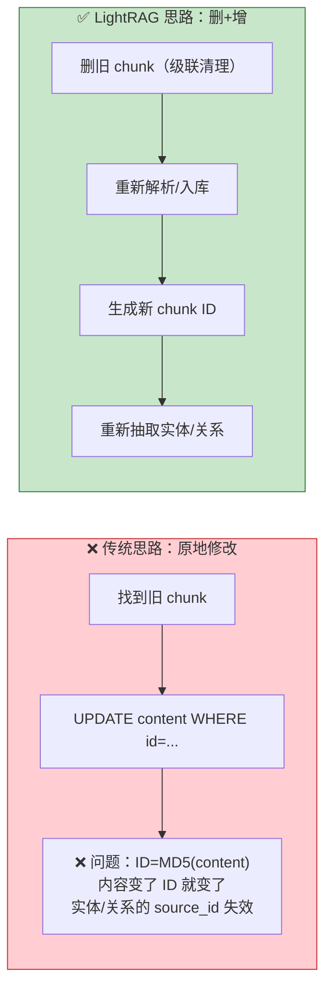

**为什么不能原地改**：chunk 的 ID 是 `MD5(content)`，内容一改 ID 就变，而图谱节点/边的 `source_id` 字段引用的是旧 chunk ID，会断裂。

---

## 三、改整篇文档：级联删除流程

`adelete_by_doc_id`（`lightrag.py:3111`）做的是**全链路级联清理**：

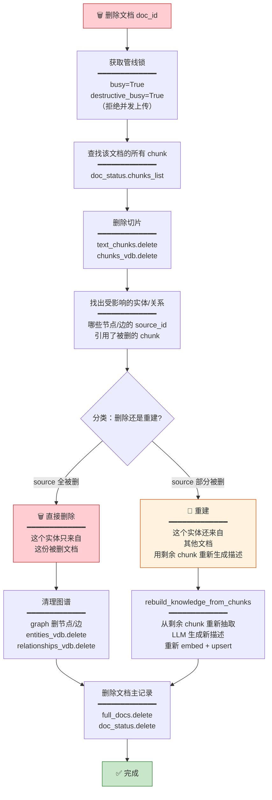

### 关键设计：删除 vs 重建的判定（`lightrag.py:2801`）

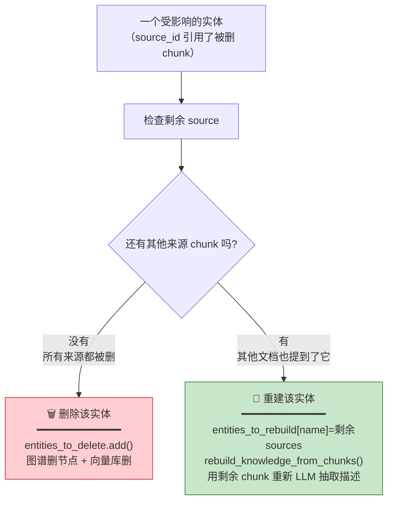

> **这个设计很聪明**：如果一个实体被多份文档提到，删其中一份不会丢失这个实体，而是用**剩余文档的 chunk 重新生成描述**。只有「只来自被删文档」的实体才会真正删除。

---

## 四、改一个 chunk：两种粒度

### 4.1 粗粒度（推荐）：文档级重处理

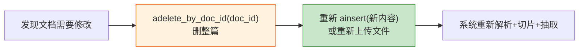

### 4.2 细粒度（SDK 支持）：单个 chunk 删除

```python
# LightRAG 没有「改一个 chunk」的 API，但可以：
# 1. 删旧 chunk
await rag.text_chunks.delete([old_chunk_id])
await rag.chunks_vdb.delete([old_chunk_id])
# 2. 加新 chunk（手动）
await rag.ainsert_custom_chunks(new_chunk_text, doc_id=doc_id)
# ⚠️ 但实体/关系不会自动更新（它们还引用旧 chunk_id）
```

> **细粒度修改有陷阱**：直接删 chunk 不会触发实体/关系的级联重建（只有 `adelete_by_doc_id` 才有级联逻辑）。所以**文档级重处理是推荐做法**。

---

## 五、前端切片维护：需要到什么粒度

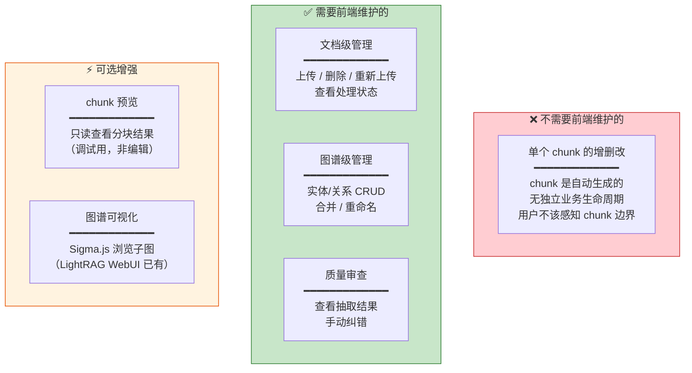

### 前端应该提供的能力对照

| 操作 | 粒度 | 前端需要? | 底层 API |
|---|---|---|---|
| 上传文档 | 文档级 | ✅ 需要 | `POST /documents/upload` |
| 删除文档 | 文档级 | ✅ 需要 | `DELETE /documents/{doc_id}` |
| 查看文档状态 | 文档级 | ✅ 需要 | `GET /documents` |
| 重新上传（覆盖）| 文档级 | ✅ 需要 | 删后传 |
| 查看 chunk 内容 | chunk 级 | ⚡ 可选（只读） | full_docs 的 chunks_list |
| 编辑单个 chunk | chunk 级 | ❌ 不需要 | 无（且不推荐） |
| 编辑实体 | 图谱级 | ✅ 需要 | `POST /graph/entity` |
| 编辑关系 | 图谱级 | ✅ 需要 | `POST /graph/relation` |
| 合并实体 | 图谱级 | ✅ 需要 | `POST /graph/merge` |

---

## 六、知识图谱修改：完整的 CRUD

LightRAG 的图谱修改能力**非常完整**（`graph_routes.py`）：

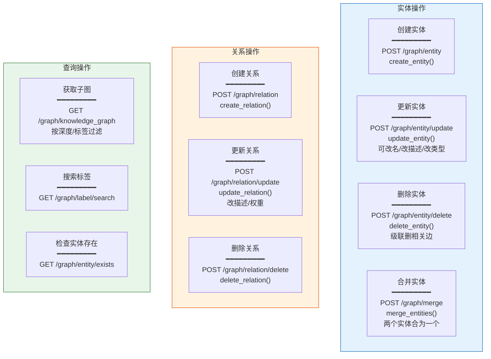

---

## 七、图谱修改的底层机制

### 7.1 更新实体（`update_entity`，`graph_routes.py:250`）

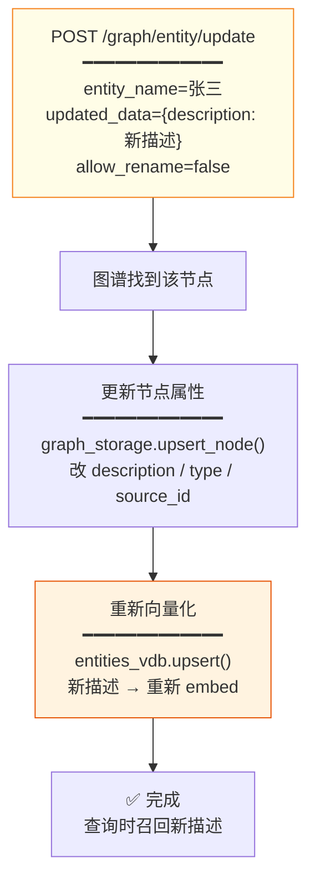

> 改了描述会**自动重新向量化**，保证后续查询用新描述召回。

### 7.2 合并实体（`merge_entities`，`graph_routes.py:649`）

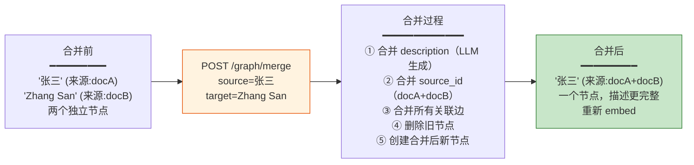

> 合并是**图谱维护的核心操作**——处理「同一实体被抽成不同名字」（张三 vs Zhang San）的同义问题。

### 7.3 删除实体（`delete_entity`，`graph_routes.py:737`）

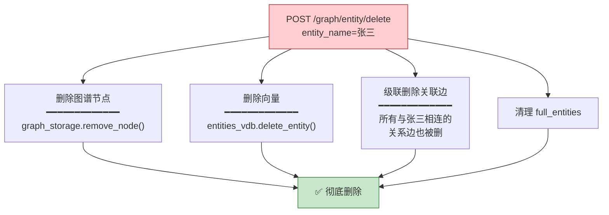

---

## 八、完整修改场景对照

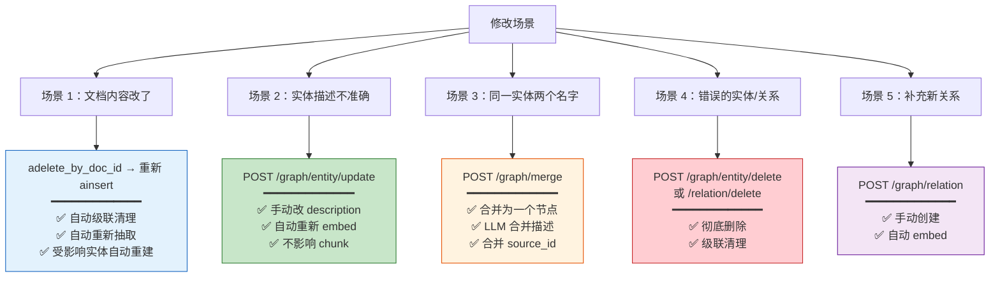

---

## 九、前端维护建议

### 9.1 推荐的前端能力分层

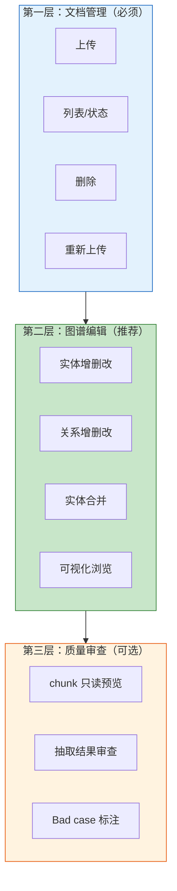

### 9.2 为什么不做 chunk 级编辑

| 理由 | 说明 |
|---|---|
| chunk 无业务语义 | 切片边界由算法决定，用户不该关心第 3 个 chunk 在哪 |
| 修改破坏哈希 | ID=MD5(content)，改内容→ID 变→source_id 断裂 |
| 无级联 | 删单个 chunk 不会触发实体重建，只有文档级删除才有 |
| 成本不划算 | 改一个 chunk 的复杂度 ≈ 重新入库整篇文档 |

---

## 十、操作示例

### 10.1 删文档重新入库（Python SDK）

```python
# 删旧文档（自动级联清理切片+图谱）
await rag.adelete_by_doc_id("doc-xxx")
# 重新入库
await rag.ainsert(new_content, ids=["doc-xxx"])
```

### 10.2 图谱修改（REST API）

```bash
# 更新实体描述
curl -X POST http://localhost:9621/graph/entity/update \
  -H "Authorization: Bearer <JWT>" \
  -d '{"entity_name":"张三","updated_data":{"description":"更新后的描述"}}'

# 合并两个实体
curl -X POST http://localhost:9621/graph/merge \
  -d '{"source_entity":"张三","target_entity":"Zhang San"}'

# 删除关系
curl -X POST http://localhost:9621/graph/relation/delete \
  -d '{"source_id":"张三","target_id":"李四"}'
```

### 10.3 自定义 KG 导入（跳过抽取，手动建图谱）

```python
custom_kg = {
    "entities": [
        {"entity_name": "张三", "description": "...", "source_id": "chunk-xxx"},
    ],
    "relationships": [
        {"src_id": "张三", "tgt_id": "李四", "description": "同事", "source_id": "chunk-xxx"},
    ],
}
await rag.ainsert_custom_kg(custom_kg)
```

---

## 十一、源码索引

| 能力 | 源码位置 |
|---|---|
| 文档级联删除 | `lightrag.py:3111 adelete_by_doc_id` |
| 删除 vs 重建判定 | `lightrag.py:2801` 分类逻辑 |
| 用剩余 chunk 重建实体 | `operate.py:1063 rebuild_knowledge_from_chunks` |
| 实体 CRUD API | `graph_routes.py:250 update_entity` / `:481 create_entity` / `:737 delete_entity` |
| 实体合并 | `graph_routes.py:649 merge_entities` |
| 关系 CRUD API | `graph_routes.py:443 update_relation` / `:557 create_relation` / `:773 delete_relation` |
| 自定义 KG 导入 | `lightrag.py:1786 ainsert_custom_kg` |

---

## 相关文档

- 切片存储设计：`切片存储设计.md`（chunk 如何落库）
- 流水线流程与网状关系：`流水线流程与网状关系.md`（存储读写角色）
- 项目架构图：`项目架构图.md`（整体分层）
- 作为 RAG 基座融合指南：`作为RAG基座与MCP工具的融合指南.md`（SDK/API 调用）
