# 知识图谱：抽取、存储、检索、增删改

**项目**：LightRAG · **版本**：1.5.5 · **日期**：2026-07-10 · **作者**：15531

> 本文档完整回答：**实体关系怎么抽取的？知识图谱存在哪？是三元组吗？检索流程是什么？怎么增删改？新文档和旧文档的关系怎么关联？向量相似≠图谱关系。** 全部基于源码核实（`operate.py`、`networkx_impl.py`、`lightrag.py:2000`）。

---

## 一、核心澄清：先纠正一个误解

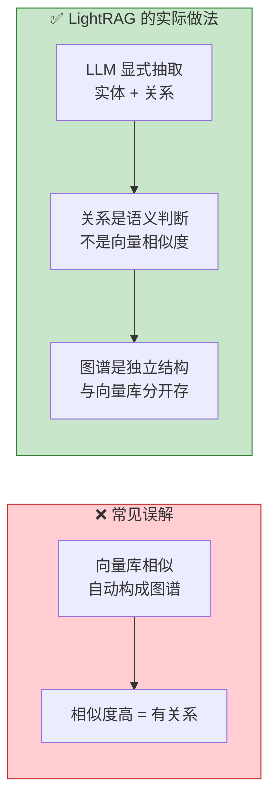

**LightRAG 的知识图谱不是「向量相似自动连边」**，而是 **LLM 读文本后显式判断「A 和 B 有什么关系」**，把关系作为结构化数据存进图数据库。向量库只负责召回，图谱负责关系推理。

---

## 二、抽取：LLM 怎么生成知识图谱

### 2.1 抽取过程（`operate.py:3320 extract_entities`）

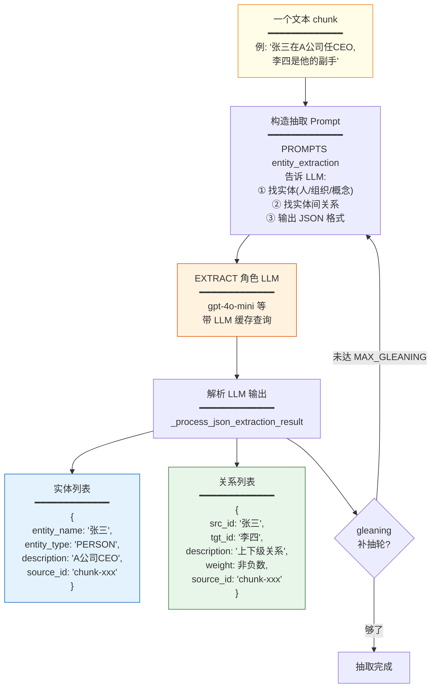

### 2.2 是三元组吗？

**接近三元组，但更丰富。** 传统三元组是 `(主语, 谓词, 宾语)`，LightRAG 的结构是：

| 元素 | 传统三元组 | LightRAG 实体 | LightRAG 关系 |
|---|---|---|---|
| 核心字段 | subject | entity_name | src_id → tgt_id |
| 谓词 | predicate | — | description（自然语言描述） |
| 宾语 | object | — | — |
| 额外信息 | 无 | entity_type、description、source_id | weight、source_id |

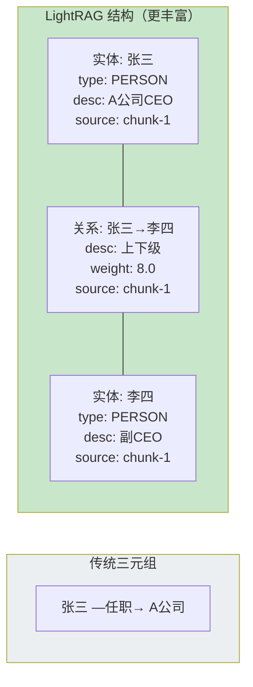

> **关键区别**：关系的「谓词」是**自然语言描述**（"上下级关系"），而非固定谓词（"管理"）。这让关系表达更灵活，也意味着关系需要 embedding 来做语义召回。

---

## 三、存储：知识图谱存在哪

### 3.1 三个地方同时存（不是只有 Neo4j）

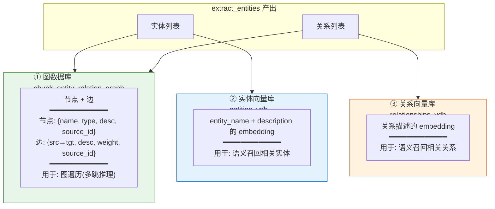

### 3.2 图数据库后端选择

**不一定用 Neo4j**，取决于配置：

| 后端 | 配置值 | 适用场景 |
|---|---|---|
| **NetworkX**（默认） | `graph_storage=NetworkXStorage` | 单机、内存、零依赖 |
| **Neo4j** | `graph_storage=Neo4JStorage` | 大规模图谱、专业图查询 |
| **PostgreSQL AGE** | `graph_storage=PGGraphStorage` | 生产统一存储 |
| **Memgraph** | `graph_storage=MemgraphStorage` | 高性能图查询 |
| **MongoDB** | `graph_storage=MongoGraphStorage` | 统一文档存储 |

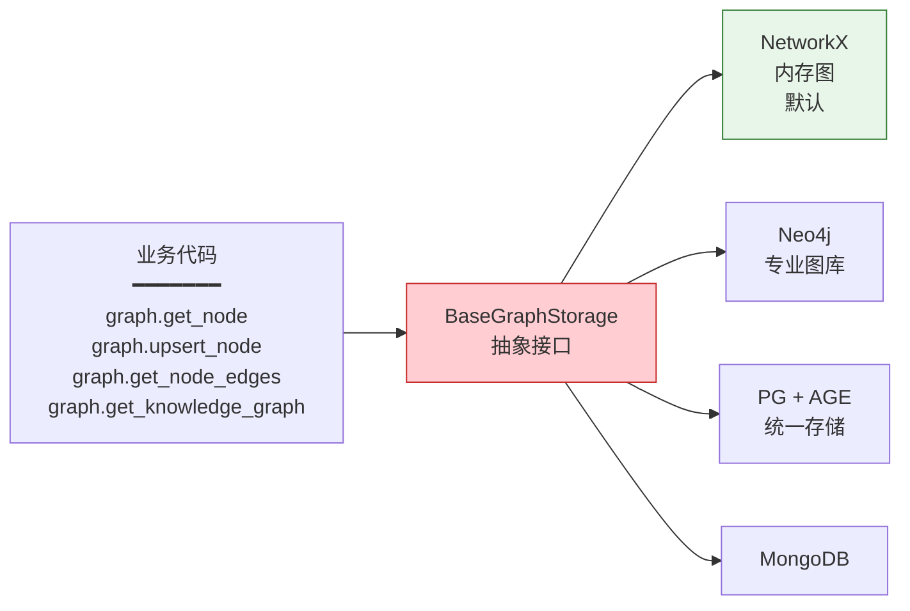

> 业务代码只调抽象方法（`get_node` / `upsert_edge`），完全不感知底层是 NetworkX 还是 Neo4j。

### 3.3 节点和边的结构

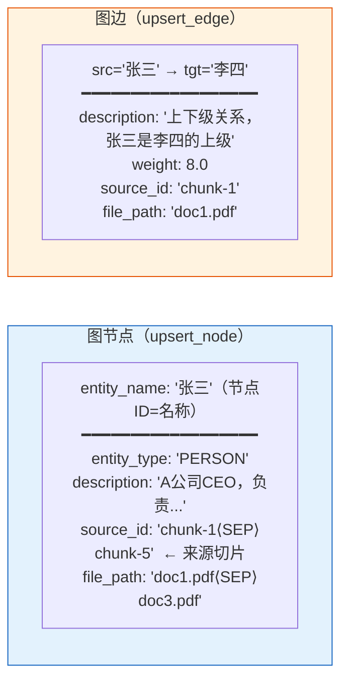

> **`source_id` 是溯源关键**：记录这个实体/关系来自哪些 chunk，用 `⟨SEP⟩` 分隔多个来源。

---

## 四、跨文档关系：新文档怎么和旧文档关联

**这是最核心的问题**——LightRAG 不是每个文档建独立图，而是**所有文档共享一张图**，同名实体自动合并。

### 4.1 合并逻辑（`operate.py:2000 _merge_nodes_then_upsert`）

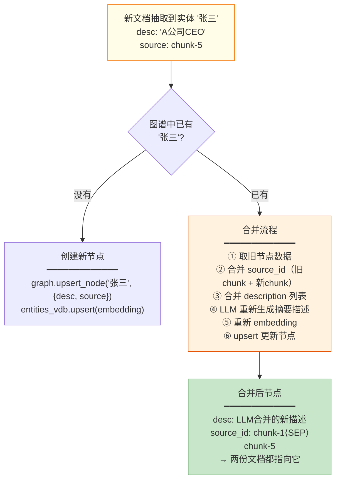

### 4.2 合并的细节步骤

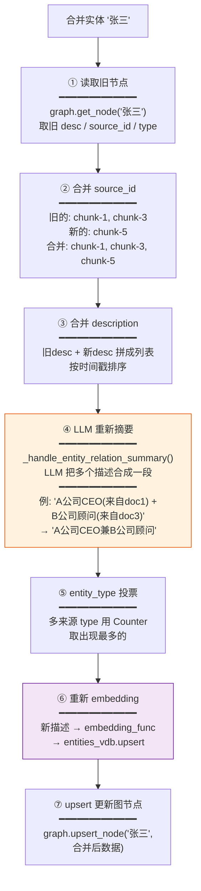

### 4.3 跨文档关系怎么建立

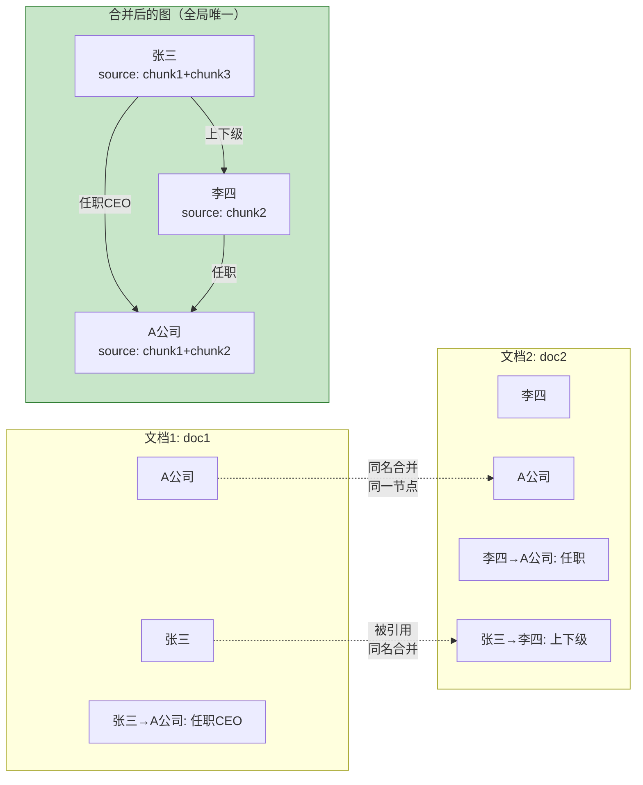

> **跨文档关系靠「同名实体合并」建立**：两份文档都提到「A公司」，这个节点会自动合并，`source_id` 累积两个来源。这样 doc1 的「张三→A公司」和 doc2 的「李四→A公司」就通过共享的「A公司」节点关联起来了。

### 4.4 并发安全：keyed lock

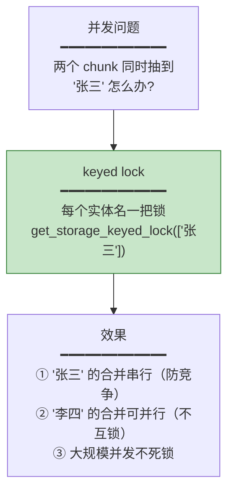

---

## 五、检索：怎么用图谱回答问题

### 5.1 检索不是「查图」，是「向量召回 + 图遍历」组合

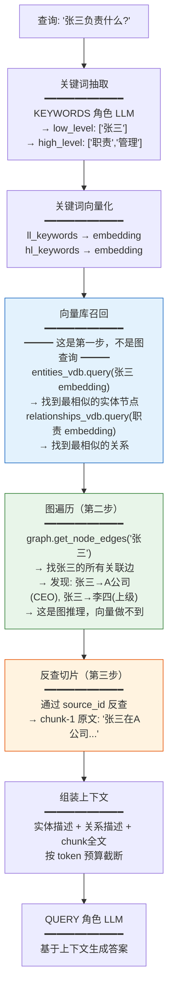

### 5.2 向量库和图谱的分工

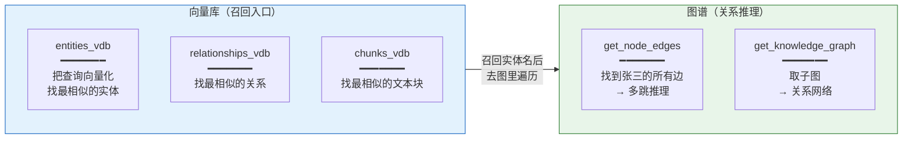

> **向量库 = 找入口节点**（张三在哪）；**图谱 = 关系推理**（张三和谁有关系）。两者协作，缺一不可。

### 5.3 为什么不能只靠向量

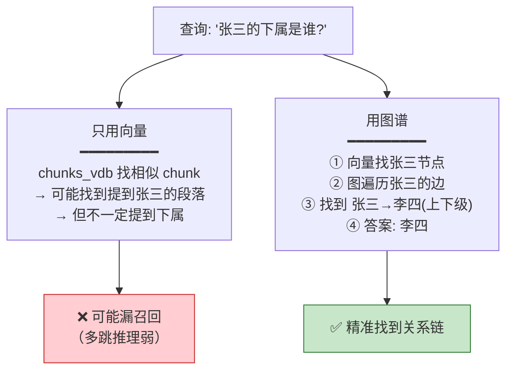

---

## 六、增删改：怎么维护图谱

### 6.1 增（新文档入库）

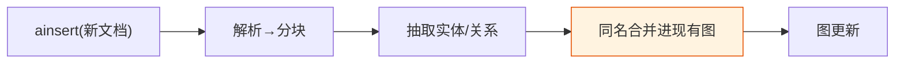

详见第四节——自动和旧文档建立关系。

### 6.2 删（删文档，级联清理）

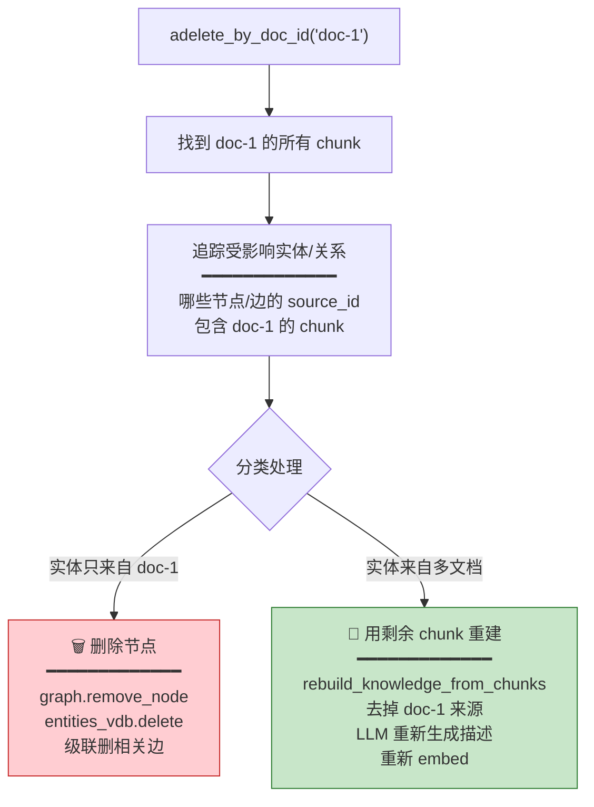

> **聪明的处理**：多来源实体不会因删一个文档而消失，而是**用剩余来源重新生成**。

### 6.3 改（图谱 CRUD API）

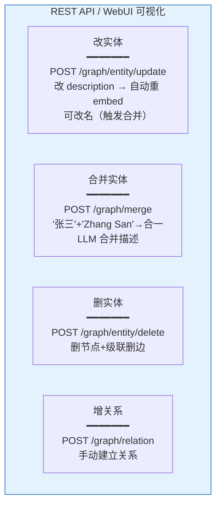

---

## 七、完整生命周期一图总结

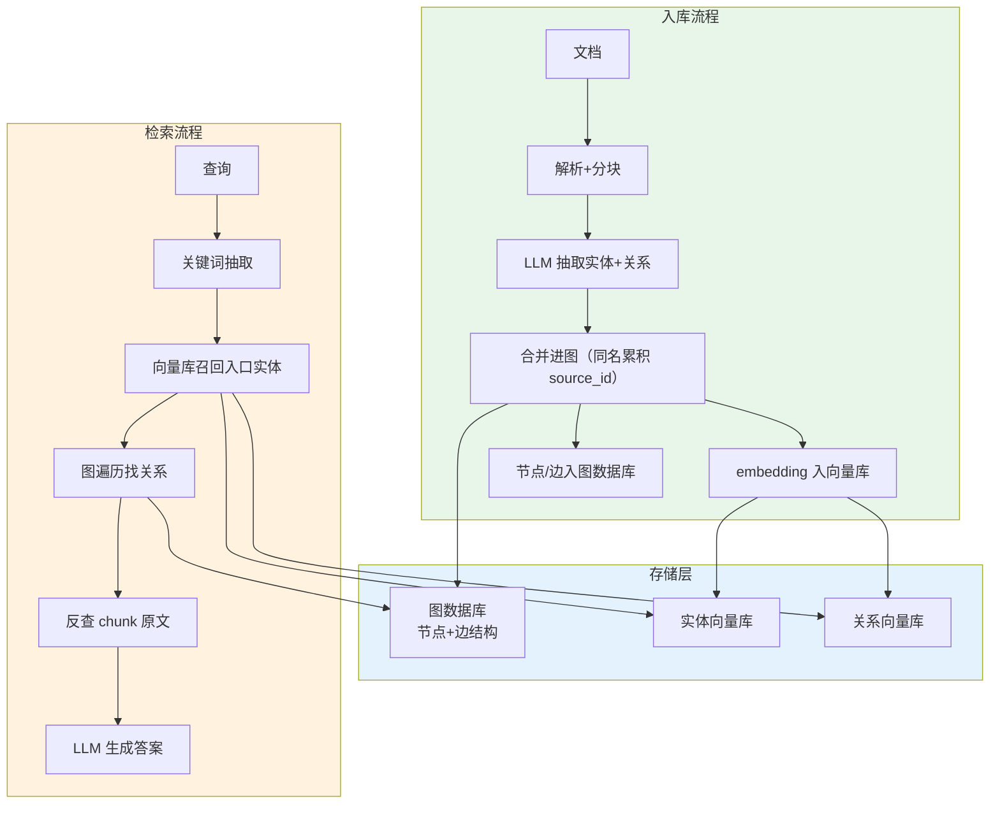

---

## 八、关键结论速查

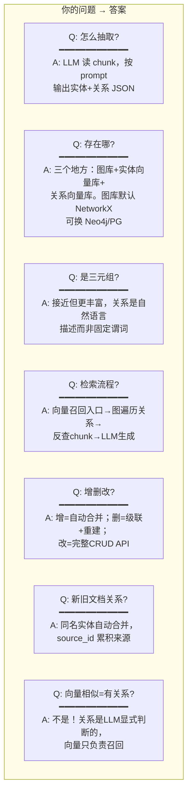

---

## 九、源码索引

| 机制 | 源码位置 |
|---|---|
| 实体抽取 prompt | `prompt.py:54 entity_extraction_system_prompt` |
| 抽取主函数 | `operate.py:3320 extract_entities` |
| JSON 结果解析 | `operate.py:714 _process_json_extraction_result` |
| 跨文档合并 | `operate.py:2000 _merge_nodes_then_upsert` |
| LLM 描述重摘要 | `operate.py:265 _handle_entity_relation_summary` |
| entity_type 投票 | `operate.py:2143 Counter` |
| keyed lock 防竞争 | `operate.py:3015 get_storage_keyed_lock` |
| 检索主函数 | `operate.py:4315 _perform_kg_search` |
| 向量召回实体 | `operate.py:5155 entities_vdb.query` |
| 图遍历找边 | `operate.py:1581 get_node_edges` |
| 删文档级联 | `lightrag.py:2801 删除vs重建分类` |
| 重建实体 | `operate.py:1063 rebuild_knowledge_from_chunks` |
| 图谱 CRUD API | `api/routers/graph_routes.py` |
| NetworkX 节点结构 | `kg/networkx_impl.py:259 upsert_node` |

---

## 相关文档

- 切片与图谱修改机制：`04-切片与图谱修改机制.md`（增删改详解）
- 切片存储设计：`03-切片存储设计.md`（chunk 如何落库）
- 项目架构图：`../02-架构设计/01-项目架构图.md`（存储契约）
- 流水线流程与网状关系：`../02-架构设计/03-流水线流程与网状关系.md`
