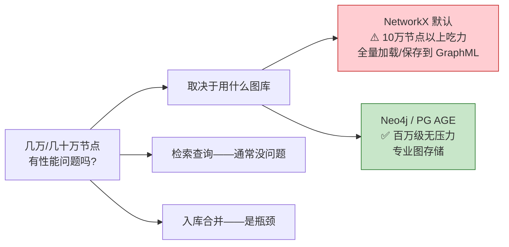
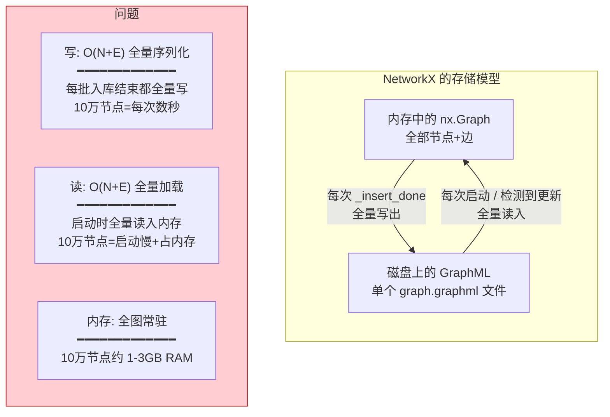
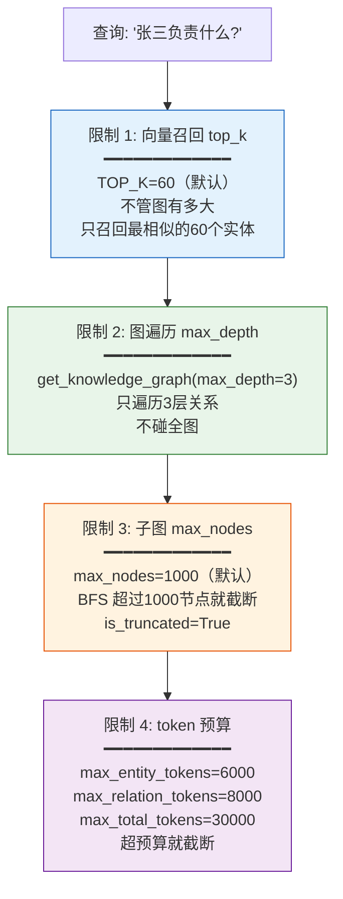
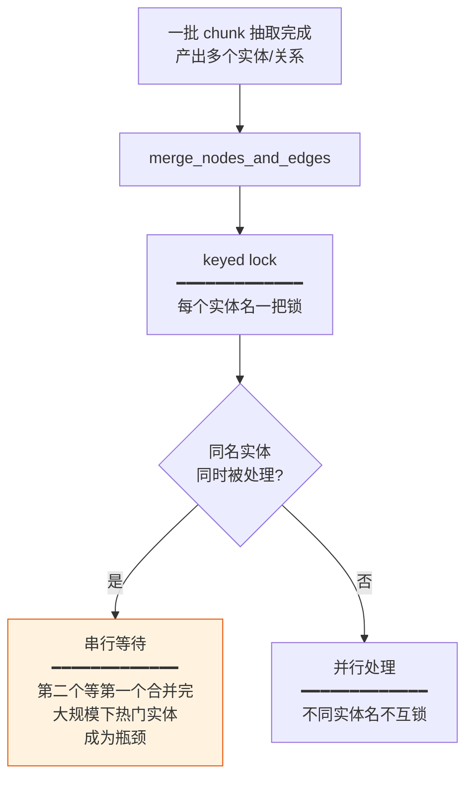
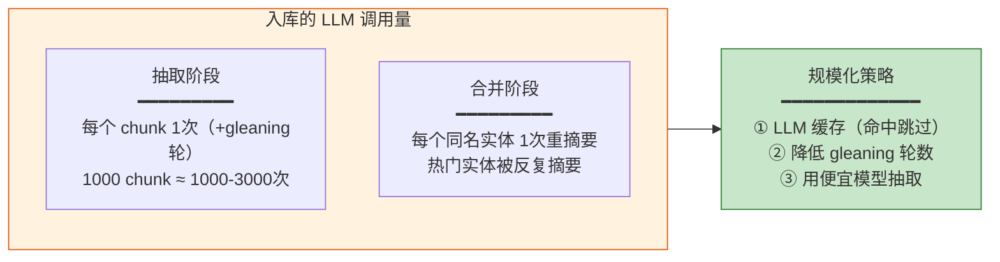
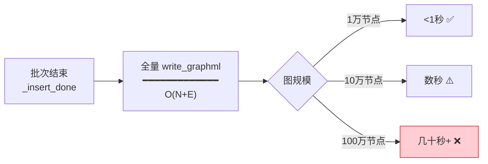
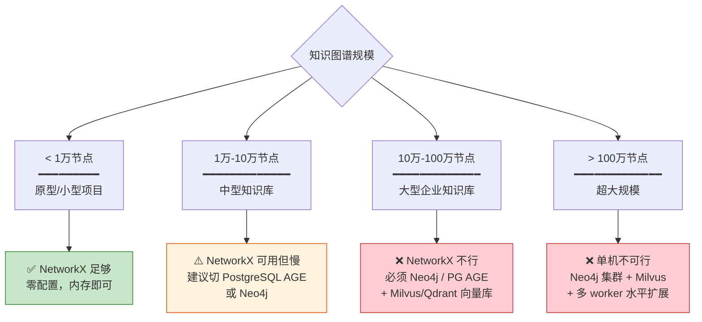
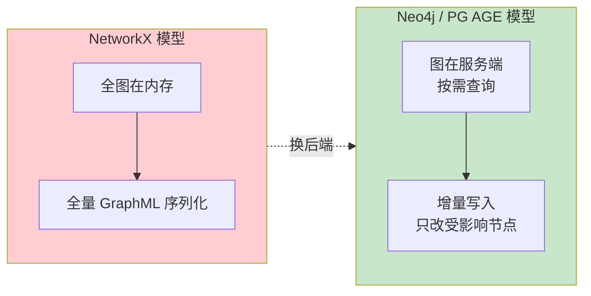
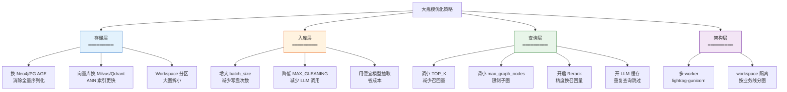
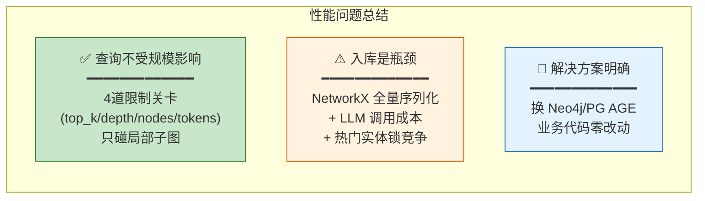

# 大规模图谱性能分析

**项目**：LightRAG · **版本**：1.5.5 · **日期**：2026-07-10 · **作者**：15531

> 本文档回答：**知识图谱几万、几十万节点时会有性能问题吗？瓶颈在哪？怎么解决？** 全部基于源码核实（`networkx_impl.py`、`operate.py`、`base.py:107`）。

---

## 一、结论先行



| 场景 | NetworkX（默认） | Neo4j/PG AGE |
|---|---|---|
| **检索查询** | ✅ 查询有限制（max_depth=3, max_nodes=1000），不受总节点数影响 | ✅ 同样快 |
| **入库合并** | ⚠️ 全量 GraphML 序列化，10万+慢 | ✅ 增量写，无全量序列化 |
| **启动加载** | ❌ 全量加载到内存，O(N) | ✅ 按需查询 |
| **内存占用** | ❌ 全图在内存 | ✅ 服务端管理 |
| **推荐规模** | < 10万节点 | 百万级+ |

---

## 二、为什么 NetworkX 大了会慢

### 2.1 根本原因：全量序列化



源码证据（`networkx_impl.py`）：
- `write_nx_graph`（:131）：`nx.write_graphml(graph, tmp)` —— **全量写出**
- `load_nx_graph`（:125）：`nx.read_graphml(file_name)` —— **全量读入**
- 每次入库批次的 `_insert_done` 触发全量写盘

### 2.2 各操作的真实复杂度

| 操作 | 复杂度 | 说明 | 大规模影响 |
|---|---|---|---|
| `get_node(name)` | O(1) | 字典查找 | ✅ 不受规模影响 |
| `get_node_edges(name)` | O(degree) | 取该节点的边 | ✅ 只看该节点度数 |
| `get_knowledge_graph(label)` | O(BFS 到 max_depth) | 但有 **max_nodes=1000** 截断 | ✅ 有硬限制 |
| `upsert_node` | O(1) | 内存字典操作 | ✅ 快 |
| `_insert_done` 写盘 | **O(N+E) 全量** | **每次批次结束** | ⚠️ **这是瓶颈** |
| 启动加载 | **O(N+E) 全量** | 全量 read_graphml | ⚠️ 启动慢 |

> **关键洞察：查询操作本身不受总规模影响**（因为有限制和局部遍历）。瓶颈在**入库时的全量序列化**和**启动时的全量加载**。

---

## 三、查询侧：为什么不太受影响

### 3.1 多重规模限制



**四道关卡保证查询规模可控**：
1. 向量召回只取 top_k 个（默认 60），不管全图几百万节点
2. 图遍历最多 3 层深度
3. 子图最多 1000 节点就截断
4. 最终 token 预算截断

> 所以**查询 1 万节点和 100 万节点的图，延迟差异不大**——因为查询只碰局部子图。

### 3.2 查询的真实复杂度

```
向量召回:  O(top_k × log N)    ← 向量库 ANN 索引，与图规模无关
图遍历:    O(min(max_nodes, BFS3层))  ← 最多1000节点
反查chunk: O(命中实体数)         ← 通常几十个
```

---

## 四、入库侧：真正的瓶颈

### 4.1 合并过程的锁竞争



> 大规模语料下，**高频实体**（如"中国"、"美国"、"AI"）会被大量 chunk 同时抽到，成为锁热点。但大多数实体是低频的，可以并行。

### 4.2 LLM 调用成本



### 4.3 NetworkX 全量写盘

每次批次入库结束（`_insert_done`），NetworkX 会**全量写出 GraphML**：



---

## 五、瓶颈定位与解决方案

### 5.1 不同规模的推荐方案



### 5.2 换专业图库的效果



**切换方式**（只改一个配置）：

```env
# 从 NetworkX 换到 Neo4j
LIGHTRAG_GRAPH_STORAGE=Neo4JStorage
NEO4J_URI=bolt://localhost:7687
NEO4J_USERNAME=neo4j
NEO4J_PASSWORD=xxx
```

> 业务代码零改动——所有图操作都走 `BaseGraphStorage` 抽象接口。

---

## 六、优化策略全景



---

## 七、实用调参建议

### 7.1 查询参数（`QueryParam` / 环境变量）

| 参数 | 默认 | 大规模建议 | 作用 |
|---|---|---|---|
| `TOP_K` | 60 | 40-60 | 实体/关系召回数 |
| `CHUNK_TOP_K` | 12 | 8-12 | chunk 召回数 |
| `max_graph_nodes` | 1000 | 500-1000 | 子图节点上限 |
| `max_entity_tokens` | 6000 | 不变 | 实体 token 预算 |
| `max_total_tokens` | 30000 | 不变 | 总 token 预算 |

### 7.2 入库参数

| 参数 | 默认 | 大规模建议 | 作用 |
|---|---|---|---|
| `max_parallel_insert` | 3 | 5-10 | 并行入库数 |
| `MAX_GLEANING` | 1 | 0-1 | 补抽轮数（减成本） |
| `chunk_token_size` | 1200 | 1000-1500 | chunk 大小（小=更精细抽取） |

---

## 八、性能预估表

| 图规模 | NetworkX | Neo4j | 向量库建议 |
|---|---|---|---|
| **1千节点** | ✅ 毫秒级 | ✅ 毫秒级 | NanoVectorDB 够用 |
| **1万节点** | ✅ 查询快，写盘<1秒 | ✅ 快 | NanoVectorDB / FAISS |
| **10万节点** | ⚠️ 写盘数秒，启动慢 | ✅ 无感 | FAISS / Qdrant |
| **50万节点** | ❌ 不可用（GB级内存） | ✅ 正常 | Milvus / Qdrant |
| **100万+节点** | ❌ 不可用 | ✅ 正常 | Milvus 集群 |

---

## 九、关键结论



### 一句话回答

> **几万节点：NetworkX 可用但建议换 PG/Neo4j；几十万节点：必须换专业图库，但只需改一个配置（`LIGHTRAG_GRAPH_STORAGE`），业务代码零改动。查询本身不受规模影响（有多重限制），瓶颈在入库时的全量序列化和 LLM 调用成本。**

---

## 十、源码索引

| 机制 | 源码位置 |
|---|---|
| 全量 GraphML 序列化 | `networkx_impl.py:131 write_nx_graph` |
| 全量加载 | `networkx_impl.py:125 load_nx_graph` |
| 查询 max_depth=3 限制 | `networkx_impl.py:491 get_knowledge_graph` |
| 查询 max_nodes=1000 限制 | `networkx_impl.py:492` + `:507 global_config` |
| get_node O(1) 查找 | `networkx_impl.py:231 graph.nodes.get` |
| get_node_edges O(degree) | `networkx_impl.py:253 graph.edges` |
| TOP_K 默认值 | `base.py:107 QueryParam.top_k` |
| keyed lock 并发控制 | `operate.py:3015 get_storage_keyed_lock` |
| 图存储后端注册表 | `kg/__init__.py STORAGES` |

---

## 相关文档

- 知识图谱抽取检索与增删改：`05-知识图谱抽取检索与增删改.md`
- 项目架构图：`../02-架构设计/01-项目架构图.md`（存储可插拔轴）
- 技术栈与能力全景：`../01-入门概览/03-技术栈与能力全景.md`（图后端清单）
- 切片与图谱修改机制：`04-切片与图谱修改机制.md`（删除级联）
