# 多路召回全景

**项目**：LightRAG · **版本**：1.5.5 · **日期**：2026-07-10 · **作者**：15531

> 本文档完整梳理 LightRAG 查询时的**多路召回机制**：不同 mode 走哪几条路径、每条路径做什么、结果怎么合并去重、最后怎么组装上下文。全部基于源码核实（`operate.py:4315 _perform_kg_search`、`:4456 round-robin merge`、`:5024 _build_query_context`）。

---

## 一、核心概念：检索不是一路，是多路

LightRAG 的查询不是「查一次就完」，而是根据 `QueryParam.mode` **组合多条召回路径**，各路径并行执行，结果合并后送 LLM：

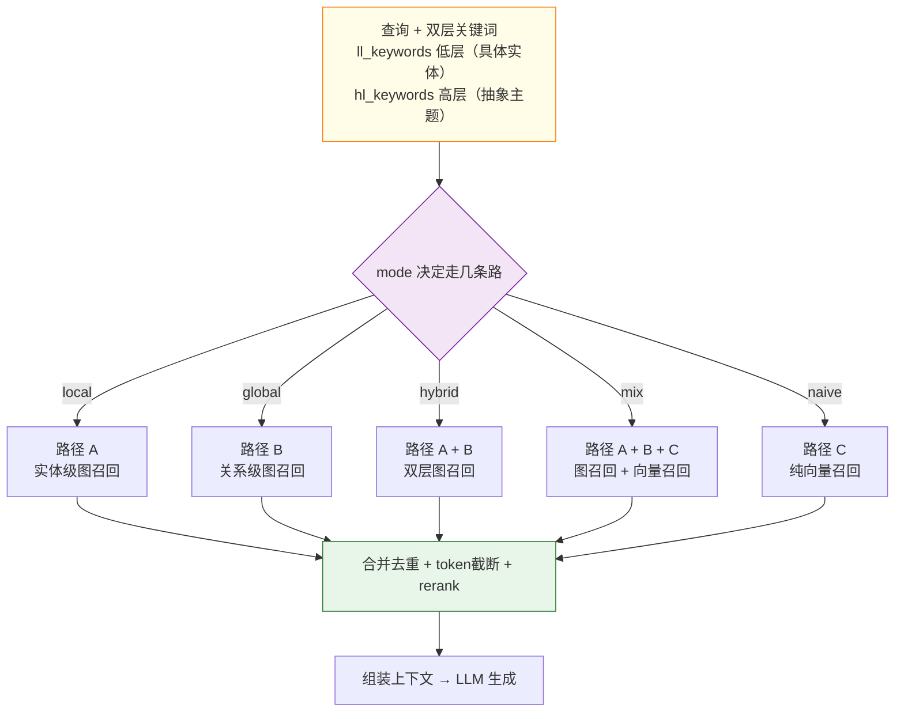

---

## 二、四条召回路径详解

### 路径 A：实体级图召回（local 用）— `operate.py:4400`

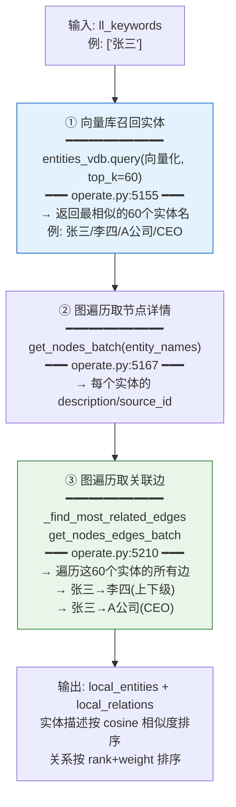

> **入口是向量库，不是图库。** 先用 ll_keywords 的 embedding 在 entities_vdb 里召回实体名，再用这些名字去图里遍历边。

### 路径 B：关系级图召回（global 用）— `operate.py:4409`

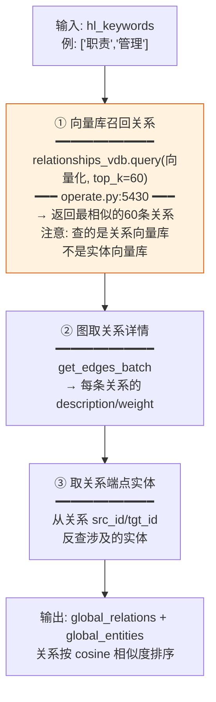

> **路径 B 和 A 的区别**：A 先找实体再找边；B 先找关系（边），再找关系两端的实体。一个从「具体的人/物」入手，一个从「抽象的主题/关系」入手。

### 路径 C：向量 chunk 召回（只有 mix 有）— `operate.py:4437`

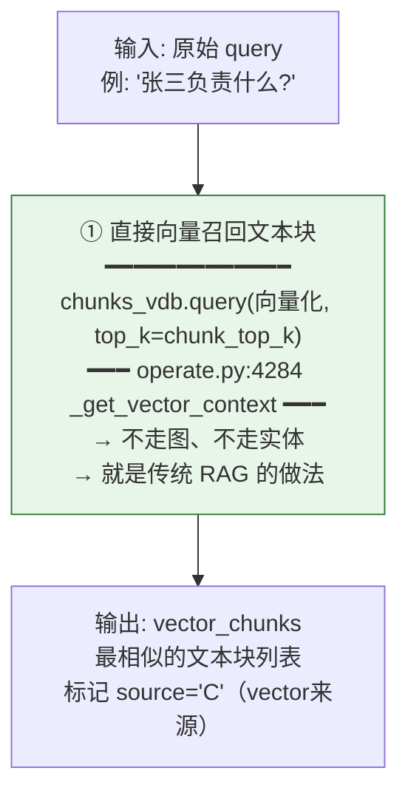

> **路径 C 是传统 RAG 的召回方式**——直接用查询语义匹配文本块。mix 模式把它和图召回叠加，作为「图谱没覆盖到时的兜底」。

### 路径 D：naive 纯向量（naive 专用）— `operate.py:5740`

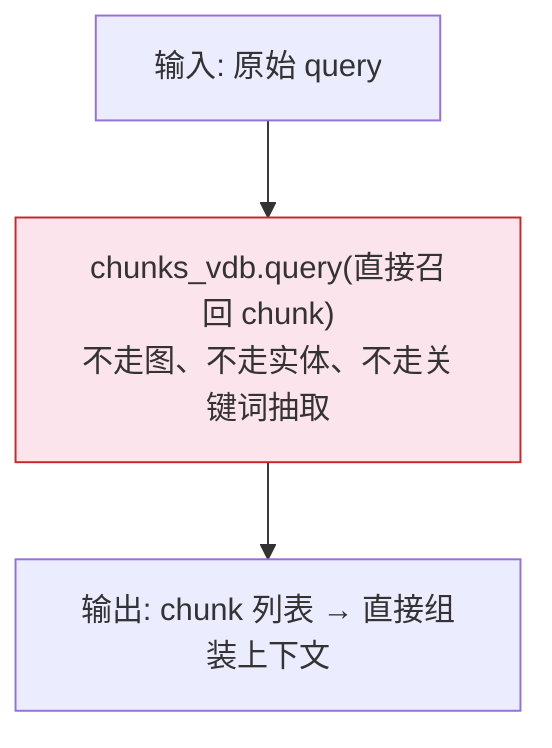

> naive 模式完全不用知识图谱，等价于传统向量 RAG。

---

## 三、五种 mode × 路径组合

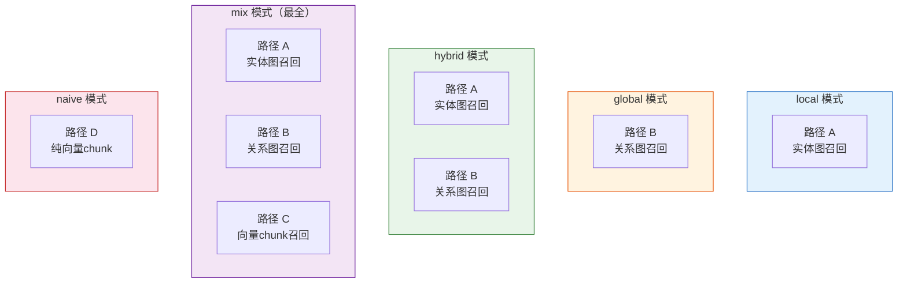

### 路径组合矩阵

| mode | 路径 A 实体图 | 路径 B 关系图 | 路径 C 向量chunk | 总路数 | 源码分支 |
|---|:---:|:---:|:---:|---|---|
| **local** | ✅ | ❌ | ❌ | 1 | `operate.py:4400` |
| **global** | ❌ | ✅ | ❌ | 1 | `operate.py:4409` |
| **hybrid** | ✅ | ✅ | ❌ | 2 | `operate.py:4418` |
| **mix** | ✅ | ✅ | ✅ | **3（最全）** | `operate.py:4418` + `:4437` |
| **naive** | ❌ | ❌ | ✅（直接chunk） | 1 | `operate.py:5740` |
| **bypass** | ❌ | ❌ | ❌ | 0 | 不检索 |

> **mix 效果最好的原因**：图召回（A+B）兜底关系推理 + 向量召回（C）兜底语义匹配，双保险。

---

## 四、多路结果合并：round-robin 去重

多路并行召回后，实体和关系需要合并。LightRAG 用**轮询交替（round-robin）**策略，保证两路结果均匀分布（`operate.py:4456`）：

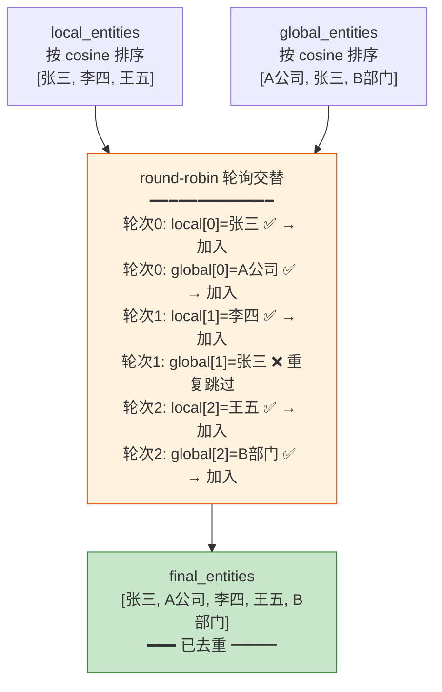

### 去重逻辑

| 类型 | 去重键 | 策略 |
|---|---|---|
| **实体** | `entity_name` | 同名只保留一次 |
| **关系** | `tuple(sorted([src, tgt]))` | 同一对端点只保留一次 |

> **为什么用 round-robin 而非简单拼接**：避免某一路完全压过另一路。local 和 global 交替取，保证两种视角的结果都有机会进入上下文。

---

## 五、四阶段处理流水线

召回结果经过四个阶段处理，最终变成 LLM 上下文（`operate.py:5024 _build_query_context`）：

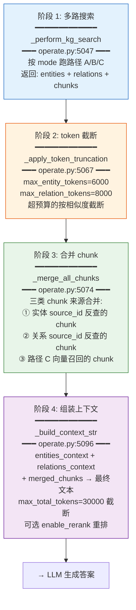

### chunk 的三个来源合并（阶段 3）

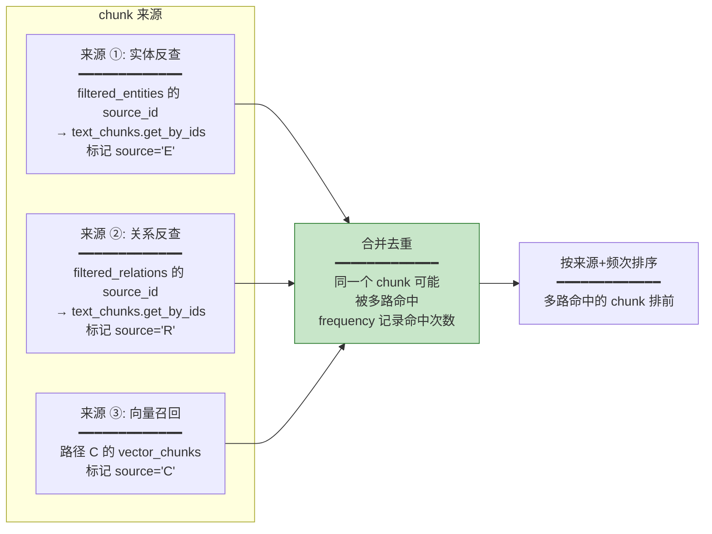

> **chunk_tracking** 记录每个 chunk 被哪条路径命中（source 标记）和命中次数（frequency）。多路命中的 chunk 排名更靠前——因为它既和实体相关、又和关系相关、还和查询语义相关。

---

## 六、rerank 重排（可选）

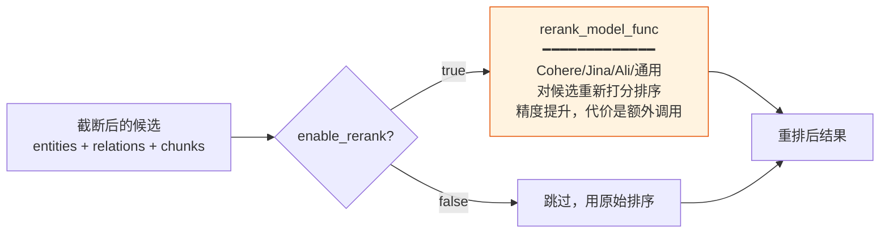

> **rerank 是在截断之后、组装上下文之前**做的。它对已召回的候选重新打分，把最相关的排到前面，提升精度。

---

## 七、完整端到端流程（mix 模式为例）

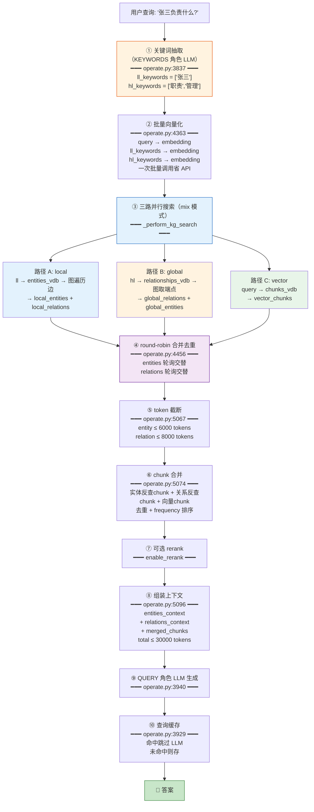

---

## 八、各向量库和图谱的分工总结

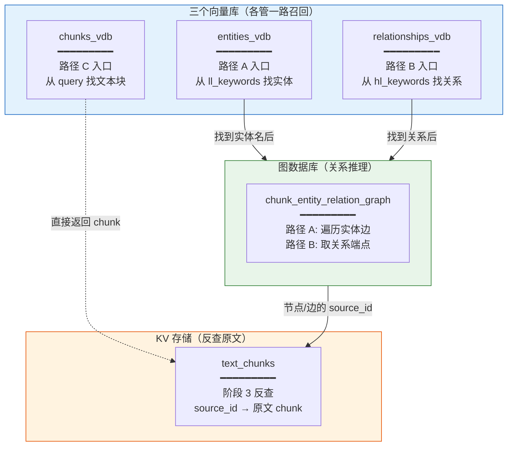

### 分工总结

| 组件 | 角色 | 用在哪条路径 |
|---|---|---|
| **entities_vdb** | 从关键词找实体入口 | 路径 A |
| **relationships_vdb** | 从关键词找关系入口 | 路径 B |
| **chunks_vdb** | 从查询直接找文本块 | 路径 C / naive |
| **图数据库** | 关系推理（遍历边/取端点） | 路径 A + B |
| **text_chunks KV** | 反查 chunk 原文 | 阶段 3 合并 |

---

## 九、mode 选择建议

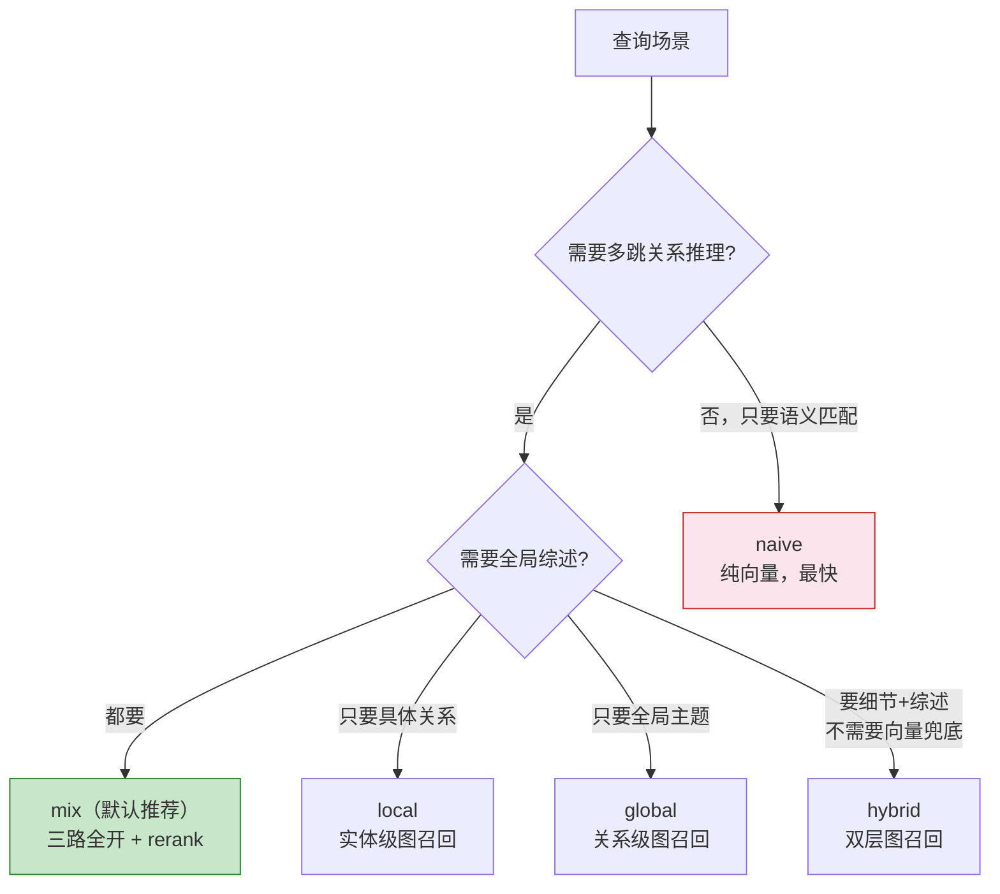

### 性能与效果权衡

| mode | 召回路数 | LLM 调用 | 效果 | 延迟 |
|---|---|---|---|---|
| **naive** | 1（向量） | 1（关键词可选跳过） | 基础 | ⚡ 最快 |
| **local** | 1（图） | 2（关键词+生成） | 实体级 | 快 |
| **global** | 1（图） | 2 | 主题级 | 快 |
| **hybrid** | 2（图×2） | 2 | 均衡 | 中 |
| **mix** | 3（图×2+向量） | 2 | ⭐ 最佳 | 中 |

> **mix 是默认模式**——虽然三路召回，但关键词抽取只调 1 次 LLM，三路搜索是并行的，所以延迟并不比 hybrid 高多少。

---

## 十、源码索引

| 机制 | 源码位置 |
|---|---|
| 关键词抽取 | `operate.py:3837 get_keywords_from_query` |
| mode 分支调度 | `operate.py:4399-4454 _perform_kg_search` |
| 路径 A 实体图召回 | `operate.py:4400` → `:5144 _get_node_data` |
| 路径 B 关系图召回 | `operate.py:4409` → `:5419 _get_edge_data` |
| 路径 C 向量 chunk | `operate.py:4437` → `:4258 _get_vector_context` |
| round-robin 合并实体 | `operate.py:4456` |
| round-robin 合并关系 | `operate.py:4477` |
| 四阶段流水线 | `operate.py:5024 _build_query_context` |
| token 截断 | `operate.py:5067 _apply_token_truncation` |
| chunk 合并 | `operate.py:5074 _merge_all_chunks` |
| 上下文组装 | `operate.py:5096 _build_context_str` |
| 实体反查 chunk | `operate.py:5260 _find_related_text_unit_from_entities` |
| 关系反查 chunk | `operate.py:5511 _find_related_text_unit_from_relations` |
| naive 查询 | `operate.py:5740 naive_query` |
| 查询缓存 | `operate.py:3929 handle_cache` |

---

## 相关文档

- 知识图谱抽取检索与增删改：`05-知识图谱抽取检索与增删改.md`
- 大规模图谱性能分析：`06-大规模图谱性能分析.md`
- 项目架构图：`../02-架构设计/01-项目架构图.md`
- 流水线流程与网状关系：`../02-架构设计/03-流水线流程与网状关系.md`
