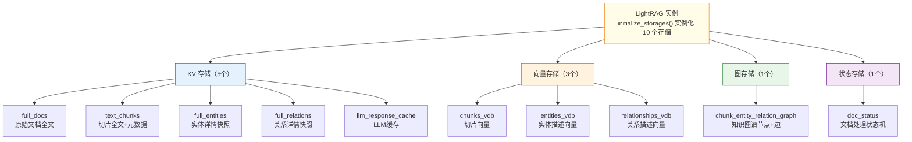
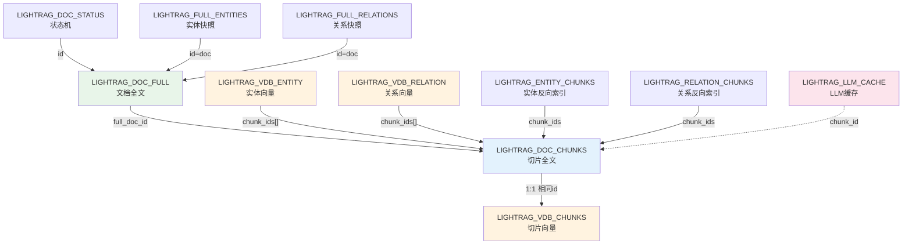
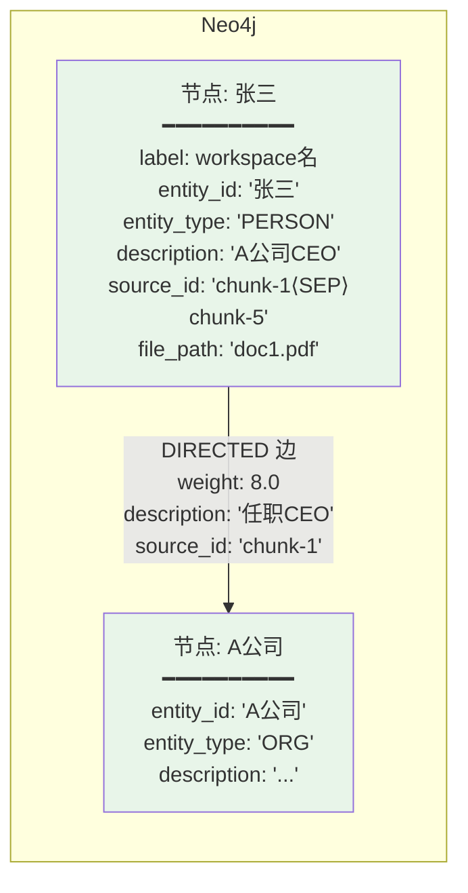
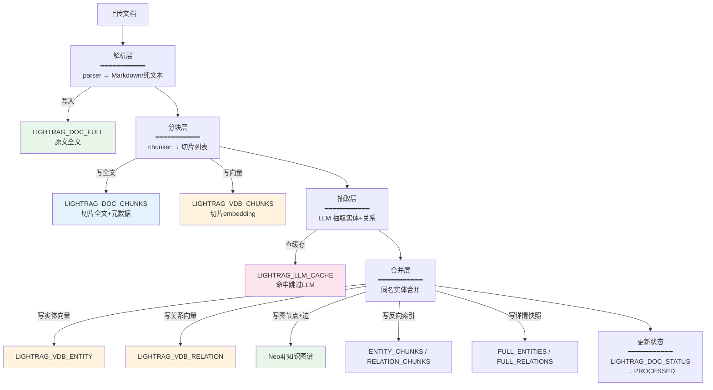
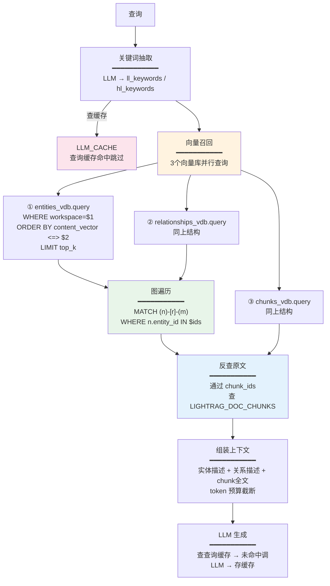
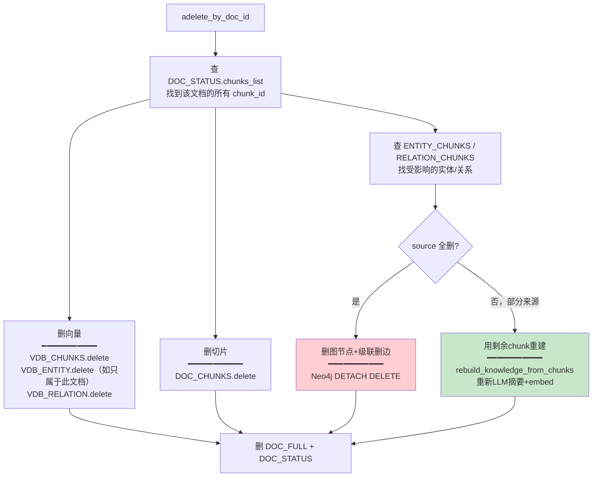
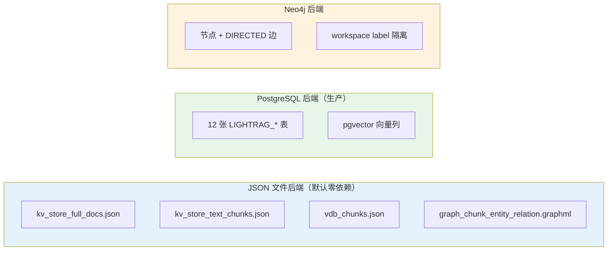

# LightRAG 存储架构全览

**项目**：LightRAG · **版本**：1.5.5 · **日期**：2026-07-10 · **作者**：15531

> 本文档汇集项目**全部存储相关内容**：10 个存储实例、12 张 PG 表、Neo4j 图结构、向量索引、KV 缓存、原始文档存储、写入流程、查询流程。一份文档看懂「数据存在哪、怎么存、怎么查」。全部基于源码核实。

---

## 一、存储全景：10 个实例 × 4 种类型



---

## 二、PostgreSQL 全部 12 张表（完整 DDL）

PG 部署时自动创建以下表（源码 `postgres_impl.py:7964-8129`）。所有表主键都是 `(workspace, id)` 实现多租户。

### 2.1 文档层

#### LIGHTRAG_DOC_FULL — 原始文档全文

```sql
CREATE TABLE LIGHTRAG_DOC_FULL (
    id              VARCHAR(255),         -- doc-<MD5>
    workspace       VARCHAR(255),         -- 多租户隔离
    doc_name        VARCHAR(1024),        -- 文件名
    content         TEXT,                 -- 全文/Markdown
    meta            JSONB,                -- 元数据
    sidecar_location TEXT,                -- 解析产物路径
    parse_format    VARCHAR(32) DEFAULT 'raw',
    content_hash    TEXT,                 -- SHA-256 内容指纹（去重）
    process_options TEXT,                 -- 解析选项（如"Fi"）
    chunk_options   JSONB DEFAULT '{}',   -- 分块选项
    parse_engine    TEXT,                 -- 使用的引擎（native/legacy/mineru/docling）
    create_time     TIMESTAMP DEFAULT CURRENT_TIMESTAMP,
    update_time     TIMESTAMP DEFAULT CURRENT_TIMESTAMP,
    PRIMARY KEY (workspace, id)
);
```

#### LIGHTRAG_DOC_STATUS — 文档状态机

```sql
CREATE TABLE LIGHTRAG_DOC_STATUS (
    workspace       VARCHAR(255),
    id              VARCHAR(255),         -- doc-<MD5>
    content_summary VARCHAR(255),         -- 前100字符预览
    content_length  INT,                  -- 内容长度
    chunks_count    INT,                  -- 切片数量
    status          VARCHAR(64),          -- PENDING/PARSING/ANALYZING/PROCESSING/PROCESSED/FAILED
    file_path       TEXT,                 -- 来源路径
    chunks_list     JSONB DEFAULT '[]',   -- 该文档的所有 chunk_id 列表
    track_id        VARCHAR(255),         -- 追踪ID
    metadata        JSONB DEFAULT '{}',   -- 额外元数据
    PRIMARY KEY (workspace, id)
);
```

### 2.2 切片层（双写：全文表 + 向量表）

#### LIGHTRAG_DOC_CHUNKS — 切片全文（关系库，无向量）

```sql
CREATE TABLE LIGHTRAG_DOC_CHUNKS (
    id              VARCHAR(255),         -- chunk-<MD5>，内容哈希
    workspace       VARCHAR(255),
    full_doc_id     VARCHAR(256),         -- 所属文档 doc-<MD5>
    chunk_order_index INTEGER,            -- 切片在文档中的序号
    tokens          INTEGER,              -- token 数
    content         TEXT,                 -- 切片全文
    file_path       TEXT,                 -- 来源路径（引用溯源）
    llm_cache_list  JSONB DEFAULT '[]',   -- LLM 缓存引用
    heading         JSONB DEFAULT '{}',   -- 标题层级（parent_headings）
    sidecar         JSONB DEFAULT '{}',   -- 多模态引用（图片/表格/公式）
    create_time     TIMESTAMP DEFAULT CURRENT_TIMESTAMP,
    update_time     TIMESTAMP DEFAULT CURRENT_TIMESTAMP,
    PRIMARY KEY (workspace, id)
);
```

#### LIGHTRAG_VDB_CHUNKS — 切片向量（向量库）

```sql
CREATE TABLE LIGHTRAG_VDB_CHUNKS (
    id              VARCHAR(255),         -- chunk-<MD5>，与 DOC_CHUNKS 相同
    workspace       VARCHAR(255),
    full_doc_id     VARCHAR(256),
    chunk_order_index INTEGER,
    tokens          INTEGER,
    content         TEXT,                 -- 原文（冗余，便于召回后直接用）
    content_vector  VECTOR(dimension),    -- ← pgvector 嵌入向量
    file_path       TEXT,
    create_time     TIMESTAMP DEFAULT CURRENT_TIMESTAMP,
    update_time     TIMESTAMP DEFAULT CURRENT_TIMESTAMP,
    PRIMARY KEY (workspace, id)
);
-- HNSW 向量索引（cosine 相似度）
CREATE INDEX ... USING hnsw (content_vector vector_cosine_ops) WITH (m=16, ef_construction=200);
```

> **双写设计**：同一份 chunk 数据，DOC_CHUNKS 存全文+全字段，VDB_CHUNKS 存向量+精简字段。用相同 `id` 关联。

### 2.3 实体/关系层

#### LIGHTRAG_VDB_ENTITY — 实体向量

```sql
CREATE TABLE LIGHTRAG_VDB_ENTITY (
    id              VARCHAR(255),         -- 实体哈希ID
    workspace       VARCHAR(255),
    entity_name     VARCHAR(512),         -- 实体名（如"张三"）
    content         TEXT,                 -- 实体描述（用于 embed）
    content_vector  VECTOR(dimension),    -- 描述的嵌入向量
    chunk_ids       VARCHAR(255)[] NULL,  -- ← 来源切片ID数组（溯源）
    file_path       TEXT,
    create_time     TIMESTAMP DEFAULT CURRENT_TIMESTAMP,
    update_time     TIMESTAMP DEFAULT CURRENT_TIMESTAMP,
    PRIMARY KEY (workspace, id)
);
```

#### LIGHTRAG_VDB_RELATION — 关系向量

```sql
CREATE TABLE LIGHTRAG_VDB_RELATION (
    id              VARCHAR(255),
    workspace       VARCHAR(255),
    source_id       VARCHAR(512),         -- 源实体名
    target_id       VARCHAR(512),         -- 目标实体名
    content         TEXT,                 -- 关系描述（用于 embed）
    content_vector  VECTOR(dimension),    -- 描述的嵌入向量
    chunk_ids       VARCHAR(255)[] NULL,  -- ← 来源切片ID数组（溯源）
    file_path       TEXT,
    create_time     TIMESTAMP DEFAULT CURRENT_TIMESTAMP,
    update_time     TIMESTAMP DEFAULT CURRENT_TIMESTAMP,
    PRIMARY KEY (workspace, id)
);
```

#### LIGHTRAG_FULL_ENTITIES / LIGHTRAG_FULL_RELATIONS — 详情快照

```sql
CREATE TABLE LIGHTRAG_FULL_ENTITIES (
    id          VARCHAR(255),             -- doc-<MD5>
    workspace   VARCHAR(255),
    entity_names JSONB,                   -- 该文档抽取的实体名列表
    count       INTEGER,
    PRIMARY KEY (workspace, id)
);

CREATE TABLE LIGHTRAG_FULL_RELATIONS (
    id            VARCHAR(255),
    workspace     VARCHAR(255),
    relation_pairs JSONB,                 -- 该文档抽取的关系对列表
    count         INTEGER,
    PRIMARY KEY (workspace, id)
);
```

### 2.4 溯源索引层（反向索引）

```sql
-- 实体 → 来源切片的反向索引
CREATE TABLE LIGHTRAG_ENTITY_CHUNKS (
    id          VARCHAR(512),             -- entity_name
    workspace   VARCHAR(255),
    chunk_ids   JSONB,                    -- 该实体来自哪些 chunk
    count       INTEGER,
    PRIMARY KEY (workspace, id)
);

-- 关系 → 来源切片的反向索引
CREATE TABLE LIGHTRAG_RELATION_CHUNKS (
    id          VARCHAR(512),             -- "src⟨SEP⟩tgt"
    workspace   VARCHAR(255),
    chunk_ids   JSONB,
    count       INTEGER,
    PRIMARY KEY (workspace, id)
);
```

> **溯源链路**：实体/关系 → `chunk_ids` → `LIGHTRAG_DOC_CHUNKS` 反查原文。删除文档时用这两张表快速找到受影响的实体/关系。

### 2.5 缓存层

```sql
CREATE TABLE LIGHTRAG_LLM_CACHE (
    workspace       VARCHAR(255),
    id              VARCHAR(255),         -- 参数哈希
    original_prompt TEXT,                 -- 原始提示词
    return_value    TEXT,                 -- LLM 返回结果
    chunk_id        VARCHAR(255),         -- 关联切片（抽取缓存）
    cache_type      VARCHAR(32),          -- extract/query
    queryparam      JSONB,                -- 查询参数快照
    create_time     TIMESTAMP DEFAULT CURRENT_TIMESTAMP,
    update_time     TIMESTAMP DEFAULT CURRENT_TIMESTAMP,
    PRIMARY KEY (workspace, id)
);
```

### 表关系 ER 图



---

## 三、Neo4j 图存储结构

### 3.1 节点和边的 Cypher 结构



### 3.2 写入 Cypher

**节点写入**（`neo4j_impl.py:1076`）：
```cypher
MERGE (n:`{workspace}` {entity_id: $entity_id})
SET n += $properties
```
> `MERGE` = 存在则更新，不存在则创建。同名实体自动合并。

**边写入**（`neo4j_impl.py:1212`）：
```cypher
UNWIND $edges AS row
MATCH (source:`{workspace}` {entity_id: row.src})
MATCH (target:`{workspace}` {entity_id: row.tgt})
MERGE (source)-[r:DIRECTED]-(target)
SET r += row.props
```

### 3.3 查询 Cypher

**取节点**（`neo4j_impl.py:566`）：
```cypher
MATCH (n:`{workspace}` {entity_id: $entity_id}) RETURN n
```

**取节点的边**（`neo4j_impl.py:916`）：
```cypher
MATCH (n:`{workspace}` {entity_id: $entity_id})-[r]-(m)
RETURN type(r), m.entity_id, properties(r)
```

### 3.4 workspace 作为 label 实现多租户

```
不同 workspace → 不同 label → 逻辑隔离
  workspace=demo     → (:demo {entity_id:'张三'})
  workspace=project2 → (:project2 {entity_id:'张三'})
两个张三互不可见
```

---

## 四、向量存储：三种索引方式

### 4.1 pgvector 索引选项

```env
POSTGRES_VECTOR_INDEX_TYPE=HNSW   # 可选: HNSW / IVFFLAT / VCHORDRQ / HALFVEC
POSTGRES_HNSW_M=16                # HNSW 每层最大连接数
POSTGRES_HNSW_EF=200              # HNSW 搜索时的候选集大小
```

| 索引类型 | 特点 | 适用 |
|---|---|---|
| **HNSW** | 图近似最近邻，查询快 | 默认推荐，大部分场景 |
| **IVFFLAT** | 倒排+聚类 | 大规模数据，构建快 |
| **VCHORDRQ** | 量化压缩 | 省内存，大规模 |

### 4.2 查询方式（cosine 相似度）

PG 查询（`postgres_impl.py`）：
```sql
SELECT id, entity_name, content
FROM LIGHTRAG_VDB_ENTITY
WHERE workspace = $1
ORDER BY content_vector <=> $2    -- ← cosine 距离排序
LIMIT $3                           -- ← top_k
```

NanoVectorDB 查询（`nano_vector_db_impl.py:414`）：
```python
results = client.query(
    query=embedding,               # 查询向量
    top_k=top_k,                   # 召回数
    better_than_threshold=0.2,     # 最低 cosine 相似度
)
```

> **`<=>`** 是 pgvector 的 cosine 距离运算符，越小越相似。

---

## 五、KV 缓存：LLM 响应缓存

### 5.1 缓存什么

| 缓存类型 | `cache_type` | 触发点 | 作用 |
|---|---|---|---|
| **抽取缓存** | `extract` | `extract_entities` 每 chunk | 相同 chunk 不重复调 LLM 抽取 |
| **查询缓存** | `query` | `aquery` 每次查询 | 相同问题秒回，不调 LLM |

### 5.2 缓存键

缓存的 `id` 是**参数哈希**（`compute_args_hash`），包含：
```
mode + query + response_type + top_k + chunk_top_k
+ token 参数 + 关键词 + user_prompt + enable_rerank + ...
```

> 任何一个参数变化 → 哈希不同 → 不命中。保证缓存正确性。

### 5.3 缓存查询

```sql
-- 先查缓存
SELECT return_value FROM LIGHTRAG_LLM_CACHE
WHERE workspace=$1 AND id=$2 AND cache_type=$3

-- 命中 → 直接返回，跳过 LLM
-- 未命中 → 调 LLM → 存入缓存
```

---

## 六、写入流程：数据怎么存进去



### 各存储的写入时机

| 存储 | 写入时机 | 写入内容 |
|---|---|---|
| `DOC_FULL` | 解析完成 | 原文 + 解析格式 + 引擎 |
| `DOC_STATUS` | 每个阶段转换 | PENDING→PARSING→...→PROCESSED |
| `DOC_CHUNKS` | 分块完成 | 切片全文 + tokens + order |
| `VDB_CHUNKS` | 分块完成（并行） | 切片 embedding |
| `VDB_ENTITY` | 合并完成 | 实体描述 embedding |
| `VDB_RELATION` | 合并完成 | 关系描述 embedding |
| Neo4j 图 | 合并完成 | 节点 MERGE + 边 MERGE |
| `ENTITY_CHUNKS` | 合并完成 | 实体→chunk 反向索引 |
| `LLM_CACHE` | 抽取/查询后 | LLM 返回值 |

---

## 七、查询流程：数据怎么查出来



### 各存储的查询方式

| 存储 | 查询方式 | 查询语句 |
|---|---|---|
| `VDB_ENTITY` | 向量 cosine 召回 | `ORDER BY content_vector <=> $query_emb LIMIT top_k` |
| `VDB_RELATION` | 向量 cosine 召回 | 同上 |
| `VDB_CHUNKS` | 向量 cosine 召回 | 同上 |
| Neo4j | Cypher 图遍历 | `MATCH (n)-[r]-(m) WHERE n.entity_id IN $ids` |
| `DOC_CHUNKS` | 按 ID 精确查 | `WHERE workspace=$1 AND id=$2` |
| `ENTITY_CHUNKS` | 按 entity_name 查 | 反查该实体来自哪些 chunk |
| `LLM_CACHE` | 按参数哈希查 | `WHERE workspace=$1 AND id=$hash AND cache_type=$type` |

---

## 八、删除流程：级联清理



---

## 九、各后端的存储格式对比



### 默认 JSON 后端的文件

| 文件 | 对应 PG 表 | 内容 |
|---|---|---|
| `kv_store_full_docs.json` | DOC_FULL | 文档全文 |
| `kv_store_text_chunks.json` | DOC_CHUNKS | 切片全文 |
| `kv_store_doc_status.json` | DOC_STATUS | 状态机 |
| `kv_store_llm_response_cache.json` | LLM_CACHE | LLM 缓存 |
| `kv_store_full_entities.json` | FULL_ENTITIES | 实体快照 |
| `kv_store_full_relations.json` | FULL_RELATIONS | 关系快照 |
| `kv_store_entity_chunks.json` | ENTITY_CHUNKS | 反向索引 |
| `kv_store_relation_chunks.json` | RELATION_CHUNKS | 反向索引 |
| `vdb_chunks.json` | VDB_CHUNKS | 切片向量 |
| `vdb_entity.json` | VDB_ENTITY | 实体向量 |
| `vdb_relationship.json` | VDB_RELATION | 关系向量 |
| `graph_chunk_entity_relation.graphml` | Neo4j | 图谱（GraphML 格式） |

---

## 十、源码索引

| 存储机制 | 源码位置 |
|---|---|
| 10 个存储实例化 | `lightrag.py:1095-1145 initialize_storages` |
| PG 全部 DDL | `postgres_impl.py:7964-8129 TABLE_SCHEMAS` |
| PG 查询模板 | `postgres_impl.py:8132+ SQL_TEMPLATES` |
| PG 向量查询 | `postgres_impl.py` `ORDER BY content_vector <=>` |
| Neo4j 节点 MERGE | `neo4j_impl.py:1076` |
| Neo4j 边 MERGE | `neo4j_impl.py:1212` |
| Neo4j 取节点 | `neo4j_impl.py:566` |
| NanoVectorDB 查询 | `nano_vector_db_impl.py:414` |
| NetworkX 持久化 | `networkx_impl.py:125 load` / `:137 write` |
| NetworkX GraphML | `graph_chunk_entity_relation.graphml` |
| LLM 缓存逻辑 | `operate.py:3929 handle_cache` |
| 双写 chunk | `lightrag.py:1559 asyncio.gather` |
| 删除级联 | `lightrag.py:2801 分类逻辑` |

---

## 相关文档

- 切片存储设计：`03-切片存储设计.md`（chunk 双写详解）
- 知识图谱抽取检索与增删改：`05-知识图谱抽取检索与增删改.md`
- 大规模图谱性能分析：`06-大规模图谱性能分析.md`
- 多路召回全景：`07-多路召回全景.md`
- 项目架构图：`../02-架构设计/01-项目架构图.md`
