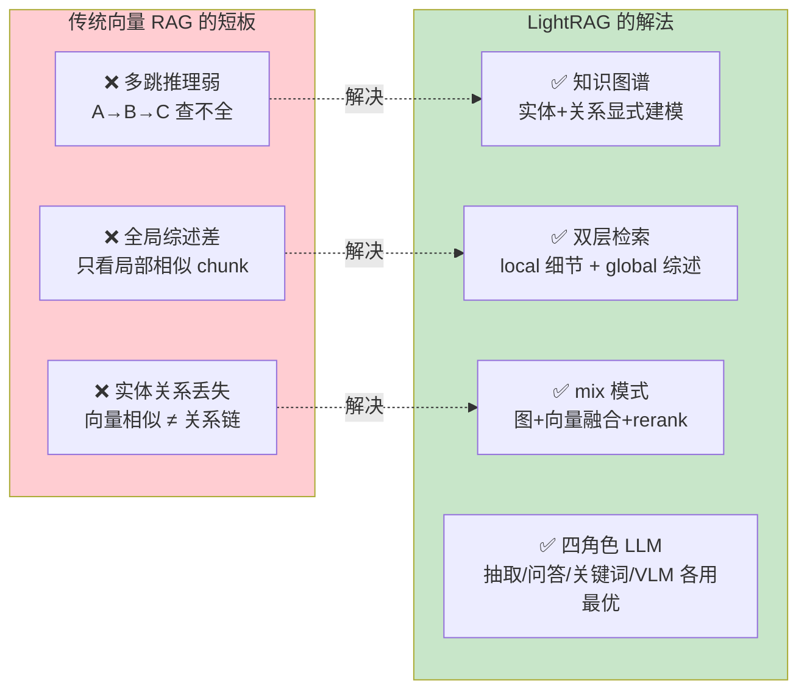
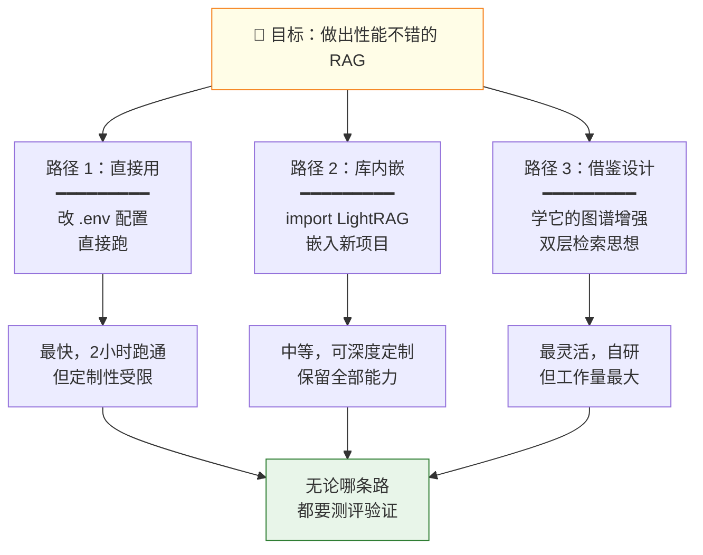
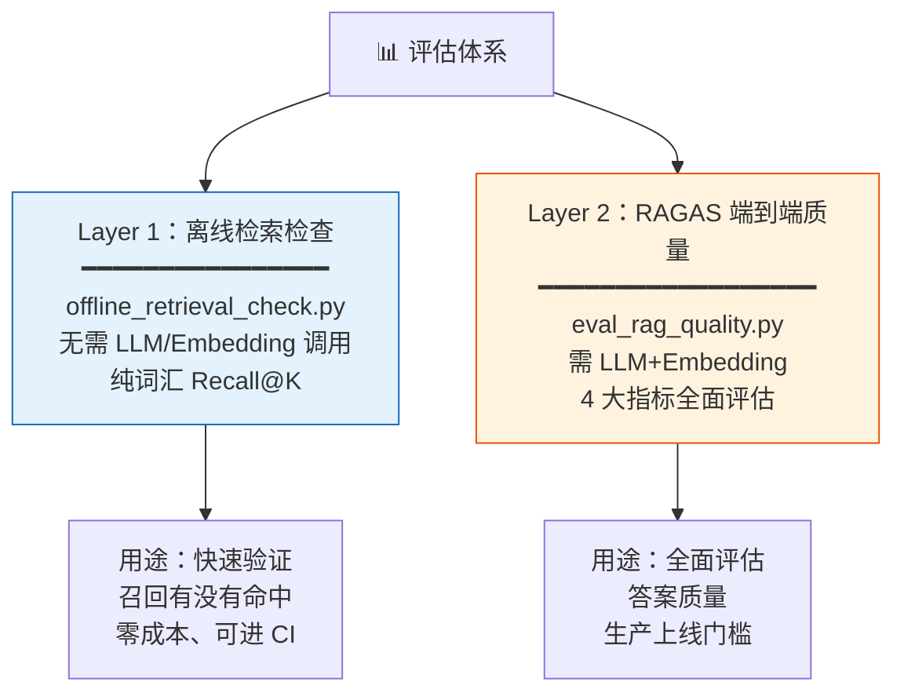
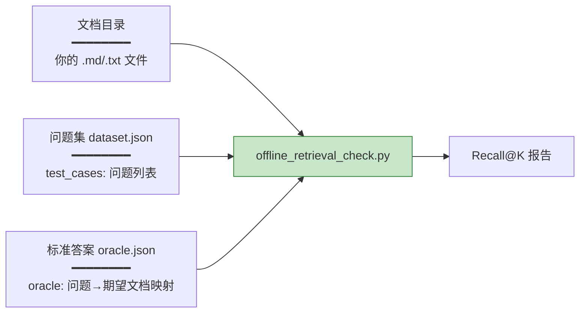
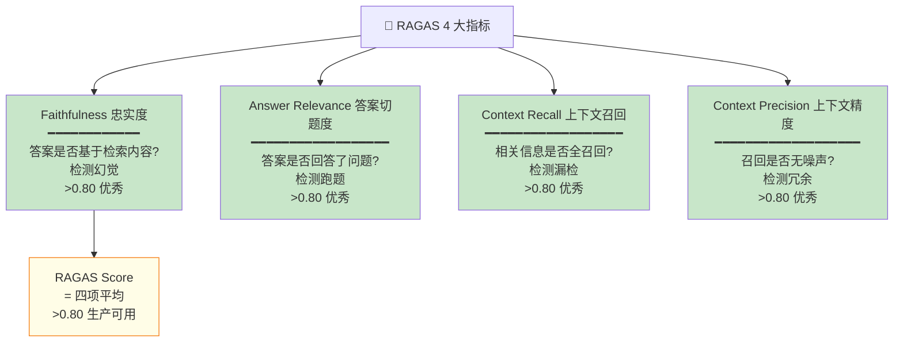
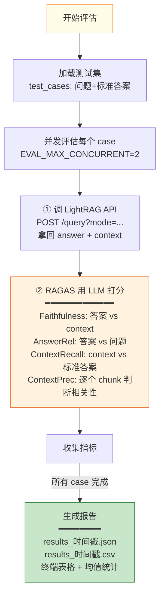
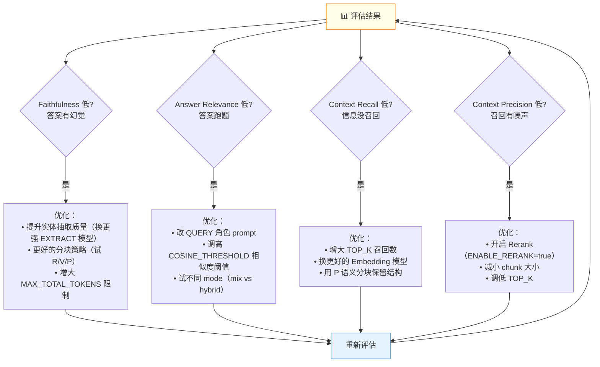
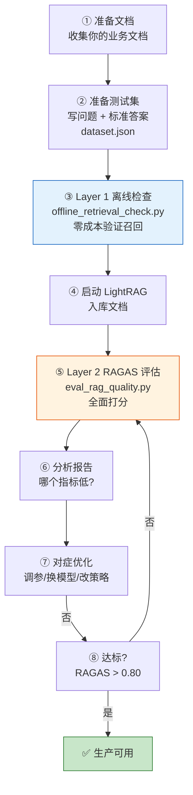
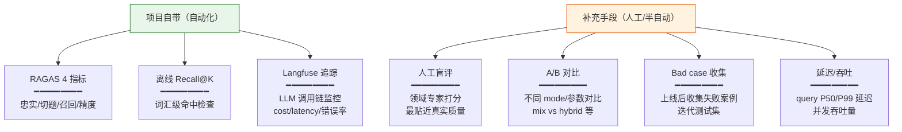

# LightRAG RAG 性能测评指南

**项目**：LightRAG · **版本**：1.5.5 · **日期**：2026-07-08 · **作者**：15531

> 本文档回答两个问题：**「借鉴这个项目能做出性能不错的 RAG 吗」** 与 **「不知道怎么测评怎么办」**。好消息：LightRAG **自带完整的评估框架**（RAGAS + 离线检索检查），你不用从零搭。

---

## 一、第一个问题：能做出性能不错的 RAG 吗？—— 能

### 1.1 项目自评结果（官方基线）

LightRAG 官方用自带的评估框架跑过，结果如下（来自 `lightrag/evaluation/README_EVALUASTION_RAGAS.md`）：

```
Average Faithfulness:      0.9053   ← 答案忠实于检索内容（不幻觉）
Average Answer Relevance:  0.8646   ← 答案切题
Average Context Recall:    1.0000   ← 相关信息全召回
Average Context Precision: 1.0000   ← 召回无噪声
Average RAGAS Score:       0.9425   ← 综合质量
```

> **0.80+ 即生产可用，0.94 属于优秀。** 这说明 LightRAG 的图谱增强检索范式确实有效。

### 1.2 它为什么性能不错（架构优势）



### 1.3 借鉴/编排的可行路径



---

## 二、第二个问题：怎么测评？—— 项目自带两套工具

LightRAG 在 `lightrag/evaluation/` 下提供了**两层评估体系**：



---

## 三、Layer 1：离线检索检查（零成本，先跑这个）

### 3.1 它测什么

**不调 LLM、不调 Embedding、不调 LightRAG 服务**。用 TF-IDF 词汇匹配检查「问题能否检索到期望文档」，作为**前置健康检查**。

来自 `offline_retrieval_check.py` 的指标：
- **Recall@K**（前 K 个结果是否命中期望文档）
- **Reciprocal Rank**（期望文档的排名倒数）
- **full_recall_queries / no_hit_queries**（全命中/零命中计数）

### 3.2 怎么跑

```bash
# 项目自带 6 个样例问题 + 5 个样例文档
cd /d/Project/LightRAG
python lightrag/evaluation/offline_retrieval_check.py --strict
```

### 3.3 自定义你的数据

准备三个文件：



文件格式：
```json
// dataset.json
{"test_cases": [{"question": "你的问题"}]}

// oracle.json
{"oracle": [{"question": "你的问题", "expected_documents": ["alpha.md"]}]}
```

---

## 四、Layer 2：RAGAS 端到端质量评估（核心）

### 4.1 它测什么（4 大指标）



### 4.2 评分标准

| 区间 | 评级 | 含义 |
|---|---|---|
| 0.80–1.00 | ✅ 优秀 | 生产可用 |
| 0.60–0.80 | ⚠️ 良好 | 有改进空间 |
| 0.40–0.60 | ❌ 较差 | 需优化 |
| 0.00–0.40 | 🔴 严重 | 有重大问题 |

### 4.3 怎么跑

```bash
# 1. 安装评估依赖
pip install -e ".[evaluation]"
# 或：pip install ragas datasets

# 2. 启动 LightRAG 服务（必须，评估器要调它的 API）
PYTHONUTF8=1 uv run lightrag-server

# 3. 把测试文档入库（用 WebUI 或 API）

# 4. 跑评估（默认测自带 6 个问题）
python lightrag/evaluation/eval_rag_quality.py

# 或指定你的测试集 + 服务地址
python lightrag/evaluation/eval_rag_quality.py -d my_test.json -r http://localhost:9621
```

### 4.4 评估流程（内部做了什么）



### 4.5 准备你自己的测试集

```json
{
  "test_cases": [
    {
      "question": "城乡居民养老保险的申领条件是什么？",
      "ground_truth": "年满60周岁、累计缴费满15年、未领取其他养老待遇...",
      "project": "社保政策问答"
    }
  ]
}
```

> **关键**：`ground_truth`（标准答案）必须有，RAGAS 靠它算 Context Recall。你自己手写或用 LLM 从文档生成。

### 4.6 配置评估用的模型（环境变量）

```env
# 评估用的 LLM（RAGAS 打分用，必须 OpenAI 兼容）
EVAL_LLM_MODEL=gpt-4o-mini
EVAL_LLM_BINDING_API_KEY=sk-xxx
# EVAL_LLM_BINDING_HOST=http://localhost:8000/v1  # 自部署可选

# 评估用的 Embedding
EVAL_EMBEDDING_MODEL=text-embedding-3-large
EVAL_EMBEDDING_BINDING_API_KEY=sk-xxx

# 并发与限流
EVAL_MAX_CONCURRENT=2        # 并发评估数（遇 429 就降到 1）
EVAL_QUERY_TOP_K=10          # 检索召回数
EVAL_LLM_MAX_RETRIES=5       # 重试次数
EVAL_LLM_TIMEOUT=180         # 超时秒数
```

> **注意**：评估模型可以和被评估的 LightRAG 用**不同的**模型。建议评估用**更强的模型**（如 gpt-4o）以保证打分公正。

---

## 五、从测评到优化（闭环）

测出分数后，按低分指标对症优化：



---

## 六、完整测评工作流（从零到报告）



### 最少步骤版（快速验证）

```bash
# 1. 装依赖
pip install -e ".[evaluation]"

# 2. 启服务 + 入库（用自带样例文档）
PYTHONUTF8=1 uv run lightrag-server
# 在 WebUI 上传 lightrag/evaluation/sample_documents/ 里的 5 个 md

# 3. 跑评估
python lightrag/evaluation/eval_rag_quality.py

# 4. 看 results/ 下的报告
```

---

## 七、除了 RAGAS，还能怎么测



---

## 八、源码索引

| 能力 | 代码位置 |
|---|---|
| RAGAS 评估主脚本 | `lightrag/evaluation/eval_rag_quality.py` |
| 离线检索检查 | `lightrag/evaluation/offline_retrieval_check.py` |
| 样例测试集 | `lightrag/evaluation/sample_dataset.json` |
| 样例文档 | `lightrag/evaluation/sample_documents/` |
| 样例 oracle | `lightrag/evaluation/sample_retrieval_oracle.json` |
| 评估 README | `lightrag/evaluation/README_EVALUASTION_RAGAS.md` |
| ragas 依赖声明 | `pyproject.toml` 的 `[evaluation]` extra |
| 测试用例 | `tests/evaluation/test_evaluation_offline_retrieval_check.py` |

---

## 九、建议的起步动作

1. **今天**：跑 Layer 1 离线检查（零成本，确认召回逻辑没毛病）
2. **明天**：跑 Layer 2 RAGAS（用自带样例，确认评估流程跑通）
3. **本周**：换成你的业务文档 + 业务问题，建你的测试集
4. **下周**：迭代优化，把 RAGAS 刷到 0.80+
5. **上线前**：补人工盲评 + Langfuse 监控 + Bad case 池

> **核心建议**：**评估先行**。不要先优化再评估，而要先建立评估基线，让每次优化都有数据支撑。项目自带的两套工具让你不用从零搭评估体系，这是借鉴这个项目最大的隐藏价值之一。

---

## 相关文档

- 解析流水线全流程详解：`解析流水线全流程详解.md`
- 技术栈与能力全景：`技术栈与能力全景.md`
- 作为 RAG 基座融合指南：`作为RAG基座与MCP工具的融合指南.md`
- 文档解析能力与输出格式对照：`文档解析能力与输出格式对照.md`
