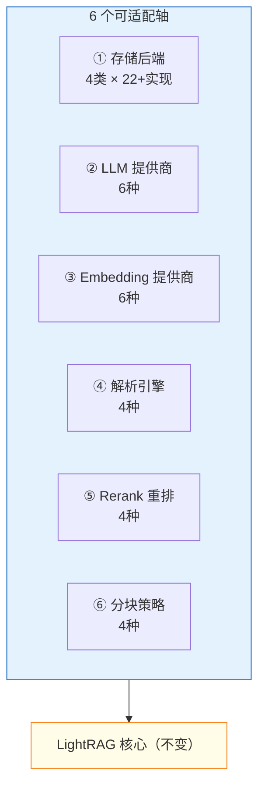
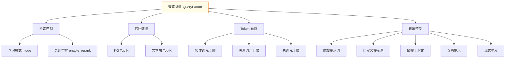

# LightRAG 可适配组件与配置参数全览

**项目**：LightRAG · **版本**：1.5.5 · **日期**：2026-07-10 · **作者**：15531

> 本文档列出 LightRAG 中**所有可插拔/可配置的组件**和**每个参数的含义**。用于理解「能换什么」「怎么调」。全部基于源码核实（`base.py:83 QueryParam`、`kg/__init__.py`、`constants.py`、`env.example`）。

---

## 一、六大可适配组件总览



---

## 二、组件 ①：存储后端（4 类 × 22+ 实现）

### KV 存储（文档/块/实体/关系/缓存）

| 值 | 需要 | 适用 |
|---|---|---|
| `JsonKVStorage` | 无 | 默认，单机零依赖 |
| `RedisKVStorage` | `REDIS_URI` | 生产，高性能 |
| `PGKVStorage` | `POSTGRES_*` | 生产统一存储 |
| `MongoKVStorage` | `MONGO_URI` | 文档型存储 |
| `OpenSearchKVStorage` | `OPENSEARCH_HOSTS` | 搜索引擎 |

### 向量存储

| 值 | 需要 | 适用 |
|---|---|---|
| `NanoVectorDBStorage` | 无 | 默认，单机 |
| `PGVectorStorage` | `POSTGRES_*` + pgvector | 生产统一 |
| `MilvusVectorDBStorage` | `MILVUS_URI` | 大规模向量 |
| `FaissVectorDBStorage` | 无 | 单机高性能 |
| `QdrantVectorDBStorage` | `QDRANT_URL` | 生产向量 |
| `MongoVectorDBStorage` | `MONGO_URI` | 统一存储 |
| `OpenSearchVectorDBStorage` | `OPENSEARCH_HOSTS` | 搜索引擎 |

### 图存储

| 值 | 需要 | 适用 |
|---|---|---|
| `NetworkXStorage` | 无 | 默认，内存图 |
| `Neo4JStorage` | `NEO4J_URI` + 用户名密码 | 专业图库 |
| `PGGraphStorage` | `POSTGRES_*` + Apache AGE | 统一存储 |
| `MongoGraphStorage` | `MONGO_URI` | 统一存储 |
| `MemgraphStorage` | `MEMGRAPH_URI` | 高性能图 |
| `OpenSearchGraphStorage` | `OPENSEARCH_HOSTS` | 搜索引擎 |

### 文档状态存储

| 值 | 需要 |
|---|---|
| `JsonDocStatusStorage` | 无（默认） |
| `RedisDocStatusStorage` | `REDIS_URI` |
| `PGDocStatusStorage` | `POSTGRES_*` |
| `MongoDocStatusStorage` | `MONGO_URI` |
| `OpenSearchDocStatusStorage` | `OPENSEARCH_HOSTS` |

### 配置方式

```env
LIGHTRAG_KV_STORAGE=PGKVStorage
LIGHTRAG_VECTOR_STORAGE=PGVectorStorage
LIGHTRAG_GRAPH_STORAGE=Neo4JStorage
LIGHTRAG_DOC_STATUS_STORAGE=PGDocStatusStorage
```

---

## 三、组件 ②③④⑤：模型与引擎

### LLM 提供商

```env
LLM_BINDING=openai          # 可选: openai / ollama / azure_openai / bedrock / gemini / lollms
LLM_BINDING_HOST=http://...  # API 地址
LLM_BINDING_API_KEY=sk-xxx
LLM_MODEL=gpt-4o-mini
```

### Embedding 提供商

```env
EMBEDDING_BINDING=openai    # 可选: openai / ollama / azure_openai / jina / lollms / bedrock
EMBEDDING_BINDING_HOST=http://...
EMBEDDING_MODEL=text-embedding-3-small
EMBEDDING_DIM=1536           # 必须与模型匹配
EMBEDDING_TOKEN_LIMIT=8192
EMBEDDING_SEND_DIM=false     # OpenAI: false | Gemini: true
EMBEDDING_USE_BASE64=true    # OpenAI: true
EMBEDDING_BATCH_NUM=32       # 每批嵌入数量
```

### Rerank 重排

```env
RERANK_BINDING=cohere       # 可选: null(关闭) / cohere / jina / aliyun
RERANK_BINDING_HOST=http://...  # 重排 API 地址
RERANK_BINDING_API_KEY=xxx
RERANK_MODEL=bge-reranker-v2-m3
```

### 解析引擎（路由规则）

```env
# 格式: 后缀:引擎-分块标记;后缀:引擎-分块标记
# 引擎: native / legacy / mineru / docling
# 分块标记: F(固定token) / R(递归字符) / V(语义向量) / P(段落语义)
# 可加 i(图片) t(表格) e(公式) 启用多模态分析
LIGHTRAG_PARSER=*:native-teP;*:legacy-R
```

| 引擎 | 适用格式 | 特点 |
|---|---|---|
| `native` | docx/md | 结构化解析，保留标题/表格/图片 |
| `legacy` | 全格式 | 纯文本提取，零依赖 |
| `mineru` | pdf/图片/office | 全模态 OCR（含 PaddleOCR） |
| `docling` | pdf/office | IBM 文档解析 |

### 分块策略

| 标记 | 名称 | 特点 |
|---|---|---|
| `F` | 固定 token | 最快，按 token 大小切 |
| `R` | 递归字符 | 按分隔符层级切，保留段落 |
| `V` | 语义向量 | embedding 聚类，语义连贯 |
| `P` | 段落语义 | 依赖 blocks.jsonl，最精细 |

---

## 四、组件 ⑥：查询参数详解（`QueryParam`）

**这是你最关心的部分**——WebUI 查询界面上每个参数的含义。



### 4.1 查询模式（mode）— 最重要

| 值 | 含义 | 召回路数 | 适用场景 |
|---|---|---|---|
| `mix` | **默认**，图召回+向量召回融合 | 3 路 | 复杂问题，效果最佳 |
| `local` | 实体级图召回 | 1 路 | 具体实体/细节事实 |
| `global` | 关系级图召回 | 1 路 | 全局综述/主题汇总 |
| `hybrid` | local+global 双层 | 2 路 | 细节+综述兼顾 |
| `naive` | 纯向量召回（不走图） | 1 路 | 简单语义匹配 |
| `bypass` | 跳过检索，直接问 LLM | 0 路 | 测试 LLM 本身 |

> **核心权衡**：mix 最准但最慢（3路召回+2次LLM），naive 最快但最弱。简单问题用 naive，复杂问题用 mix。

### 4.2 召回数量

| 参数 | 默认值 | 环境变量 | 作用 |
|---|---|---|---|
| **KG Top K**（`top_k`） | 40 | `TOP_K` | 从向量库召回多少个实体（local）或关系（global） |
| **文本块 Top K**（`chunk_top_k`） | 20 | `CHUNK_TOP_K` | 从向量库召回多少个文本块 |

> **调大** = 召回更多 = 覆盖更全但可能引入噪声；**调小** = 更精准但可能漏召回。一般 40/20 够用。

### 4.3 Token 预算（控制上下文大小）

| 参数 | 默认值 | 环境变量 | 作用 |
|---|---|---|---|
| **实体词元上限**（`max_entity_tokens`） | 6000 | `MAX_ENTITY_TOKENS` | 实体描述部分最多占多少 token |
| **关系词元上限**（`max_relation_tokens`） | 8000 | `MAX_RELATION_TOKENS` | 关系描述部分最多占多少 token |
| **总词元上限**（`max_total_tokens`） | 30000 | `MAX_TOTAL_TOKENS` | 整个上下文（实体+关系+chunk+系统提示）的最大 token |

> 这些是**截断阈值**——召回的内容超过预算时，按相似度截断保留最相关的。调大=更多上下文（更全但更慢更贵），调小=更省但可能丢信息。

### 4.4 输出控制

| 参数 | 类型 | 作用 |
|---|---|---|
| **启用重排**（`enable_rerank`） | bool | 对召回的 chunk 用 rerank 模型重新打分排序。需要配 `RERANK_BINDING`。开=精度提升，代价是多一次 API 调用 |
| **仅需上下文**（`only_need_context`） | bool | 只返回检索到的上下文（实体/关系/chunk），**不调 LLM 生成答案**。用于调试检索质量、可视化检索结果 |
| **仅需提示**（`only_need_prompt`） | bool | 只返回组装好的 prompt（含上下文+系统提示），**不调 LLM**。用于检查 prompt 内容 |
| **流式响应**（`stream`） | bool | SSE 流式输出，边生成边返回。**大幅改善体验**——不用等全部生成完 |

### 4.5 提示词定制

| 参数 | 字段 | 作用 |
|---|---|---|
| **附加输出提示词**（`user_prompt`） | `QueryParam.user_prompt` | 给 LLM 的额外指令，注入到系统提示模板。例："用中文回答"、"列成表格"、"只基于检索内容回答" |
| **输入自定义提示词**（`system_prompt`） | `aquery` 参数 | 完全替换默认的系统提示模板。高级用法，一般不用 |

> **区别**：`user_prompt` 是在默认模板上**追加**指令；`system_prompt` 是**完全替换**模板。日常用 `user_prompt` 就够了。

---

## 五、摄入管线参数

| 参数 | 默认值 | 环境变量 | 作用 |
|---|---|---|---|
| 最大并行入库 | 3 | `MAX_PARALLEL_INSERT` | 同时处理几个文档 |
| 分块大小 | 1200 | `CHUNK_SIZE` | 每个切片多少 token |
| 补抽轮数 | 1 | `MAX_GLEANING` | LLM 实体抽取的补抽轮数（0=只抽1轮，省成本） |
| Cosine 阈值 | 0.2 | `COSINE_THRESHOLD` | 向量召回的最低相似度，低于此值丢弃 |

---

## 六、LLM 缓存参数

| 参数 | 环境变量 | 作用 |
|---|---|---|
| 抽取缓存 | `ENABLE_LLM_CACHE_FOR_EXTRACT` | 实体抽取结果缓存，相同 chunk 不重复调 LLM |
| 查询缓存 | `ENABLE_LLM_CACHE_FOR_QUERY` | 查询结果缓存，相同问题秒回 |

---

## 七、角色化模型配置（高级）

LightRAG 支持为不同环节配不同模型：

| 角色 | 前缀 | 用途 | 建议模型 |
|---|---|---|---|
| `extract` | `EXTRACT_*` | 实体/关系抽取 | 强模型（保质量） |
| `query` | `QUERY_*` | 问答生成 | 平衡模型 |
| `keyword` | `KEYWORD_*` | 关键词抽取 | 快模型（省成本） |
| `vlm` | `VLM_*` | 多模态图像分析 | 多模态模型 |

配置示例：
```env
# 抽取用强模型
EXTRACT_LLM_BINDING=openai
EXTRACT_LLM_MODEL=gpt-4o
# 关键词用快模型
KEYWORD_LLM_BINDING=openai
KEYWORD_LLM_MODEL=gpt-4o-mini
```

---

## 八、快速参数调优建议

### 追求速度

```env
# 用 naive 模式（不走图，只1次LLM）
mode=naive
# 调小召回
TOP_K=20
CHUNK_TOP_K=8
# 开流式
stream=true
# 开缓存
ENABLE_LLM_CACHE_FOR_QUERY=true
```

### 追求精度

```env
# 用 mix 模式（三路全开）
mode=mix
# 调大召回
TOP_K=60
CHUNK_TOP_K=20
# 开 rerank
enable_rerank=true
RERANK_BINDING=cohere
# 大 token 预算
MAX_TOTAL_TOKENS=30000
```

### 调试检索质量

```env
# 只看检索到的上下文，不生成答案
only_need_context=true
# 或只看 prompt
only_need_prompt=true
```

---

## 九、源码索引

| 参数/组件 | 源码位置 |
|---|---|
| QueryParam 定义 | `base.py:83` |
| 默认常量 | `constants.py:52-56` |
| 存储后端注册表 | `kg/__init__.py STORAGE_IMPLEMENTATIONS` |
| 存储工厂 | `kg/factory.py get_storage_class` |
| 解析引擎注册表 | `parser/registry.py _REGISTRY` |
| 角色定义 | `llm_roles.py:52 ROLES` |
| 全部环境变量 | `env.example` |

---

## 相关文档

- 技术栈与能力全景：`../01-入门概览/03-技术栈与能力全景.md`
- 多路召回全景：`../03-解析与存储/07-多路召回全景.md`
- 项目架构图：`../02-架构设计/01-项目架构图.md`
