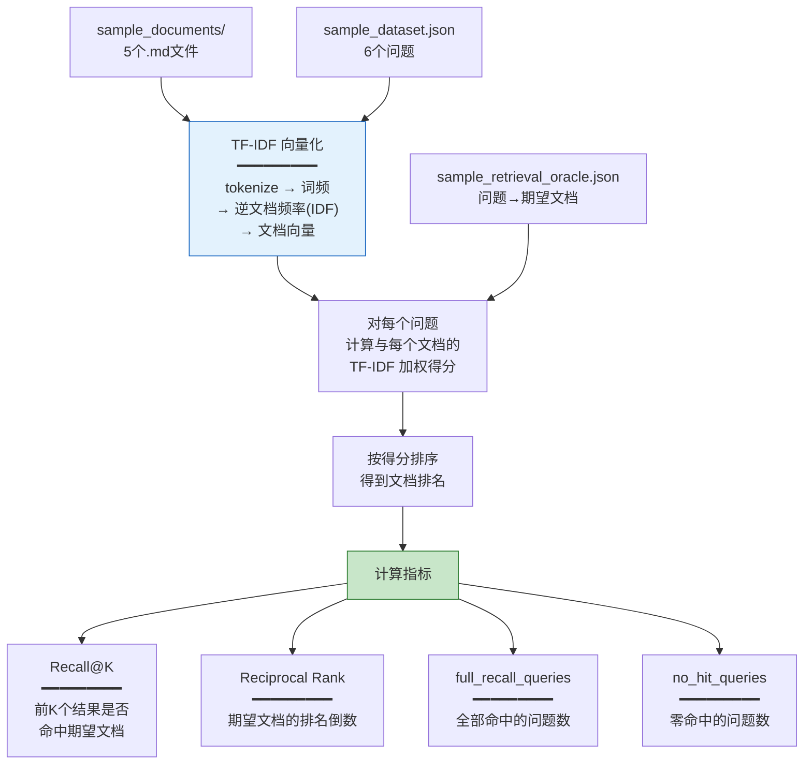
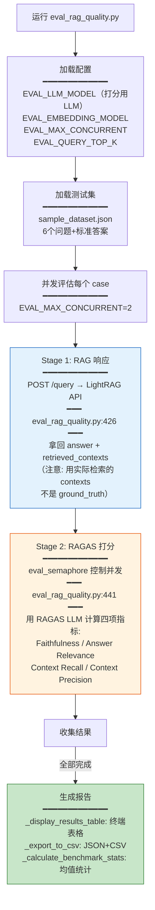
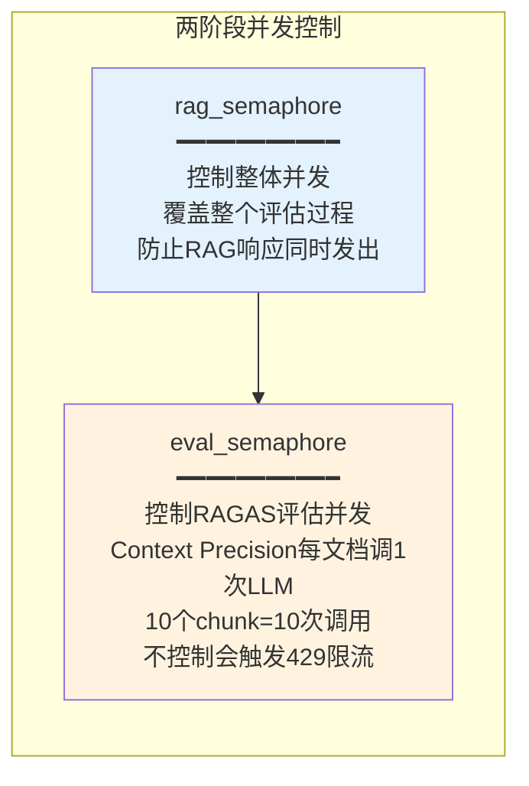

# 评估工具详解

**项目**：LightRAG · **版本**：1.5.5 · **日期**：2026-07-11 · **作者**：15531

> 详解 `lightrag/evaluation/` 下两套评估工具的原理、内部流程和源码分析。

---

## 一、文件结构

```
lightrag/evaluation/
├── __init__.py                    # 模块入口（懒导出 RAGEvaluator）
├── eval_rag_quality.py            # ★ RAGAS 端到端评估（40KB）
├── offline_retrieval_check.py     # ★ 离线检索检查（8KB）
├── sample_dataset.json            # 测试问题集（6题+标准答案）
├── sample_retrieval_oracle.json   # 期望命中映射（问题→期望文档）
├── sample_documents/              # 测试文档（5个Markdown）
│   ├── 01_lightrag_overview.md
│   ├── 02_rag_architecture.md
│   ├── 03_lightrag_improvements.md
│   ├── 04_supported_databases.md
│   └── 05_evaluation_and_deployment.md
├── README_EVALUASTION_RAGAS.md    # 使用文档
└── results/                       # 评估报告输出（自动创建）
    ├── results_时间戳.json
    └── results_时间戳.csv
```

---

## 二、Layer 1：离线检索检查

### 2.1 它做什么

**完全不调 LightRAG / LLM / Embedding**。用经典 TF-IDF 算法验证「问题能不能词汇匹配到期望文档」。



### 2.2 核心算法（源码 `offline_retrieval_check.py`）

**分词**（:78）：
```python
def tokenize(text):
    tokens = re.findall(r"[a-z0-9]+", text.lower())
    return [t for t in tokens if t not in STOPWORDS and len(t) > 1]
```

**逆文档频率 IDF**（:123）：
```python
idf[token] = math.log((doc_count + 1) / (frequency + 1)) + 1
```

**查询打分**（:134）：
```python
def score_query(query_tokens, document, idf):
    score = sum((1 + math.log(tf)) * idf[token] for token in query_tokens)
    return score
```

**Recall@K**（:67）：
```python
def recall_at(self, top_k):
    hits = set(self.expected) & set(self.ranked[:top_k])
    return len(hits) / len(self.expected)
```

### 2.3 用法

```bash
# 使用自带测试数据
python lightrag/evaluation/offline_retrieval_check.py --strict

# 自定义数据
python lightrag/evaluation/offline_retrieval_check.py \
    --dataset your_questions.json \
    --oracle your_oracle.json \
    --documents your_docs_dir/
```

### 2.4 局限性

> ⚠️ **它不评估你的 LightRAG 系统**。它只验证测试数据本身的自洽性——问题里的词汇能不能匹配到期望文档。它是 RAGAS 评估前的「前置健康检查」，不是替代品。

---

## 三、Layer 2：RAGAS 端到端评估

### 3.1 它做什么

**调你运行的 LightRAG API**，走真实的「检索→生成」链路，再用 RAGAS 框架的 LLM 打分。

### 3.2 评估流程（源码 `eval_rag_quality.py`）



### 3.3 关键设计：用实际检索的上下文打分

源码注释（`eval_rag_quality.py:441`）：
```python
# *** CRITICAL FIX: Use actual retrieved contexts, NOT ground_truth ***
retrieved_contexts = rag_response["contexts"]
```

> RAGAS 的 Context Recall/Precision 是用 **LightRAG 实际检索返回的上下文** 对比 ground_truth 来打分的——不是拿标准答案的上下文。这样才能反映真实检索质量。

### 3.4 两阶段并发控制



### 3.5 RAGEvaluator 类结构（`eval_rag_quality.py:115`）

| 方法 | 行号 | 作用 |
|---|---|---|
| `__init__` | :118 | 加载测试集 + 配置 |
| `generate_rag_response` | :290 | Stage 1：调 LightRAG API |
| `evaluate_single_case` | :391 | 单个测试用例的完整评估 |
| `evaluate_responses` | :556 | 并发评估所有用例 |
| `_export_to_csv` | :623 | 导出 JSON + CSV 报告 |
| `_display_results_table` | :698 | 终端表格输出 |
| `_calculate_benchmark_stats` | :772 | 计算均值/最小/最大 |
| `run` | :869 | 主入口 |

### 3.6 用法

```bash
# 基本用法（自带测试集）
python lightrag/evaluation/eval_rag_quality.py

# 指定测试集 + 服务地址
python lightrag/evaluation/eval_rag_quality.py \
    -d my_test.json \
    -r http://localhost:9621
```

### 3.7 配置环境变量

```env
# 评估用的 LLM（RAGAS 打分，必须 OpenAI 兼容）
EVAL_LLM_MODEL=gpt-4o-mini
EVAL_LLM_BINDING_API_KEY=sk-xxx
# EVAL_LLM_BINDING_HOST=http://localhost:8000/v1  # 自部署可选

# 评估用的 Embedding
EVAL_EMBEDDING_MODEL=text-embedding-3-large
EVAL_EMBEDDING_BINDING_API_KEY=sk-xxx

# 并发与限流
EVAL_MAX_CONCURRENT=2          # 并发评估数（遇429降到1）
EVAL_QUERY_TOP_K=10            # 检索召回数
EVAL_LLM_MAX_RETRIES=5         # 重试次数
EVAL_LLM_TIMEOUT=180           # 超时秒数
```

> **评估模型可以和被评估的 LightRAG 用不同模型**。建议评估用更强的模型保证打分公正。

---

## 四、输出报告格式

### 4.1 终端输出示例

```
#    | Question                                    | Faith | AnswRel | CtxRec | CtxPrec | RAGAS | Status
----------------------------------------------------------------------------------------------------------
1    | How does LightRAG solve the hallucination  | 1.0000|  1.0000 | 1.0000 |  1.0000 | 1.0000|    ✓
2    | What are the three main components...       | 0.8500|  0.5790 | 1.0000 |  1.0000 | 0.8573|    ✓
...

Average RAGAS Score: 0.9425
```

### 4.2 文件输出

```
results/
├── results_20260711_143022.json    ← 完整指标（含每题详细数据）
└── results_20260711_143022.csv     ← 表格格式（可 Excel 打开）
```

---

## 五、常见问题排查

| 问题 | 原因 | 解决 |
|---|---|---|
| `ModuleNotFoundError: ragas` | 未安装评估依赖 | `pip install ragas datasets` |
| Context Precision 返回 NaN | API 限流导致 LLM 返回不足 | `EVAL_MAX_CONCURRENT=1` + `EVAL_QUERY_TOP_K=5` |
| 429 Rate Limit | RAGAS 内部 LLM 调用太多 | 降低并发 + 增大重试 |
| NaN 结果 | LLM/Embedding 未正确配置 | 设置 `EVAL_LLM_BINDING_API_KEY` |
| 查询超时 | 模型太慢 | `EVAL_LLM_TIMEOUT=180` |

---

## 六、源码索引

| 工具 | 源码 |
|---|---|
| 离线检索检查 | `lightrag/evaluation/offline_retrieval_check.py` |
| RAGAS 评估主脚本 | `lightrag/evaluation/eval_rag_quality.py` |
| RAGEvaluator 类 | `eval_rag_quality.py:115` |
| 单用例评估 | `eval_rag_quality.py:391 evaluate_single_case` |
| 报告生成 | `eval_rag_quality.py:623 _export_to_csv` |
| 测试集格式 | `lightrag/evaluation/sample_dataset.json` |
| Oracle 格式 | `lightrag/evaluation/sample_retrieval_oracle.json` |
| 官方文档 | `lightrag/evaluation/README_EVALUASTION_RAGAS.md` |
| 测试用例 | `tests/evaluation/test_evaluation_offline_retrieval_check.py` |

---

## 相关文档

- 自定义测试集与实战：`02-自定义测试集与实战.md`
- 评估指标深度解读：`03-评估指标深度解读.md`
