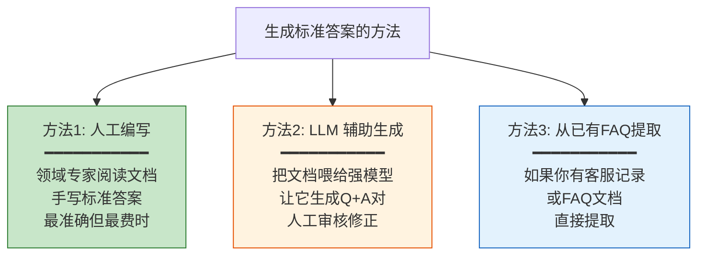
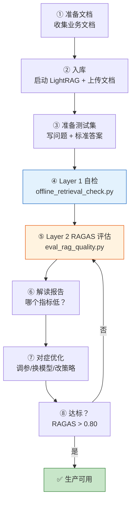
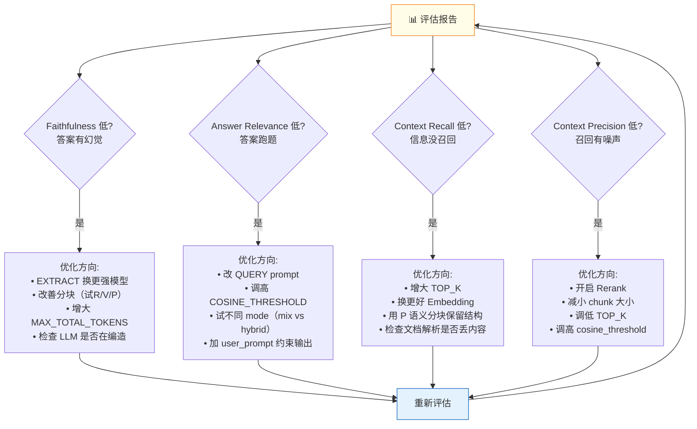

# 自定义测试集与实战

**项目**：LightRAG · **版本**：1.5.5 · **日期**：2026-07-11 · **作者**：15531

> 如何准备你自己的测试集、运行评估、解读报告、形成「评估→优化→再评估」闭环。

---

## 一、为什么自带测试集不够用

自带的 6 个问题全是关于 LightRAG 本身的：

```
"How does LightRAG solve the hallucination problem?"
"What are the three main components required in a RAG system?"
...
```

**你的文档不是关于 LightRAG 的**——可能关于社保政策、法律条文、企业知识库。用自带问题评估你的系统，等于「考卷和课本不匹配」，评估结果毫无意义。

---

## 二、准备你自己的测试集

### 2.1 测试集格式（`sample_dataset.json`）

```json
{
  "test_cases": [
    {
      "question": "城乡居民养老保险的申领条件是什么？",
      "ground_truth": "年满60周岁、累计缴费满15年、未领取其他养老待遇的参保人员可以申领。申领时需携带身份证、户口本、缴费凭证到户籍所在地社保经办机构办理。",
      "project": "社保政策问答"
    },
    {
      "question": "养老保险的缴费比例是多少？",
      "ground_truth": "个人缴费标准目前设为每年100元至5000元共12个档次，参保人自主选择。政府对应缴费档次给予补贴，最低补贴30元，最高补贴140元。",
      "project": "社保政策问答"
    }
  ]
}
```

### 2.2 字段说明

| 字段 | 必填 | 作用 |
|---|---|---|
| `question` | ✅ | 你的测试问题 |
| `ground_truth` | ✅ | **标准答案**（RAGAS 靠它算 Context Recall） |
| `project` | 可选 | 项目分组标签 |

### 2.3 怎么生成 ground_truth



### 2.4 测试集质量要求

| 要求 | 说明 |
|---|---|
| **覆盖面** | 简单/中等/困难问题都要有 |
| **多样性** | 事实型/推理型/对比型/汇总型 |
| **数量** | 至少 10-20 题，太少不具统计意义 |
| **标准答案准确** | ground_truth 直接影响 Recall 打分 |

---

## 三、完整评估流程



---

## 四、运行评估（完整命令）

### 4.1 前置准备

```bash
# 安装评估依赖
pip install ragas datasets
# 或
uv sync --extra evaluation

# 确保 LightRAG 在运行
PYTHONUTF8=1 uv run lightrag-server

# 确保文档已入库（用 WebUI 上传）
```

### 4.2 运行评估

```bash
# 用你的测试集
python lightrag/evaluation/eval_rag_quality.py \
    -d /path/to/your_dataset.json \
    -r http://localhost:9621

# 或配置环境变量后直接跑
export EVAL_LLM_MODEL=gpt-4o-mini
export EVAL_LLM_BINDING_API_KEY=sk-xxx
python lightrag/evaluation/eval_rag_quality.py -d your_dataset.json
```

### 4.3 查看结果

```bash
# 终端会直接打印表格
# 文件在 lightrag/evaluation/results/
ls lightrag/evaluation/results/
# results_20260711_143022.json  +  results_20260711_143022.csv
```

---

## 五、解读报告

### 5.1 单题结果

```
#    | Question                           | Faith | AnswRel | CtxRec | CtxPrec | RAGAS | Status
------------------------------------------------------------------------------------------------
1    | 养老保险申领条件是什么？            | 0.95  |  0.88   | 1.00   |  0.90   | 0.93  |    ✓
2    | 缴费比例是多少？                    | 0.72  |  0.65   | 0.80   |  1.00   | 0.79  |    ✓
```

**第1题**：RAGAS=0.93 ✅ 好。Faithfulness=0.95 说明答案忠实于检索内容。

**第2题**：RAGAS=0.79 ⚠️ 偏低。Faithfulness=0.72 说明答案有部分不准确；Context Recall=0.80 说明信息没全召回。

### 5.2 整体统计

```
Average Faithfulness:      0.84
Average Answer Relevance:  0.77
Average Context Recall:    0.90
Average Context Precision: 0.95
Average RAGAS Score:       0.86
Min RAGAS Score:           0.72   ← 最低的那道题
Max RAGAS Score:           0.98
```

**关注 Min**——最低分的那道题是薄弱环节，优先优化它。

---

## 六、从评估到优化



---

## 七、优化后验证

每次改完参数后，用**相同的测试集**重新评估，对比前后变化：

```bash
# 第一次评估（基线）
python lightrag/evaluation/eval_rag_quality.py -d your_dataset.json
# → results_20260711_100000.json  RAGAS=0.82

# 优化后（比如开了 rerank）
python lightrag/evaluation/eval_rag_quality.py -d your_dataset.json
# → results_20260711_140000.json  RAGAS=0.89  ← 提升了！
```

> **关键**：每次只改一个参数，评估对比，确认是否真的变好。不要同时改多个——你不知道是哪个起的作用。

---

## 八、实战示例：社保政策问答系统

### 8.1 准备阶段

```bash
# 1. 启动服务 + 入库文档
PYTHONUTF8=1 uv run lightrag-server
# WebUI 上传社保政策相关 docx/pdf

# 2. 写测试集
cat > social_insurance_test.json << 'EOF'
{
  "test_cases": [
    {
      "question": "城乡居民养老保险的申领条件是什么？",
      "ground_truth": "年满60周岁、累计缴费满15年...",
      "project": "社保"
    },
    {
      "question": "缴费档次有哪些？",
      "ground_truth": "每年100元至5000元共12个档次...",
      "project": "社保"
    },
    {
      "question": "去世后个人账户余额怎么处理？",
      "ground_truth": "可依法继承，由继承人申请一次性领取...",
      "project": "社保"
    }
  ]
}
EOF
```

### 8.2 评估

```bash
python lightrag/evaluation/eval_rag_quality.py \
    -d social_insurance_test.json \
    -r http://localhost:9621
```

### 8.3 根据报告优化

假设结果是 `Context Recall=0.60`（信息没召回）：
```env
# 增大召回数
TOP_K=80
CHUNK_TOP_K=20
# 换更好的 embedding（如果当前维度低）
```

再跑一次评估，看 Recall 是否提升。

---

## 九、源码索引

| 能力 | 源码 |
|---|---|
| 测试集格式 | `lightrag/evaluation/sample_dataset.json` |
| 加载测试集 | `eval_rag_quality.py:280 _load_test_dataset` |
| 调 LightRAG API | `eval_rag_quality.py:290 generate_rag_response` |
| 单题评估 | `eval_rag_quality.py:391 evaluate_single_case` |
| 报告导出 | `eval_rag_quality.py:623 _export_to_csv` |
| 均值统计 | `eval_rag_quality.py:772 _calculate_benchmark_stats` |
| 主入口 | `eval_rag_quality.py:869 run` |
| 命令行入口 | `eval_rag_quality.py:950 main` |

---

## 相关文档

- 评估工具详解：`01-评估工具详解.md`
- 评估指标深度解读：`03-评估指标深度解读.md`
