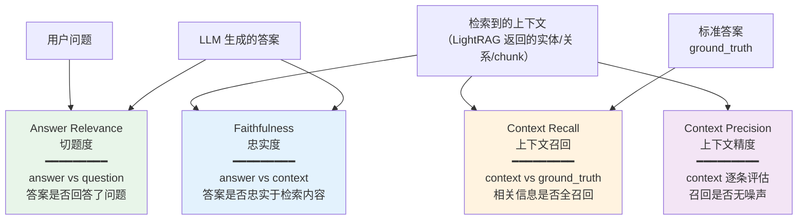
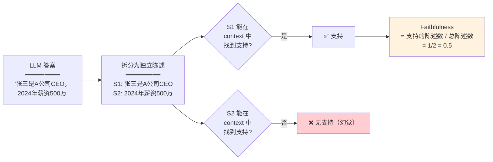
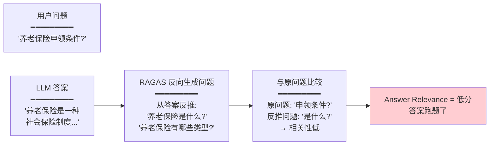
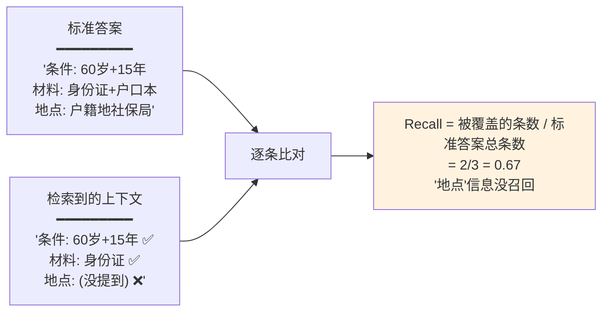
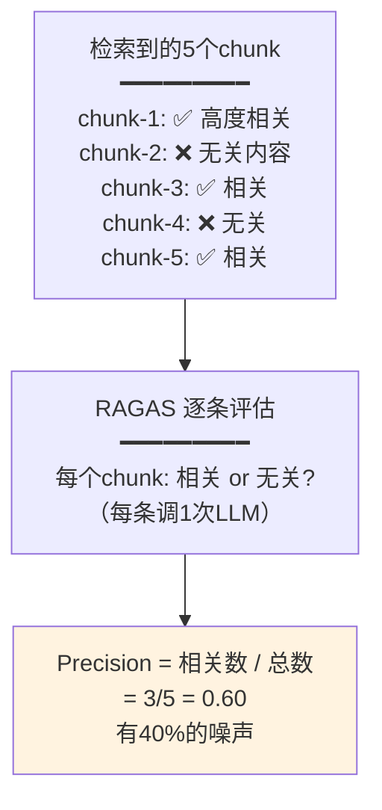
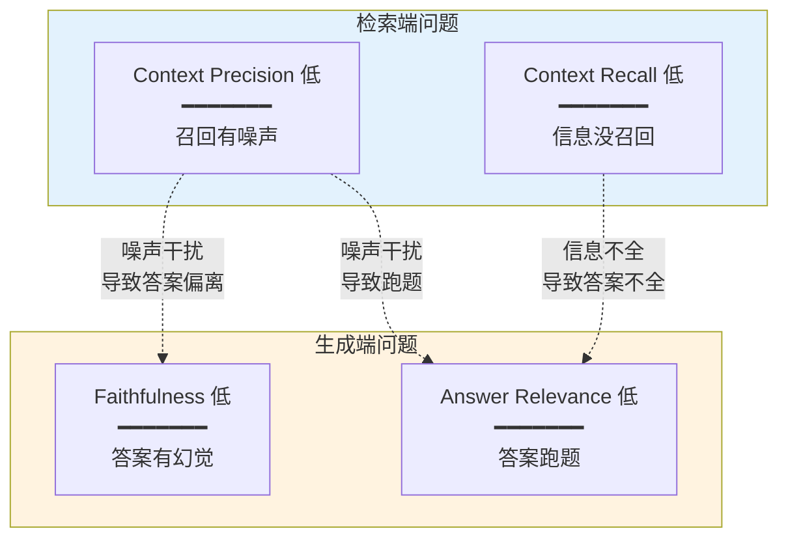
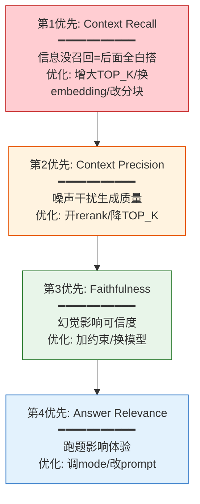

# 评估指标深度解读

**项目**：LightRAG · **版本**：1.5.5 · **日期**：2026-07-11 · **作者**：15531

> RAGAS 四大指标的算法原理、打分逻辑、低分根因、对应优化方向。

---

## 一、四大指标总览



---

## 二、Faithfulness（忠实度）

### 2.1 含义

> 答案中的每个陈述，是否都能在检索到的上下文中找到支持？**检测幻觉。**

### 2.2 打分原理



### 2.3 分值解读

| 分值 | 含义 | 动作 |
|---|---|---|
| >0.80 | 答案忠实于检索内容 | ✅ |
| 0.60-0.80 | 有少量编造 | 检查 LLM prompt |
| <0.60 | 大量幻觉 | 换更强模型 / 加约束 |

### 2.4 低分根因与优化

| 根因 | 优化 |
|---|---|
| LLM 喜欢编造 | 在 user_prompt 加「只基于检索内容回答，不知道就说不知道」 |
| 检索的上下文质量差 | 改善召回（见 Context Recall） |
| 模型能力不足 | 换更强 QUERY 模型 |
| 上下文太少 | 增大 `max_total_tokens` |

---

## 三、Answer Relevance（切题度）

### 3.1 含义

> 答案是否真正回答了用户的问题？**检测跑题。**

### 3.2 打分原理



> RAGAS 的巧妙设计：不直接判断「答案是否切题」，而是**从答案反生成问题**，看反生成的问题和原问题有多相似。

### 3.3 低分根因与优化

| 根因 | 优化 |
|---|---|
| 检索到的内容和问题不相关 | 调高 `COSINE_THRESHOLD`（过滤低质量召回） |
| LLM 理解错了问题方向 | 在 user_prompt 明确回答方向 |
| mode 选错 | 简单事实用 local，综述用 global，通用用 mix |
| 上下文噪声干扰 | 开启 Rerank |

---

## 四、Context Recall（上下文召回）

### 4.1 含义

> 标准答案中的信息，是否都被检索到的上下文覆盖了？**检测漏检。**

### 4.2 打分原理



### 4.3 低分根因与优化

| 根因 | 优化 |
|---|---|
| 召回数量不够 | 增大 `TOP_K` / `CHUNK_TOP_K` |
| Embedding 质量差 | 换更好的 embedding 模型 |
| 分块太大/太小 | 调 `CHUNK_SIZE`（太大信息分散，太小上下文不足） |
| 文档解析丢内容 | 换 native/mineru 引擎 |
| 关键词没抽准 | 换更强的 KEYWORDS 模型 |
| mode 选错 | mix 三路全开覆盖最广 |

### 4.4 这是最重要的指标

> Context Recall 低 = **检索端出了问题**——相关信息压根没召回。后面生成再好也补不回来。**优先优化这个指标。**

---

## 五、Context Precision（上下文精度）

### 5.1 含义

> 检索到的上下文，有多少是真正相关的？**检测噪声。**

### 5.2 打分原理



> **注意**：Context Precision 对每个检索到的 chunk 调一次 LLM 判断相关性。`EVAL_QUERY_TOP_K=10` 意味着每题 10 次 LLM 调用，容易触发限流。

### 5.3 低分根因与优化

| 根因 | 优化 |
|---|---|
| 召回太多无关内容 | 降低 `TOP_K` |
| chunk 太大混入无关信息 | 减小 `CHUNK_SIZE` |
| 缺少重排 | **开启 Rerank**（`enable_rerank=true`） |
| cosine 阈值太低 | 调高 `COSINE_THRESHOLD` |

### 5.4 Rerank 是最有效的优化

```
召回 60 个 → Rerank 打分排序 → 只保留最相关的 20 个
                                    ↑
                              Precision 大幅提升
```

---

## 六、四指标的关系



**因果链**：
- Recall 低（没召回）→ 答案信息不全 → Relevance 可能低
- Precision 低（有噪声）→ 干扰生成 → Faithfulness/Relevance 可能低
- **检索端是根因，生成端是表现**

---

## 七、优化优先级



> **先修检索（Recall→Precision），再修生成（Faithfulness→Relevance）**。因为检索是基础，检索不到的信息生成端怎么也补不出来。

---

## 八、完整优化对照表

| 指标低 | 检索端还是生成端？ | 具体优化 | 对应参数 |
|---|---|---|---|
| Context Recall 低 | 检索端 | 增大召回 | `TOP_K=80` |
| | | 换 embedding | `EMBEDDING_MODEL` |
| | | 改善分块 | `CHUNK_SIZE` / 策略R/V/P |
| | | 三路全开 | `mode=mix` |
| Context Precision 低 | 检索端 | 开 rerank | `RERANK_BINDING=cohere` |
| | | 降低召回量 | `TOP_K=30` |
| | | 提高阈值 | `COSINE_THRESHOLD=0.3` |
| Faithfulness 低 | 生成端 | 加约束 prompt | `user_prompt="只基于检索内容"` |
| | | 增加上下文 | `MAX_TOTAL_TOKENS=30000` |
| | | 换更强模型 | `LLM_MODEL=gpt-4o` |
| Answer Relevance 低 | 混合 | 调 mode | `mode=mix` |
| | | 加方向 prompt | `user_prompt` |
| | | 调高阈值 | `COSINE_THRESHOLD` |

---

## 九、相关文档

- 评估工具详解：`01-评估工具详解.md`
- 自定义测试集与实战：`02-自定义测试集与实战.md`
- 可适配组件与配置参数全览：`../04-融合与实践/04-可适配组件与配置参数全览.md`
