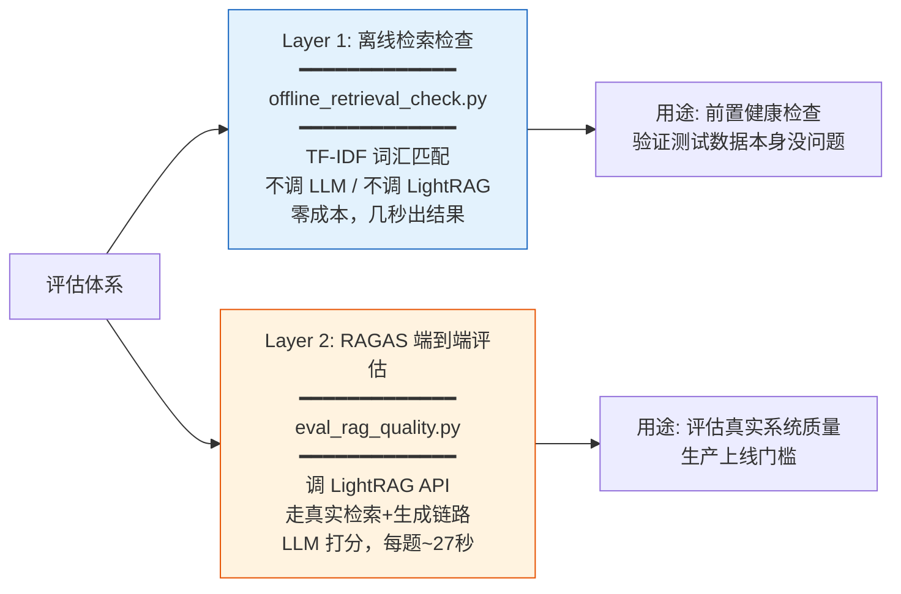

# 评估系统总览

**项目**：LightRAG · **版本**：1.5.5 · **日期**：2026-07-11 · **作者**：15531

> 本文件夹详解 LightRAG 自带的 RAG 质量评估框架（`lightrag/evaluation/`），包括两套评估工具的原理、用法、自定义测试集、以及从评估到优化的完整闭环。

---

## 文件夹索引

| 编号 | 文档 | 内容 |
|---|---|---|
| 01 | [评估工具详解](01-评估工具详解.md) | 两套工具（离线检索检查 + RAGAS 端到端评估）的原理、源码分析、内部流程 |
| 02 | [自定义测试集与实战](02-自定义测试集与实战.md) | 如何准备你自己的问题+标准答案、运行评估、解读报告、调优闭环 |
| 03 | [评估指标深度解读](03-评估指标深度解读.md) | RAGAS 四大指标的算法原理、低分原因、优化方向 |

---

## 一、两套评估工具



### 关键区别

| 维度 | 离线检索检查 | RAGAS 评估 |
|---|---|---|
| **是否调 LightRAG** | ❌ 不调 | ✅ 调 API（`POST /query`） |
| **是否用你的向量/图谱** | ❌ 不用 | ✅ 走真实链路 |
| **是否调 LLM** | ❌ 不调 | ✅ RAGAS 用 LLM 打分 |
| **成本** | 零（几秒） | 有（每题~27s + LLM 调用费） |
| **测什么** | 测试数据自洽性 | 真实 RAG 质量 |
| **能评价你的系统吗** | ❌ 不能 | ✅ 能 |

> **重要**：`offline_retrieval_check.py` 只是测试数据的「自检工具」，**不评估你的 LightRAG 实际性能**。要评估真实系统必须用 `eval_rag_quality.py`。

---

## 二、RAGAS 四大指标

| 指标 | 测什么 | 好分 | 低分说明 |
|---|---|---|---|
| **Faithfulness**（忠实度） | 答案是否基于检索内容，有无幻觉 | >0.80 | 有幻觉/编造 |
| **Answer Relevance**（切题度） | 答案是否回答了问题 | >0.80 | 答非所问 |
| **Context Recall**（上下文召回） | 相关信息是否全召回 | >0.80 | 漏检 |
| **Context Precision**（上下文精度） | 召回内容是否无噪声 | >0.80 | 召回太多无关内容 |
| **RAGAS Score** | 以上四项平均 | >0.80 | 综合质量 |

### 官方基线（项目自评）

```
Average Faithfulness:      0.9053
Average Answer Relevance:  0.8646
Average Context Recall:    1.0000
Average Context Precision: 1.0000
Average RAGAS Score:       0.9425
```

---

## 三、快速上手

```bash
# Layer 1：零成本自检
python lightrag/evaluation/offline_retrieval_check.py --strict

# Layer 2：RAGAS 真实评估
pip install -e ".[evaluation]"
PYTHONUTF8=1 uv run lightrag-server        # 先启动服务
python lightrag/evaluation/eval_rag_quality.py  # 跑评估
# 报告输出到 lightrag/evaluation/results/
```

详见各文档。
